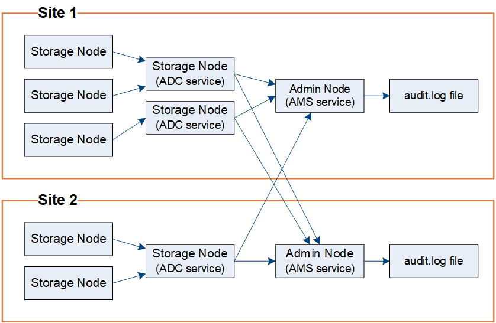

= Audit message flow and retention
:icons: font
:imagesdir: ../media/

[.lead]
All StorageGRID services generate audit messages during normal system operation. You should understand how these audit messages move through the StorageGRID system to the `audit.log` file.

== Audit message flow

Audit messages are processed by Admin Nodes and by those Storage Nodes that have an Administrative Domain Controller (ADC) service.

As shown in the audit message flow diagram, each StorageGRID node sends its audit messages to one of the ADC services at the data center site. The ADC service is automatically enabled for the first three Storage Nodes installed at each site.

In turn, each ADC service acts as a relay and sends its collection of audit messages to every Admin Node in the StorageGRID system, which gives each Admin Node a complete record of system activity.

Each Admin Node stores audit messages in text log files; the active log file is named `audit.log`.

=== Audit message retention

StorageGRID uses a copy-and-delete process to ensure that no audit messages are lost before they can be written to the audit log.

When a node generates or relays an audit message, the message is stored in an audit message queue on the system disk of the grid node. A copy of the message is always held in an audit message queue until the message is written to the audit log file in the Admin Node's `/var/local/audit/export` directory. This helps prevent loss of an audit message during transport.

image::../media/audit_message_retention.gif[diagram that summarizes audit message receipt at the AMS]

The audit message queue can temporarily increase due to network connectivity issues or insufficient audit capacity. As the queues increase, they consume more of the available space in each node's `/var/local/` directory. If the issue persists and a node's audit message directory becomes too full, the individual nodes will prioritize processing their backlog and become temporarily unavailable for new messages.

Specifically, you might see the following behaviors:

* If the `/var/local/audit/export` directory used by an Admin Node becomes full, the Admin Node will be flagged as unavailable to new audit messages until the directory is no longer full. S3 and Swift client requests are not affected. The XAMS (Unreachable Audit Repositories) alarm is triggered when an audit repository is unreachable.
* If the `/var/local/` directory used by a Storage Node with the ADC service becomes 92% full, the node will be flagged as unavailable to audit messages until the directory is only 87% full. S3 and Swift client requests to other nodes are not affected. The NRLY (Available Audit Relays) alarm is triggered when audit relays are unreachable.
+
NOTE: If there are no available Storage Nodes with the ADC service, the Storage Nodes store the audit messages locally.

* If the `/var/local/` directory used by a Storage Node becomes 85% full, the node will start refusing S3 and Swift client requests with `503 Service Unavailable`.

The following types of issues can cause audit message queues to grow very large:

* The outage of an Admin Node or a Storage Node with the ADC service. If one of the system's nodes is down, the remaining nodes might become backlogged.
* A sustained activity rate that exceeds the audit capacity of the system.
* The `/var/local/` space on an ADC Storage Node becoming full for reasons unrelated to audit messages. When this happens, the node stops accepting new audit messages and prioritizes its current backlog, which can cause backlogs on other nodes.

=== Large audit queue alert and Audit Messages Queued (AMQS) alarm

To help you monitor the size of audit message queues over time, the *Large audit queue* alert and the legacy AMQS alarm are triggered when the number of messages in a Storage Node queue or Admin Node queue reaches certain thresholds.

If the *Large audit queue* alert or the legacy AMQS alarm is triggered, start by checking the load on the system--if there have been a significant number of recent transactions, the alert and the alarm should resolve over time and can be ignored.

If the alert or alarm persists and increases in severity, view a chart of the queue size. If the number is steadily increasing over hours or days, the audit load has likely exceeded the audit capacity of the system. Reduce the client operation rate or decrease the number of audit messages logged by changing the audit level for Client Writes and Client Reads to Error or Off. See "xref:changing-audit-message-levels.adoc[Changing audit message levels]."

=== Duplicate messages

The StorageGRID system takes a conservative approach if a network or node failure occurs. For this reason, duplicate messages might exist in the audit log.
