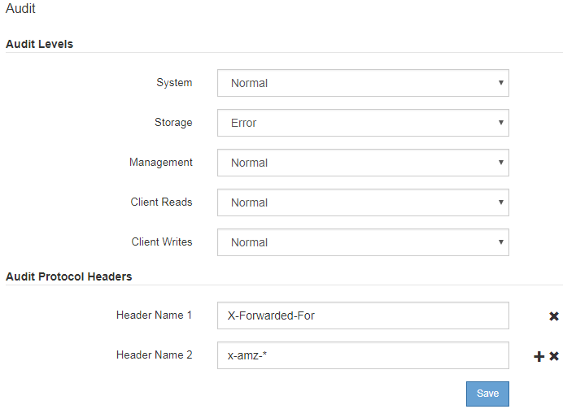

= Changing audit message levels
:icons: font
:imagesdir: ../media/

[.lead]
You can adjust audit levels to increase or decrease the number of audit messages recorded in the audit log for each audit message category.

.What you'll need

* You must be signed in to the Grid Manager using a supported browser.
* You must have specific access permissions.

.About this task

The audit messages recorded in the audit log are filtered based on the settings on the *Configuration* > *Monitoring* > *Audit* page.

You can set a different audit level for each of the following categories of messages:

* *System*: By default, this level is set to Normal.
* *Storage*: By default, this level is set to Error.
* *Management*: By default, this level is set to Normal.
* *Client Reads*: By default, this level is set to Normal.
* *Client Writes*: By default, this level is set to Normal.

NOTE: These defaults apply if you initially installed StorageGRID using version 10.3 or later. If you have upgraded from an earlier version of StorageGRID, the default for all categories is set to Normal.

NOTE: During upgrades, audit level configurations will not be effective immediately.

.Steps

. Select *Configuration* > *Monitoring* > *Audit*.
+

. For each category of audit message, select an audit level from the drop-down list:
+
[cols=2*,options="header",cols="20,80"]
[options="header"]
|===
| Audit level| Description
a|
Off
a|
No audit messages from the category are logged.
a|
Error
a|
Only error messages are logged--audit messages for which the result code was not "successful" (SUCS).
a|
Normal
a|
Standard transactional messages are logged--the messages listed in these instructions for the category.
a|
Debug
a|
Deprecated. This level behaves the same as the Normal audit level.
|===
The messages included for any particular level include those that would be logged at the higher levels. For example, the Normal level includes all of the Error messages.

. Under *Audit Protocol Headers*, enter the name of the HTTP request headers to be included in Client Read and Client Write audit messages. Use an asterisk (\*) as a wildcard, or use the escape sequence (\*) as a literal asterisk. Click the plus sign to create a list of header name fields.
+
NOTE: Audit protocol headers apply to S3 and Swift requests only.
+
When such HTTP headers are found in a request, they are included in the audit message under the field HTRH.
+
NOTE: Audit protocol request headers are logged only if the audit level for *Client Reads* or *Client Writes* is not *Off*.

. Click *Save*.

.Related information

xref:system_audit_messages.adoc[System audit messages]

xref:object_storage_audit_messages.adoc[Object storage audit messages]

xref:management_audit_message.adoc[Management audit message]

xref:client_read_audit_messages.adoc[Client read audit messages]

xref:../admin/index.adoc[Administer StorageGRID]
