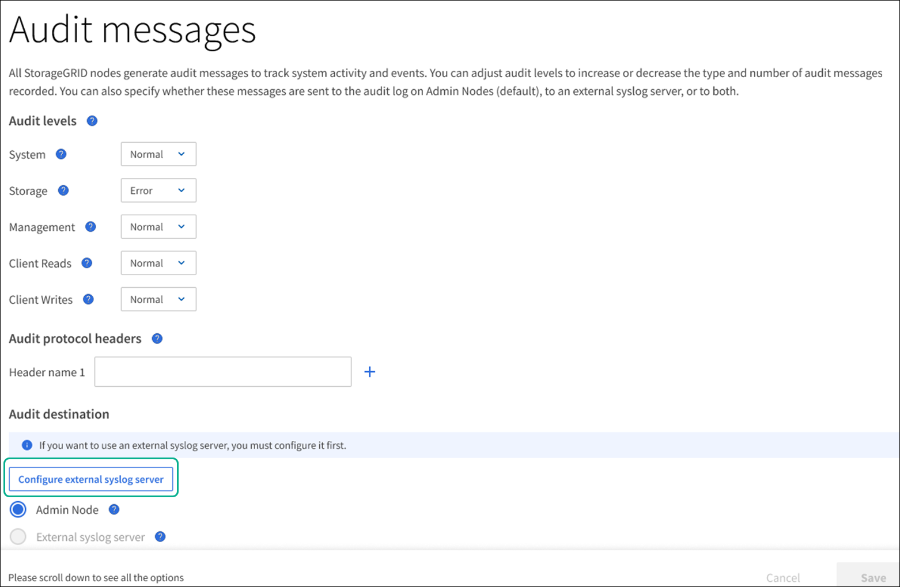

= Configure audit messages
:icons: font
:imagesdir: ../media/

[.lead]
All StorageGRID nodes generate audit messages to track system activity and events. You can adjust audit levels to increase or decrease the number of audit messages recorded in the audit log for each audit message category. You can also change the destination of audit messages.

.What you'll need

* You must be signed in to the Grid Manager using a xref:../admin/web-browser-requirements.adoc[supported web browser].
* You must have Maintenance or Root Access permissions.

.About this task

By default, audit messages are sent to the audit log on Admin Nodes. The audit messages recorded in the audit log are filtered based on the settings on the *Configuration* > *Monitoring* > *Audit messages* page. Optionally, you can configure audit messages to be sent to a remote syslog server. 

== Change audit message levels

You can set a different audit level for each of the following categories of messages:

* *System*: By default, this level is set to Normal.
* *Storage*: By default, this level is set to Error.
* *Management*: By default, this level is set to Normal.
* *Client Reads*: By default, this level is set to Normal.
* *Client Writes*: By default, this level is set to Normal.

NOTE: These defaults apply if you initially installed StorageGRID using version 10.3 or later. If you have upgraded from an earlier version of StorageGRID, the default for all categories is set to Normal.

NOTE: During upgrades, audit level configurations will not be effective immediately.

.Steps

. Select *Configuration* > *Monitoring* > *Audit messages*.
+
image::../media/audit-messages-main-page.png[Audit messages main page]

. For each category of audit message, select an audit level from the drop-down list:
+
[cols=2*,options="header",cols="20,80"]
[options="header"]
|===
| Audit level| Description
a|
Off
a|
No audit messages from the category are logged.
a|
Error
a|
Only error messages are logged--audit messages for which the result code was not "successful" (SUCS).
a|
Normal
a|
Standard transactional messages are logged--the messages listed in these instructions for the category.
a|
Debug
a|
Deprecated. This level behaves the same as the Normal audit level.
|===
The messages included for any particular level include those that would be logged at the higher levels. For example, the Normal level includes all of the Error messages.

. Under *Audit protocol headers*, enter the name of the HTTP request headers to be included in Client Reads and Client Writes audit messages. Use an asterisk (\*) as a wildcard, or use the escape sequence (\*) as a literal asterisk. Click the plus sign to create a list of header name fields.
//how many can be added?
+
NOTE: Audit protocol headers apply to S3 and Swift requests only.
+
When such HTTP headers are found in a request, they are included in the audit message under the field HTRH.
+
NOTE: Audit protocol request headers are logged only if the audit level for *Client Reads* or *Client Writes* is not *Off*.

[start=4]
. If you want to change the selected audit message destination, Go to <<Change-audit-destinations,Change audit message destinations>>. Otherwise, select *Save*.

== [[Change-audit-destinations]]Change audit message destinations

You can specify whether audit messages are sent to the audit log on Admin Nodes (default), to an external syslog server, or both. If you want to use an external server, you must configure it first.

If you want to use an external syslog server, see <<Access-the-syslog-server-configuration-wizard,Access the syslog server configuration wizard>> to open the syslog server configuration wizard. Otherwise, go to <<Select-the-destination-for-audit-messages-from-the-listed-options,Select the destination for audit messages from the listed options>>.

=== [[Access-the-syslog-server-configuration-wizard]]Access the syslog server configuration wizard
. From the Audit messages page, Select *Configure external syslog server*.
+

==== Enter Syslog info
The Syslog info page appears: 
//banner always there?

image::../media/enter-syslog-info.png[Enter syslog info]

. Enter the FQDN or IP of the remote server.
. Enter the port.
. Select the protocol used to send the audit messages to the remote server. 

+
. If you select UDP or TCP, select *Continue*.
. IF you select TLS, you must upload at least one certificate. Do the following: 
//of the remote server? 

+
//image::../media/ssh-provisioning-xxxxpassphrase.png[xxxxxxxxxxxxxxxxx]//

[start=2]
//. Select *Continue*xxxxxxxxxxxxxxxx.

==== Manage Syslog content
//. Select **.
+
//xxxxxxxxxxxxxxxxxxxxxxx.
+
//image::../media/ssh-download-current-recovery-package.png[Download current recovery package]//

[start=3]
. Select *Continue*.
==== Manage Syslog content
. Select *Continue*.
==== Send test messages
Send test messages. Skip and Finish. Finish.

. [[Select-the-destination-for-audit-messages-from-the-listed-options]]Select the destination for audit messages from the listed options.
+
[cols="1a,2a" options="header"]
|===
| Option| Description

|Admin Node
|Audit messages are sent to the audit log on the Admin Node.

|External syslog server
|Audit messages are sent to an external syslog server. This option is enabled only after you have configured the external syslog server.

|Admin Node and external syslog server.
|Audit messages are sent to both the audit log on the Admin Node and the external syslog server.

|None
|No audit messages are sent. 

|===

. Click *Save*

.Related information

xref:system-audit-messages.adoc[System audit messages]

xref:object-storage-audit-messages.adoc[Object storage audit messages]

xref:management-audit-message.adoc[Management audit message]

xref:client-read-audit-messages.adoc[Client read audit messages]

xref:../admin/index.adoc[Administer StorageGRID]