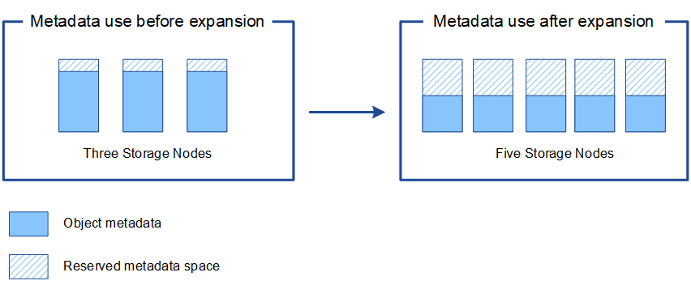

= Add metadata capacity
:icons: font
:imagesdir: ../media/

[.lead]
To ensure that adequate space is available for object metadata, you might need to perform an expansion procedure to add new Storage Nodes at each site.

StorageGRID reserves space for object metadata on volume 0 of each Storage Node. Three copies of all object metadata are maintained at each site, evenly distributed across all Storage Nodes.

You can use the Grid Manager to monitor the metadata capacity of Storage Nodes and to estimate how quickly metadata capacity is being consumed. In addition, the *Low metadata storage* alert is triggered for a Storage Node when the used metadata space reaches certain thresholds. 

Note that a grid's object metadata capacity might be consumed faster than its object storage capacity, depending on how you use the grid. For example, if you typically ingest large numbers of small objects or add large quantities of user metadata or tags to objects, you might need to add Storage Nodes to increase metadata capacity even though sufficient object storage capacity remains.

For more information, see the following:

* xref:../admin/managing-object-metadata-storage.adoc[Manage object metadata storage]

* xref:../monitor/monitoring-storage-capacity.adoc#monitor-object-metadata-capacity-for-each-storage-node[Monitor object metadata capacity for each Storage Node]

== Guidelines for increasing metadata capacity

Before adding Storage Nodes to increase metadata capacity, review the following guidelines and limitations:

* Assuming sufficient object storage capacity is available, having more space available for object metadata increases the number of objects you can store in your StorageGRID system.
* You can increase a grid's metadata capacity by adding one or more Storage Nodes to each site.
* The actual space reserved for object metadata on any given Storage Node depends on the Metadata Reserved Space storage option (system-wide setting), the amount of RAM allocated to the node, and the size of the node's volume 0. See the instructions for xref:../admin/index.adoc[administering StorageGRID].
* You cannot increase metadata capacity by adding storage volumes to existing Storage Nodes, because metadata is stored only on volume 0.
* You cannot increase metadata capacity by adding a new site.
* StorageGRID keeps three copies of all object metadata at every site. For this reason, the metadata capacity for your system is limited by the metadata capacity of your smallest site.
* When adding metadata capacity, you should add the same number of Storage Nodes to each site.

== How metadata is redistributed when you add Storage Nodes

When you add Storage Nodes in an expansion, StorageGRID redistributes the existing object metadata to the new nodes at each site, which increases the overall metadata capacity of the grid. No user action is required.

The following figure shows how StorageGRID redistributes object metadata when you add Storage Nodes in an expansion. The left side of the figure represents volume 0 of three Storage Nodes before an expansion. Metadata is consuming a relatively large portion of each node's available metadata space, and the *Low metadata storage* alert has been triggered.

The right side of the figure shows how the existing metadata is redistributed after two Storage Nodes are added to the site. The amount of metadata on each node has decreased, the *Low metadata storage* alert is no longer triggered, and the space available for metadata has increased.

