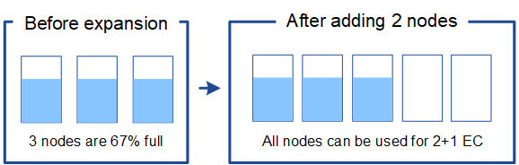
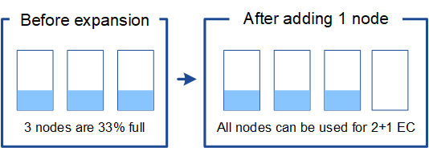

= Add storage capacity for erasure-coded objects
:icons: font
:imagesdir: ../media/

[.lead]
If your ILM policy includes a rule that makes erasure-coded copies, you must plan where to add new storage and when to add new storage. The amount of storage you add and the timing of the addition can affect the grid's usable storage capacity.

The first step in planning a storage expansion is to examine the rules in your ILM policy that create erasure-coded objects. Because StorageGRID creates _k+m_ fragments for every erasure-coded object and stores each fragment on a different Storage Node, you must ensure that at least _k+m_ Storage Nodes have space for new erasure-coded data after the expansion. If the erasure-coding profile provides site-loss protection, you must add storage to each site. See xref:../ilm/index.adoc[Manage objects with ILM].

The number of nodes you need to add also depends on how full the existing nodes are when you perform the expansion.

== General recommendation for adding storage capacity for erasure-coded objects

If you want to avoid detailed calculations, you can add two Storage Nodes per site when existing Storage Nodes reach 70% capacity.

This general recommendation provides reasonable results across a wide range of erasure-coding schemes for both single-site grids and for grids where erasure coding provides site-loss protection.

To better understand the factors that lead to this recommendation or to develop a more precise plan for your site, review the next section. For a custom recommendation optimized for your situation, contact your NetApp account representative.

== Calculate number of expansion Storage Nodes to add for erasure-coded objects

To optimize how you expand a deployment that stores erasure-coded objects, you must consider many factors:

* Erasure-coding scheme in use
* Characteristics of the storage pool used for erasure coding, including the number of nodes at each site and the amount of free space on each node
* Whether the grid was previously expanded (because the amount of free space per Storage Node might not be approximately the same on all nodes)
* Exact nature of the ILM policy, such as whether ILM rules make both replicated and erasure-coded objects

The following examples can help you understand the impact of the erasure-coding scheme, the number of nodes in the storage pool, and the amount of free space on each node.

Similar considerations affect the calculations for an ILM policy that stores both replicated and erasure-coded data and the calculations for a grid that has been previously expanded.

IMPORTANT: The examples in this section represent the best practices for adding storage capacity to a StorageGRID system. If you are unable to add the recommended number of nodes, you might need to run the EC rebalance procedure to allow additional erasure-coded objects to be stored. See xref:considerations-for-rebalancing-erasure-coded-data.adoc[Rebalance erasure-coded data].

== Example 1: Expand one-site grid that uses 2+1 erasure coding

This example shows how to expand a simple grid that includes only three Storage Nodes.

NOTE: This example uses only three Storage Nodes for simplicity. However, using only three Storage Nodes is not recommended: an actual production grid should use a minimum of _k+m_ + 1 Storage Nodes for redundancy, which equals four Storage Nodes (2+1+1) for this example.

Assume the following:

* All data is stored using the 2+1 erasure-coding scheme. With the 2+1 erasure coding scheme, every object is stored as three fragments, and each fragment is saved on a different Storage Node.
* You have one site with three Storage Nodes. Each Storage Node has a total capacity of 100 TB.
* You want to expand by adding new 100 TB Storage Nodes.
* You want to eventually balance erasure-coded data across the old and new nodes.

You have a number of options, based on how full the Storage Nodes are when you perform the expansion.

* *Add three 100 TB Storage Nodes when the existing nodes are 100% full*
+
In this example, the existing nodes are 100% full. Because there is no free capacity, you must immediately add three nodes to continue 2+1 erasure coding.
+
After the expansion is complete, when objects are erasure-coded, all fragments will be placed on the new nodes.
+
image::../media/used_space_after_3_node_expansion.png[Used Space After 3-Node Expansion]
+
NOTE: This expansion adds _k+m_ nodes. Adding four nodes is recommended for redundancy. If you add only _k+m_ expansion Storage Nodes when existing nodes are 100% full, all new objects are stored on the expansion nodes. If any of the new nodes become unavailable, even temporarily, StorageGRID cannot meet ILM requirements.

* *Add two 100 TB Storage Nodes, when the existing Storage Nodes are 67% full*
+
In this example, the existing nodes are 67% full. Because there are 100 TB of free capacity on the existing nodes (33 TB per node), you only need to add two nodes if you perform the expansion now.
+
Adding 200 TB of additional capacity will allow you to continue 2+1 erasure coding and to eventually balance erasure-coded data across all nodes.
+

* *Add one 100 TB Storage Node when the existing Storage Nodes are 33% full*
+
In this example, the existing nodes are 33% full. Because there are 200 TB of free capacity on the existing nodes (67 TB per node), you only need to add one node if you perform the expansion now.
+
Adding 100 TB of additional capacity will allow you to continue 2+1 erasure coding and to eventually balance erasure-coded data across all nodes.
+

== Example 2: Expand three-site grid that uses 6+3 erasure coding

This example shows how to develop an expansion plan for a multi-site grid that has an erasure-coding scheme with a larger number of fragments. Despite the differences between these examples, the recommended expansion plan is very similar.

Assume the following:

* All data is stored using the 6+3 erasure coding scheme. With the 6+3 erasure coding scheme, every object is stored as 9 fragments, and each fragment is saved to a different Storage Node.
* You have three sites, and each site has four Storage Nodes (12 nodes in total). Each node has a total capacity of 100 TB.
* You want to expand by adding new 100 TB Storage Nodes.
* You want to eventually balance erasure-coded data across the old and new nodes.

You have a number of options, based on how full the Storage Nodes are when you perform the expansion.

* *Add nine 100 TB Storage Nodes (three per site), when existing nodes are 100% full*
+
In this example, the 12 existing nodes are 100% full. Because there is no free capacity, you must immediately add nine nodes (900 TB of additional capacity) to continue 6+3 erasure coding.
+
After the expansion is complete, when objects are erasure-coded, all fragments will be placed on the new nodes.
+
NOTE: This expansion adds _k+m_ nodes. Adding 12 nodes (four per site) is recommended for redundancy. If you add only _k+m_ expansion Storage Nodes when existing nodes are 100% full, all new objects are stored on the expansion nodes. If any of the new nodes become unavailable, even temporarily, StorageGRID cannot meet ILM requirements.

* *Add six 100 TB Storage Nodes (two per site), when existing nodes are 75% full*
+
In this example, the 12 existing nodes are 75% full. Because there are 300 TB of free capacity (25 TB per node), you only need to add six nodes if you perform the expansion now. You would add two nodes to each of the three sites.
+
Adding 600 TB of storage capacity will allow you to continue 6+3 erasure coding and to eventually balance erasure-coded data across all nodes.

* *Add three 100 TB Storage Nodes (one per site), when existing nodes are 50% full*
+
In this example, the 12 existing nodes are 50% full. Because there are 600 TB of free capacity (50 TB per node), you only need to add three nodes if you perform the expansion now. You would add one node to each of the three sites.
+
Adding 300 TB of storage capacity will allow you to continue 6+3 erasure coding and to eventually balance erasure-coded data across all nodes.

