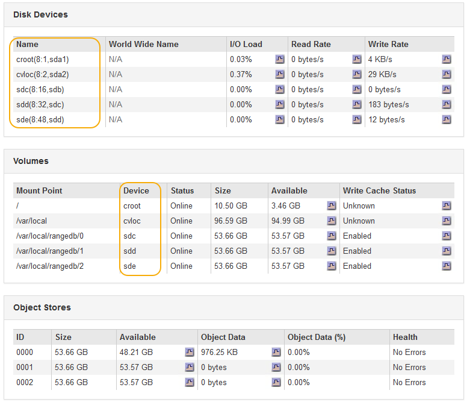

= Add storage volumes to Storage Nodes
:experimental:
:icons: font
:imagesdir: ../media/

[.lead]
You can expand the storage capacity of Storage Nodes that have 16 or fewer storage volumes by adding additional storage volumes. You might need to add storage volumes to more than one Storage Node to satisfy ILM requirements for replicated or erasure-coded copies.

.What you'll need

Before adding storage volumes, review the xref:guidelines-for-adding-object-capacity.adoc[guidelines for adding object capacity] to ensure that you know where to add volumes to meet the requirements of your ILM policy.

NOTE: These instructions apply to software-based Storage Nodes only. See xref:../sg6000/adding-expansion-shelf-to-deployed-sg6060.adoc[Add expansion shelf to deployed SG6060] to learn how to add storage volumes to SG6060 by installing expansion shelves. Other appliance Storage Nodes cannot be expanded.

.About this task

The underlying storage of a Storage Node is divided into a number of storage volumes. Storage volumes are block-based storage devices that are formatted by the StorageGRID system and mounted to store objects. Each Storage Node can support up to 16 storage volumes, which are called _object stores_ in the Grid Manager.

NOTE: Object metadata is always stored in object store 0.

Each object store is mounted on a volume that corresponds to its ID. For example, the object store with an ID of 0000 corresponds to the `/var/local/rangedb/0` mount point.

Before adding new storage volumes, use the Grid Manager to view the current object stores for each Storage Node as well as the corresponding mount points. You can use this information when adding storage volumes.

.Steps

. Select *NODES* > *_site_* > *_Storage Node_* > *Storage*.
. Scroll down to view the amounts of available storage for each volume and object store.
+
For appliance Storage Nodes, the Worldwide Name for each disk matches the volume world-wide identifier (WWID) that appears when you view standard volume properties in SANtricity software (the management software connected to the appliance's storage controller).
+
To help you interpret disk read and write statistics related to volume mount points, the first portion of the name shown in the *Name* column of the Disk Devices table (that is, _sdc_, _sdd_, _sde_, and so on) matches the value shown in the *Device* column of the Volumes table.
+

. Follow the instructions for your platform to add new storage volumes to the Storage Node.

** xref:vmware-adding-storage-volumes-to-storage-node.adoc[VMware: Add storage volumes to Storage Node]

** xref:linux-adding-direct-attached-or-san-volumes-to-storage-node.adoc[Linux: Add direct-attached or SAN volumes to Storage Node]
