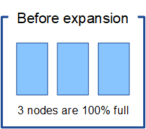
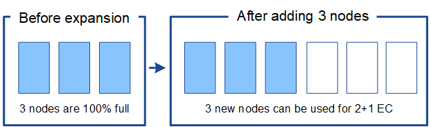
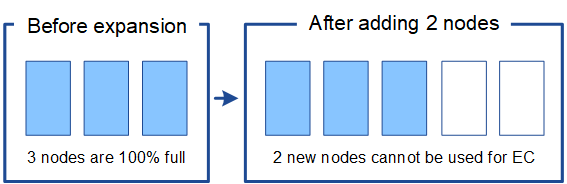
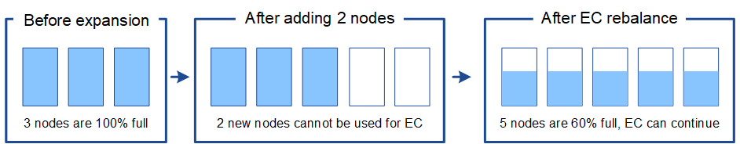

= Considerations for rebalancing erasure-coded data
:icons: font
:imagesdir: ../media/

[.lead]
If you are performing an expansion to add Storage Nodes and your ILM policy includes one or more ILM rules to erasure code data, you might need to perform the EC rebalance procedure after the expansion is complete.

For example, if you cannot add the recommended number of Storage Nodes in an expansion, you might need to run the EC rebalance procedure to allow additional erasure-coded objects to be stored.

== What is EC rebalancing?

EC rebalancing is a StorageGRID procedure that might be required after a Storage Node expansion. The procedure is run as a command-line script from the primary Admin Node. When you run the EC rebalance procedure, StorageGRID redistributes erasure-coded fragments among the existing and the newly expanded Storage Nodes at a site.

When the EC rebalance procedure runs:

* It only moves erasure-coded object data. It does not move replicated object data.
* It redistributes the data within a site. It does not move data between sites.
* It redistributes data among all Storage Nodes at a site. It does not redistribute data within storage volumes.

When the EC rebalance procedure is complete:

* Erasure-coded data is moved from Storage Nodes with less available space to Storage Nodes with more available space.
* Used (%) values might remain different between Storage Nodes because the EC rebalance procedure does not move replicated object copies.
* The data protection of erasure-coded objects will be unchanged.

When the EC rebalance procedure is running, the performance of ILM operations and S3 and Swift client operations are likely to be impacted. For this reason, you should only perform this procedure in limited cases.

== When not to perform an EC rebalance

As an example of when you do not need to perform an EC rebalance, consider the following:

* StorageGRID is running at a single site, which contains three Storage Nodes.
* The ILM policy uses a 2+1 erasure-coding rule for all objects larger than 0.2 MB and a 2-copy replication rule for smaller objects.
* All Storage Nodes have become completely full, and the *Low Object Storage* alert has been triggered at the major severity level. The recommended action is to perform an expansion procedure to add Storage Nodes.
+

To expand the site in this example, it is recommended that you add three or more new Storage Nodes. StorageGRID requires three Storage Nodes for 2+1 erasure coding so that it can place the two data fragments and the one parity fragment on different nodes.

After you add the three Storage Nodes, the original Storage Nodes remain full, but objects can continue to be ingested into the 2+1 erasure coding scheme on the new nodes. Running the EC rebalance procedure is not recommended for this case: running the procedure will temporarily decrease performance, which might impact client operations.

== When to perform an EC rebalance

As an example of when you should perform the EC rebalance procedure, consider the same example, but assume that you can only add two Storage Nodes. Because 2+1 erasure coding requires at least three Storage Nodes, the new nodes cannot be used for erasure-coded data.

To resolve this issue and make use of the new Storage Nodes, you can run the EC rebalance procedure. When this procedure runs, StorageGRID redistributes erasure-coded data and parity fragments among all Storage Nodes at the site. In this example, when the EC rebalance procedure is complete, all five nodes are now only 60% full, and objects can continue to be ingested into the 2+1 erasure coding scheme on all Storage Nodes.

== Considerations for EC rebalancing

In general, you should only run the EC rebalance procedure in limited cases. Specifically, you should perform EC rebalancing only if all of the following statements are true:

* You use erasure coding for your object data.
* The *Low Object Storage* alert has been triggered for one or more Storage Nodes at a site, indicating that the nodes are 80% or more full.
* You are unable to add the recommended number of new Storage Nodes for the erasure-coding scheme in use.
+
xref:adding-storage-capacity-for-erasure-coded-objects.adoc[Adding storage capacity for erasure-coded objects]

* Your S3 and Swift clients can tolerate lower performance for their write and read operations while the EC rebalance procedure is running.

== How the EC rebalance procedure interacts with other maintenance tasks

You cannot perform certain maintenance procedures at the same time you are running the EC rebalance procedure.

[cols="1a,2a" options="header"]

|===
| Procedure| Allowed during EC rebalance procedure?
a|
Additional EC rebalance procedures
a|
No.

You can only run one EC rebalance procedure at a time.
a|
Decommission procedure

EC data repair job

a|
No.

* You are prevented from starting a decommission procedure or an EC data repair while the EC rebalance procedure is running.
* You are prevented from starting the EC rebalance procedure while a Storage Node decommission procedure or an EC data repair is running.

a|
Expansion procedure
a|
No.

If you need to add new Storage Nodes in an expansion, you should wait to run the EC rebalance procedure until after you have added all new nodes. If an EC rebalance procedure is in progress when you add new Storage Nodes, data will not be moved to those nodes.

a|
Upgrade procedure
a|
No.

If you need to upgrade StorageGRID software, you should perform the upgrade procedure before or after running the EC rebalance procedure. As required, you can terminate the EC rebalance procedure to perform a software upgrade.

a|
Appliance node clone procedure
a|
No.

If you need to clone an appliance Storage Node, you should wait to run the EC rebalance procedure until after you have added the new node. If an EC rebalance procedure is in progress when you add new Storage Nodes, data will not be moved to those nodes.

a|
Hotfix procedure
a|
Yes.

You can apply a StorageGRID hotfix while the EC rebalance procedure is running.

a|
Other maintenance procedures
a|
No.

You must terminate the EC rebalance procedure before running other maintenance procedures.

|===

== How the EC rebalance procedure interacts with ILM

While the EC rebalance procedure is running, avoid making ILM changes that might change the location of existing erasure-coded objects. For example, do not start using an ILM rule that has a different Erasure Coding profile. If you need to make such ILM changes, you should abort the EC rebalance procedure.

.Related information

xref:rebalancing-erasure-coded-data-after-adding-storage-nodes.adoc[Rebalancing erasure-coded data after adding Storage Nodes]
