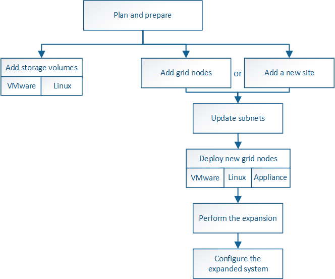

= Overview of expansion procedure
:icons: font
:imagesdir: ../media/

[.lead]
The basic steps for performing a StorageGRID expansion vary for the different types of expansion: adding storage volumes to a Storage Node, adding new nodes to an existing site, or adding a new site. In all cases, you can perform expansions without interrupting the operation of your current system.

The type of node that you are adding to the grid or the reason that you are adding nodes does not affect the basic expansion procedure. But as shown in the workflow diagram below, the steps for adding nodes vary slightly depending on whether you are adding StorageGRID appliances or hosts running VMware or Linux.

NOTE: NetApp-provided virtual machine disk files and scripts for new installations or expansions of StorageGRID on OpenStack are no longer supported. To expand an existing deployment on OpenStack, refer to the steps for your Linux distribution.

NOTE: "`Linux`" refers to a Red Hat® Enterprise Linux®, Ubuntu®, CentOS, or Debian® deployment. Use the NetApp Interoperability Matrix Tool to get a list of supported versions.

*Related information*

https://mysupport.netapp.com/matrix[NetApp Interoperability Matrix Tool^]

xref:planning-expansion.adoc[Planning a StorageGRID expansion]

xref:preparing-for-expansion.adoc[Preparing for an expansion]

xref:adding-storage-volumes-to-storage-nodes.adoc[Adding storage volumes to Storage Nodes]

xref:adding-grid-nodes-to-existing-site-or-adding-new-site.adoc[Adding grid nodes to an existing site or adding a new site]
