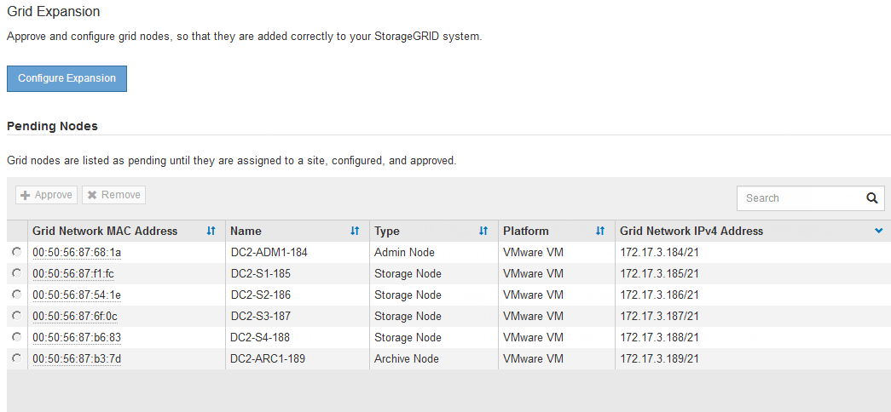
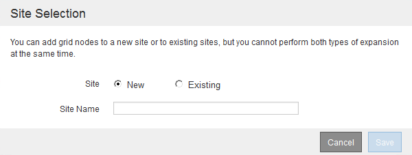
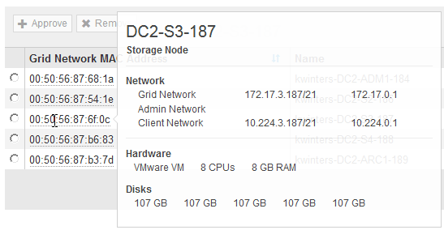
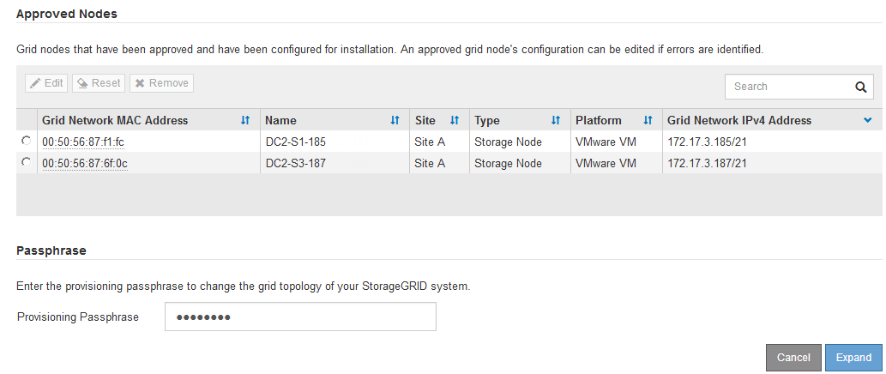
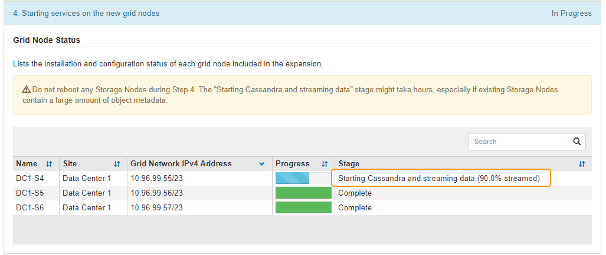

= Perform expansion
:icons: font
:imagesdir: ../media/

[.lead]
When you perform the expansion, the new grid nodes are added to your existing StorageGRID deployment.

.What you'll need

* You are signed in to the Grid Manager using a xref:../admin/web-browser-requirements.adoc[supported web browser].
* You have the Maintenance or Root access permission.
* You have the provisioning passphrase.
* You have deployed all of the grid nodes that are being added in this expansion.
* If you are adding Storage Nodes, you have confirmed that all data-repair operations performed as part of a recovery are complete. See xref:../maintain/checking-data-repair-jobs.adoc[Check data repair jobs].
* If you are adding a new site, you must review and update ILM rules before starting the expansion procedure to ensure that object copies are not stored to the new site until after the expansion is complete. For example, if a rule uses the default storage pool (All Storage Nodes), you must create a new storage pool that contains only the existing Storage Nodes and update the ILM rule to use the new storage pool. Otherwise, objects will be copied to the new site as soon as the first node at that site becomes active. See the instructions for xref:../ilm/index.adoc[managing objects with ILM].

.About this task
Performing the expansion includes these phases:

. You configure the expansion by specifying whether you are adding new grid nodes or a new site and approving the grid nodes you want to add.
. You start the expansion.
. While the expansion process is running, you download a new Recovery Package file.
. You monitor the status of the grid configuration stages, which run automatically. The set of stages depends on what types of grid nodes are being added and on whether a new site is being added.
+
IMPORTANT: Some stages might take a significant amount of time to run on a large grid. For example, streaming Cassandra to a new Storage Node might take only a few minutes if the Cassandra database is empty. However, if the Cassandra database includes a large amount of object metadata, this stage might take several hours or longer. Do not reboot any Storage Nodes during the either the "Expanding the Cassandra cluster" or "Starting Cassandra and streaming data" stages.

.Steps
. Select *MAINTENANCE* > *Tasks* > *Expansion*.
+
The Grid Expansion page appears. The Pending Nodes section lists all nodes that are ready to be added.
+

. Select *Configure Expansion*.
+
The Site Selection dialog box appears.
+

. Select the type of expansion you are starting:
 ** If you are adding a new site, select *New*, and enter the name of the new site.
 ** If you are adding grid nodes to an existing site, select *Existing*.
. Select *Save*.
. Review the *Pending Nodes* list, and confirm that it shows all of the grid nodes you deployed.
+
As required, you can hover your cursor over a node's *Grid Network MAC Address* to see details about that node.
+

+
NOTE: If a grid node is missing, confirm that it was deployed successfully.

. From the list of pending nodes, approve the grid nodes for this expansion.
 .. Select the radio button next to the first pending grid node you want to approve.
 .. Select *Approve*.
+
The grid node configuration form appears.
+
image::../media/grid_node_configuration.gif[Grid Node Configuration form]

 .. As required, modify the general settings:
  *** *Site*: The name of the site the grid node will be associated with. If you are adding multiple nodes, be sure to select the correct site for each node. If you are adding a new site, all nodes are added to the new site.
  *** *Name*: The hostname that will be assigned to the node, and the name that will be displayed in the Grid Manager.
  *** *NTP Role*: The Network Time Protocol (NTP) role of the grid node. The options are *Automatic*, *Primary*, and *Client*. Selecting *Automatic* assigns the Primary role to Admin Nodes, Storage Nodes with ADC services, Gateway Nodes, and any grid nodes that have non-static IP addresses. All other grid nodes are assigned the Client role.
+
NOTE: Assign the Primary NTP role to at least two nodes at each site. This provides redundant system access to external timing sources.

  *** *ADC Service* (Storage Nodes only): Whether this Storage Node will run the Administrative Domain Controller (ADC) service. The ADC service keeps track of the location and availability of grid services. At least three Storage Nodes at each site must include the ADC service. You cannot add the ADC service to a node after it is deployed.
   **** If you are adding this node to replace a Storage Node, select *Yes* if the node you are replacing includes the ADC service. Because you cannot decommission a Storage Node if too few ADC services would remain, this ensures that a new ADC service is available before the old service is removed.
   **** Otherwise, select *Automatic* to let the system determine whether this node requires the ADC service. Learn about the ADC quorum xref:../maintain/understanding-adc-service-quorum.adoc[here].
 .. As required, modify the settings for the Grid Network, Admin Network, and Client Network.
  *** *IPv4 Address (CIDR)*: The CIDR network address for the network interface. For example: 172.16.10.100/24
  *** *Gateway*: The default gateway of the grid node. For example: 172.16.10.1
  *** *Subnets (CIDR)*: One or more subnetworks for the Admin Network.
 .. Select *Save*.
+
The approved grid node moves to the Approved Nodes list.
+

  *** To modify the properties of an approved grid node, select its radio button, and select *Edit*.
  *** To move an approved grid node back to the Pending Nodes list, select its radio button, and select *Reset*.
  *** To permanently remove an approved grid node, power the node off. Then, select its radio button, and select *Remove*.

 .. Repeat these steps for each pending grid node you want to approve.
+
NOTE: If possible, you should approve all pending grid notes and perform a single expansion. More time will be required if you perform multiple small expansions.
. When you have approved all grid nodes, enter the *Provisioning Passphrase*, and select *Expand*.
+
After a few minutes, this page updates to display the status of the expansion procedure. When tasks that affect individual grid node are in progress, the Grid Node Status section lists the current status for each grid node.
+
NOTE: During this process, for appliances the StorageGRID Appliance Installer shows installation moving from Stage 3 to Stage 4, Finalize Installation. When Stage 4 completes, the controller is rebooted.
+
image::../media/grid_expansion_progress.png[This image is explained by the surrounding text.]
+
NOTE: A site expansion includes an additional task to configure Cassandra for the new site.

. As soon as the *Download Recovery Package* link appears, download the Recovery Package file.
+
You must download an updated copy of the Recovery Package file as soon as possible after making grid topology changes to the StorageGRID system. The Recovery Package file allows you to restore the system if a failure occurs.

 .. Select the download link.
 .. Enter the provisioning passphrase, and select *Start Download*.
 .. When the download completes, open the `.zip` file and confirm it includes a `gpt-backup` directory and a `_SAID.zip` file. Then, extract the `_SAID.zip` file, go to the `/GID*_REV*` directory, and confirm you can open the `passwords.txt` file.
 .. Copy the downloaded Recovery Package file (.zip) to two safe, secure, and separate locations.
+
IMPORTANT: The Recovery Package file must be secured because it contains encryption keys and passwords that can be used to obtain data from the StorageGRID system.

. Follow the instructions for adding a Storage Node to an existing site or adding a new site.

[role="tabbed-block"]
====

.Add Storage Node to existing site
--

If you are adding one or more Storage Nodes to an existing site, monitor the progress of the "Starting Cassandra and streaming data" stage by reviewing the percentage shown in the status message.

This percentage estimates how complete the Cassandra streaming operation is, based on the total amount of Cassandra data available and the amount that has already been written to the new node.

IMPORTANT: Do not reboot any Storage Nodes during either the "Expanding the Cassandra cluster" or "Starting Cassandra and streaming data" stages. These stages might take many hours to complete for each new Storage Node, especially if existing Storage Nodes contain a large amount of object metadata.

--

.Add new site
--

If you are adding a new site, use `nodetool status` to monitor the progress of Cassandra streaming and to see how much metadata has been copied to the new site during the "Expanding the Cassandra cluster" stage. The total Data Load on the new site should be within about 20% of the total of a current site.

IMPORTANT: Do not reboot any Storage Nodes during either the "Expanding the Cassandra cluster" or "Starting Cassandra and streaming data" stages. These stages might take many hours to complete for each new Storage Node, especially if existing Storage Nodes contain a large amount of object metadata.

--
====

[start=10]
. Continue monitoring the expansion until all tasks are complete and the *Configure Expansion* button reappears.

.After you finish

Depending on which types of grid nodes you added, you must perform additional integration and configuration steps. See xref:configuring-expanded-storagegrid-system.adoc[Configuration steps after expansion].
