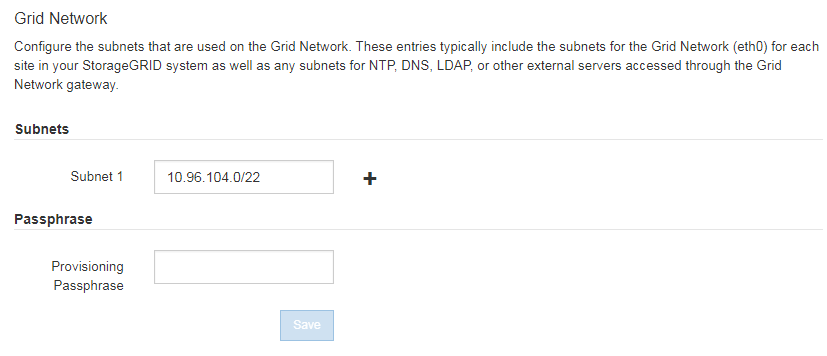

= Update subnets for Grid Network
:icons: font
:imagesdir: ../media/

[.lead]
When you add grid nodes or a new site in an expansion, you might need to update or add subnets to the Grid Network.

StorageGRID maintains a list of the network subnets used to communicate between grid nodes on the Grid Network (eth0). These entries include the subnets used for the Grid Network by each site in your StorageGRID system as well as any subnets used for NTP, DNS, LDAP, or other external servers accessed through the Grid Network gateway.

.What you'll need

* You are signed in to the Grid Manager using a xref:../admin/web-browser-requirements.adoc[supported web browser].
* You have the Maintenance or Root access permission.
* You have the provisioning passphrase.
* You have the network addresses, in CIDR notation, of the subnets you want to configure.

.About this task

If any of the new nodes has a Grid Network IP address on a subnet not previously used, you must add the new subnet to the Grid Network subnet list before starting the expansion. Otherwise, you will have to cancel the expansion, add the new subnet, and start the procedure again.

.Steps

. Select *MAINTENANCE* > *Network* > *Grid Network*.
+

. In the Subnets list, select the plus sign to add a new subnet in CIDR notation.
+
For example, enter 10.96.104.0/22.

. Enter the provisioning passphrase, and select *Save*.
+
The subnets you have specified are configured automatically for your StorageGRID system.
