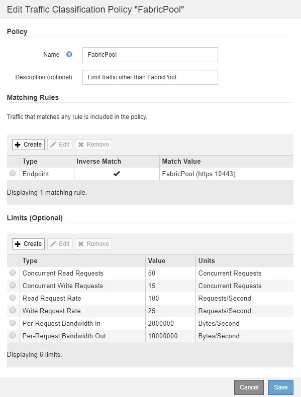
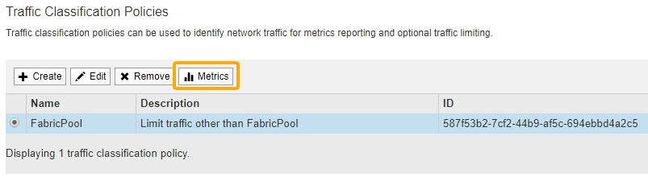

= Create a traffic classification policy for FabricPool
:icons: font
:imagesdir: ../media/

[.lead]
You can optionally design a StorageGRID traffic classification policy to optimize quality of service for the FabricPool workload.

.What you'll need
* You are signed in to the Grid Manager using a xref:../admin/web-browser-requirements.adoc[supported web browser].
* You have the Root Access permission.

.About this task
The best practices for creating a traffic classification policy for FabricPool depend on the workload, as follows:

* If you plan to tier FabricPool primary workload data to StorageGRID, you should ensure that the FabricPool workload has the majority of bandwidth. You can create a traffic classification policy to limit all other workloads.
+
NOTE: In general, FabricPool read operations are more important to prioritize than write operations.
+
For example, if other S3 clients use this StorageGRID system, you should create a traffic classification policy. You can limit network traffic for the other buckets, tenants, IP subnets, or load balancer endpoints.

* As a general rule, you should not impose quality of service limits on any FabricPool workload; you should only limit the other workloads.

* The limits placed on other workloads should account for the behavior of those workloads. The limits imposed will also vary based on the sizing and capabilities of your grid and what the expected amount of utilization is.

To learn more: xref:../admin/managing-traffic-classification-policies.adoc[Manage traffic classification policies]

.Steps
. Select *CONFIGURATION* > *Network* > *Traffic classification*.
. Enter a name and a description.
. In the Matching Rules section, create at least one rule.
 .. Select *Create*.
 .. Select *Endpoint*, and select the load balancer endpoint you created for FabricPool.
+
You can also select the FabricPool tenant account or bucket.

 .. If you want this traffic policy to limit traffic for the other endpoints, select *Inverse Match*.
. Optionally, create one or more limits.
+
NOTE: Even if no limits are set for a traffic classification policy, metrics are collected so you can understand traffic trends.

 .. Select *Create*.
 .. Select the type of traffic you want to limit and the limit to apply.
+
This example FabricPool traffic classification policy shows the types of network traffic you can limit and the types of values you can select. The limits for an actual policy would be based on your specific requirements.
+

. After creating the traffic classification policy, select the policy and then select *Metrics* to determine if the policy is limiting traffic as expected.
+

