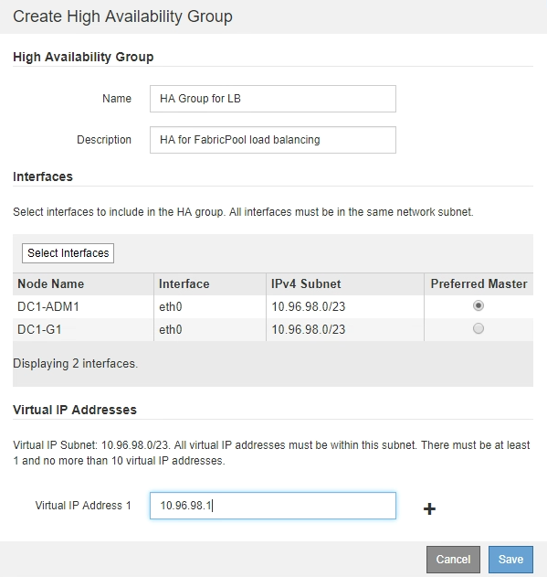

= Creating a high availability (HA) group for FabricPool
:icons: font
:imagesdir: ../media/

[.lead]
When configuring StorageGRID for use with FabricPool, you can optionally create one or more high availability (HA) groups. An HA group consists of one or more network interfaces on Admin Nodes, Gateway Nodes, or both.

.What you'll need
* You must be signed in to the Grid Manager using a supported browser.
* You must have the Root Access permission.

.About this task
Each HA group uses virtual IP addresses (VIPs) to provide highly available access to the shared services on the associated nodes.

For details about this task. see xref:../admin/managing_high_availability_groups.adoc[Managing high availability groups].

.Steps
. Select *Configuration* > *Network Settings* > *High Availability Groups*.
. Select one or more of the network interfaces. The network interfaces must belong to the same subnet on either the Grid Network (eth0) or the Client Network (eth2).
. Assign one node to be the Preferred Master.
+
The preferred Master is the active interface unless a failure occurs that causes the VIP addresses to be reassigned to a Backup interface.

. Enter up to ten IPv4 addresses for the HA group.
+
The addresses must be within the IPv4 subnet shared by all of the member interfaces.
+

