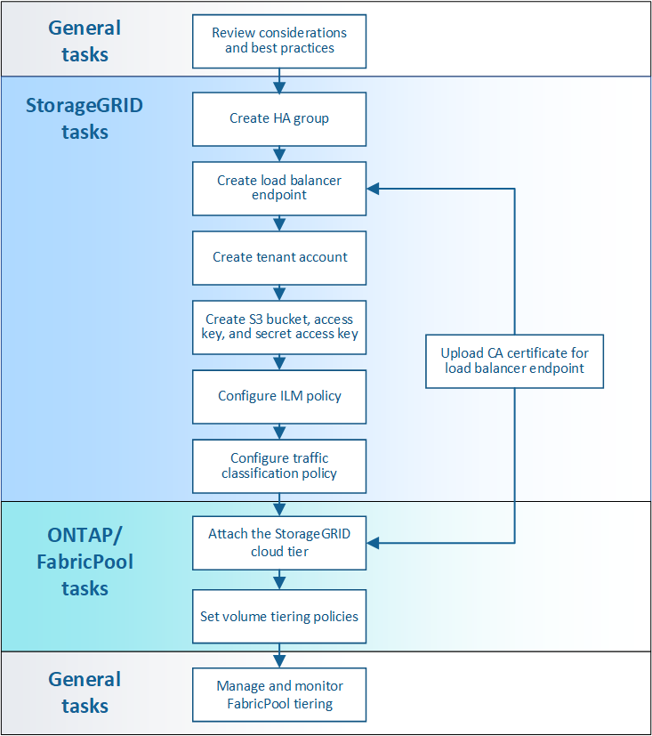

=  Configure StorageGRID for FabricPool: Overview
:icons: font
:imagesdir: ../media/

[.lead]
If you use NetApp ONTAP software, you can use NetApp FabricPool to tier inactive, or cold, data to a NetApp StorageGRID object storage system.

== About these instructions

Use these instructions to:

* Get an overview of configuring a StorageGRID object storage system for use with FabricPool.
* Learn how to obtain the information you provide to ONTAP when you attach StorageGRID as a FabricPool cloud tier.
* Learn the best practices for configuring the StorageGRID information lifecycle management (ILM) policy, a StorageGRID traffic classification policy, and other StorageGRID options for a FabricPool workload.

== Configuration workflow

== Before you start
* Decide which FabricPool volume tiering policy you will use to tier inactive ONTAP data to StorageGRID.
* Plan and install a StorageGRID system to meet your storage capacity and performance needs.
* Become familiar with StorageGRID system software, including the Grid Manager and the Tenant Manager.
* Review these additional resources, which provide details about using and configuring FabricPool:

** https://www.netapp.com/pdf.html?item=/media/17239-tr4598pdf.pdf[TR-4598: FabricPool Best Practices in ONTAP 9.9.1^]
** https://docs.netapp.com/us-en/ontap/index.html[ONTAP 9 Documentation^]

== What is FabricPool?

FabricPool is an ONTAP hybrid storage solution that uses a high-performance flash aggregate as the performance tier and an object store as the cloud tier. Data is stored either on the primary storage media or in the object datastore based on whether it is accessed frequently or not. Using FabricPool-enabled aggregates helps you reduce storage cost without compromising performance, efficiency, or protection.

No architectural changes are required, and you can continue managing your data and application environment from the central ONTAP storage system.

== What is StorageGRID?

StorageGRID is a storage architecture that manages data as objects, as opposed to other storage architectures such as file or block storage. Objects are kept inside a single container (such as a bucket) and are not nested as files inside a directory inside other directories. Although object storage generally provides lower performance than file or block storage, it is significantly more scalable. StorageGRID buckets can hold petabytes of data and billions of objects.

== Why use StorageGRID as a FabricPool cloud tier?
FabricPool can tier ONTAP data to a number of object store providers, including StorageGRID. Unlike public clouds that might set a maximum number of supported input/output operations per second (IOPS) at the bucket or container level, StorageGRID performance scales with the number of nodes in a system. Using StorageGRID as a FabricPool cloud tier allows you to keep your cold data in your own private cloud for highest performance and complete control over your data.

In addition, a FabricPool license is not required when you use StorageGRID as the cloud tier.

== Can I use multiple ONTAP clusters with StorageGRID?

These instructions describe how to connect StorageGRID to a single ONTAP cluster. However, you might want to connect the same StorageGRID system to multiple ONTAP clusters.

The only requirement for tiering data from multiple ONTAP clusters to a single StorageGRID system is that you must use a different S3 bucket for each cluster. Based on your requirements, you can use the same high availability (HA) group, load balancer endpoint, and tenant account for all clusters, or you can configure each of these items for each cluster.
