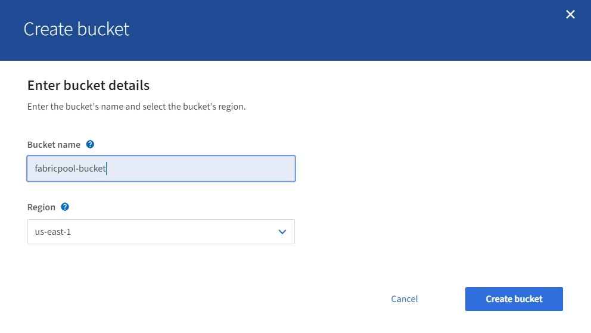

= Creating an S3 bucket and obtaining an access key
:icons: font
:imagesdir: ../media/

[.lead]
Before using StorageGRID with a FabricPool workload, you must create an S3 bucket for your FabricPool data. You also need to obtain an access key and secret access key for the tenant account you will use for FabricPool.

* You must have created a tenant account for FabricPool use.

These instructions describe how to use the StorageGRID Tenant Manager to create a bucket and obtain access keys. You can also perform these tasks using the Tenant Management API or the StorageGRID S3 REST API.

To learn more:

* http://docs.netapp.com/sgws-115/topic/com.netapp.doc.sg-tenant-admin/home.html[Using tenant accounts]
* http://docs.netapp.com/sgws-115/topic/com.netapp.doc.sg-s3/home.html[Implementing S3 client applications]

. Sign in to the Tenant Manager.
+
You can do either of the following:

 ** From the Tenant Accounts page in the Grid Manager, select the *Sign in* link for the tenant, and enter your credentials.
 ** Enter the URL for the tenant account in a web browser, and enter your credentials.

. Create an S3 bucket for FabricPool data.
+
You must create a unique bucket for each ONTAP cluster you plan to use.

 .. Select *STORAGE (S3)* > *Buckets*.
 .. Select *Create bucket*.
 .. The name of the StorageGRID bucket you will use with FabricPool. For example, `fabricpool-bucket`.
+
IMPORTANT: You cannot change the bucket name after creating the bucket.
+
Bucket names must comply with these rules:

  *** Must be unique across each StorageGRID system (not just unique within the tenant account).
  *** Must be DNS compliant.
  *** Must contain at least 3 and no more than 63 characters.
  *** Can be a series of one or more labels, with adjacent labels separated by a period. Each label must start and end with a lowercase letter or a number and can only use lowercase letters, numbers, and hyphens.
  *** Must not look like a text-formatted IP address.
  *** Should not use periods in virtual hosted style requests. Periods will cause problems with server wildcard certificate verification.

 .. Select the region for this bucket.
+
By default, all buckets are created in the `us-east-1` region.
+

 .. Select *Create bucket*.

. Create an access key and a secret access key.
 .. Select *STORAGE (S3)* > *My access keys*.
 .. Select *Create key*.
 .. Select *Create access key*.
 .. Copy the access key ID and the secret access key to a safe location, or select *Download .csv* to save a spreadsheet file containing the access key ID and secret access key.
+
You will enter these values in ONTAP when you configure StorageGRID as a FabricPool cloud tier.
+
IMPORTANT: If you create a new access key and secret access key in the future, remember to update the corresponding values in ONTAP immediately to ensure that ONTAP can store and retrieve data in StorageGRID without interruption.
