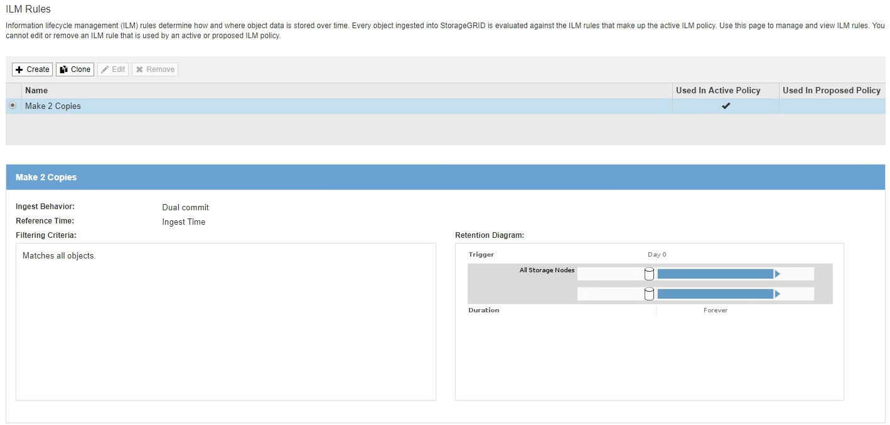

= Access the Create ILM Rule wizard
:icons: font
:imagesdir: ../media/

[.lead]
ILM rules allow you to manage the placement of object data over time. To create an ILM rule, you use the Create ILM Rule wizard.

NOTE: If you are creating the default ILM rule for a policy, use this procedure instead: xref:creating-default-ilm-rule.adoc[Create a default ILM rule].

.What you'll need

* You are signed in to the Grid Manager using a xref:../admin/web-browser-requirements.adoc[supported web browser].
* You have specific access permissions.
* If you want to specify which tenant accounts this rule applies to, you have the Tenant Accounts permission or you know the account ID for each account.
* If you want the rule to filter objects on last access time metadata, Last Access Time updates must be enabled by bucket for S3 or by container for Swift.
* If you are creating replicated copies, you have configured any storage pools or Cloud Storage Pools you plan to use. See xref:creating-storage-pool.adoc[Create storage pool] and xref:creating-cloud-storage-pool.adoc[Create Cloud Storage Pool].
* If you are creating erasure-coded copies, you have configured an Erasure Coding profile. See xref:creating-erasure-coding-profile.adoc[Create an Erasure Coding profile].
* You are familiar with the xref:data-protection-options-for-ingest.adoc[data-protection options for ingest].
* If you need to create a compliant rule for use with S3 Object Lock, you are familiar with the xref:requirements-for-s3-object-lock.adoc[requirements for S3 Object Lock].
* Optionally, you have watched the video: https://netapp.hosted.panopto.com/Panopto/Pages/Viewer.aspx?id=beffbe9b-e95e-4a90-9560-acc5013c93d8[Video: StorageGRID ILM Rules: Getting Started^].
+
image::../media/video-screenshot-ilm-rules.png[link="https://netapp.hosted.panopto.com/Panopto/Pages/Viewer.aspx?id=beffbe9b-e95e-4a90-9560-acc5013c93d8" alt="Video: StorageGRID ILM Rules: Getting Started", window=_blank]

.About this task

When creating ILM rules:

* Consider the StorageGRID system's topology and storage configurations.
* Consider what types of object copies you want to make (replicated or erasure coded) and the number of copies of each object that are required.
* Determine what types of object metadata are used in the applications that connect to the StorageGRID system. ILM rules filter objects based on their metadata.
* Consider where you want object copies to be placed over time.
* Decide which option to use for data protection option at ingest (Balanced, Strict, or Dual commit).

.Steps

. Select *ILM* > *Rules*.
+
The ILM Rules page appears, with the stock rule, Make 2 Copies, selected.
+

+
NOTE: The ILM Rules page looks slightly different if the global S3 Object Lock setting has been enabled for the StorageGRID system. The summary table includes a *Compliant* column, and the details for the selected rule include a *Compliant* field.

. Select *Create*.
+
Step 1 (Define Basics) of the Create ILM Rule wizard appears. You use the Define basics page to define which objects the rule applies to.

