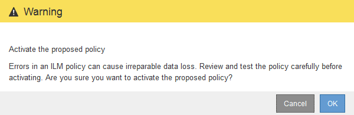
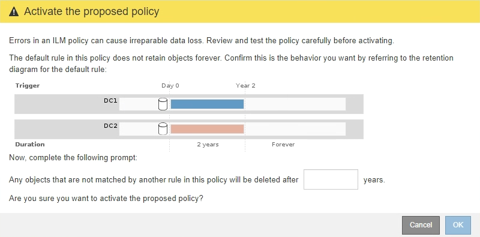
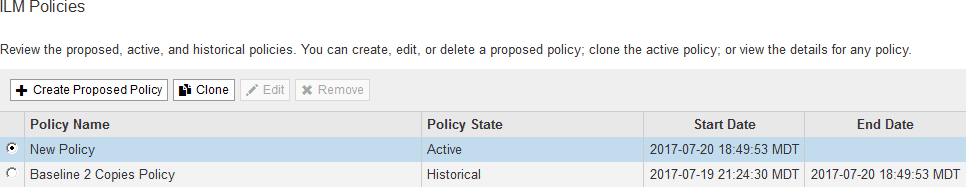

= Activate the ILM policy
:icons: font
:imagesdir: ../media/

[.lead]
After you add ILM rules to a proposed ILM policy, simulate the policy, and confirm it behaves as you expect, you are ready to activate the proposed policy.

.What you'll need

* You are signed in to the Grid Manager using a xref:../admin/web-browser-requirements.adoc[supported web browser].
* You have specific access permissions.
* You have saved and simulated the proposed ILM policy.

CAUTION: Errors in an ILM policy can cause unrecoverable data loss. Carefully review and simulate the policy before activating it to confirm that it will work as intended.

CAUTION: When you activate a new ILM policy, StorageGRID uses it to manage all objects, including existing objects and newly ingested objects. Before activating a new ILM policy, review any changes to the placement of existing replicated and erasure-coded objects. Changing an existing object's location might result in temporary resource issues when the new placements are evaluated and implemented.

.About this task

When you activate an ILM policy, the system distributes the new policy to all nodes. However, the new active policy might not actually take effect until all grid nodes are available to receive the new policy. In some cases, the system waits to implement a new active policy to ensure that grid objects are not accidentally removed.

* If you make policy changes that increase data redundancy or durability, those changes are implemented immediately. For example, if you activate a new policy that includes a three-copies rule instead of a two-copies rule, that policy will be implemented right away because it increases data redundancy.
* If you make policy changes that could decrease data redundancy or durability, those changes will not be implemented until all grid nodes are available. For example, if you activate a new policy that uses a two-copies rule instead of a three-copies rule, the new policy will be marked as "`Active,`" but it will not take effect until all nodes are online and available.

.Steps

. When you are ready to activate a proposed policy, select the policy on the ILM Policies page and select *Activate*.
+
A warning message is displayed, prompting you to confirm that you want to activate the proposed policy.
+

+
A prompt appears in the warning message if the default rule for the policy does not retain objects forever. In this example, the retention diagram shows that the default rule will delete objects after 2 years. You must type *2* in the text box to acknowledge that any objects not matched by another rule in the policy will be removed from StorageGRID after 2 years.
+

. Select *OK*.

.Result

When a new ILM policy has been activated:

* The policy is shown with a Policy State of Active in the table on the ILM Policies page. The Start Date entry indicates the date and time the policy was activated.
+

* The previously active policy is shown with a Policy State of Historical. The Start Date and End Date entries indicate when the policy became active and when it was no longer in effect.

.Related information

xref:example-6-changing-ilm-policy.adoc[Example 6: Changing an ILM policy]
