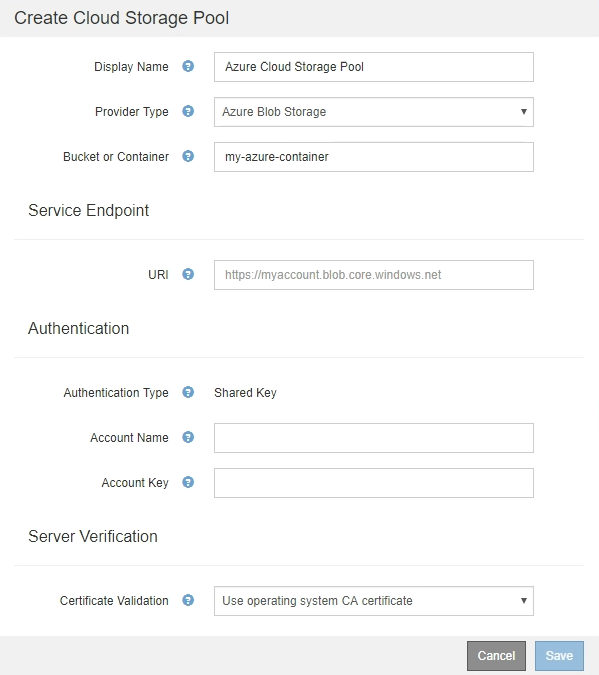

= Azure: Specify authentication details for a Cloud Storage Pool
:icons: font
:imagesdir: ../media/

[.lead]
When you create a Cloud Storage Pool for Azure Blob storage, you must specify an account name and account key for the external container that StorageGRID will use to store objects.

.What you'll need
* You have entered the basic information for the Cloud Storage Pool and specified *Azure Blob Storage* as the provider type. *Shared Key* appears in the *Authentication Type* field.
+

* You know the Uniform Resource Identifier (URI) used to access the Blob storage container used for the Cloud Storage Pool.
* You know the name of the storage account and the secret key. You can use the Azure portal to find these values.

.Steps
. In the *Service Endpoint* section, enter the Uniform Resource Identifier (URI) used to access the Blob storage container used for the Cloud Storage Pool.
+
Specify the URI in one of the following formats:

 ** `+https://host:port+`
 ** `+http://host:port+`

+
If you do not specify a port, by default port 443 is used for HTTPS URIs and port 80 is used for HTTP URIs.
 +
 +
*Example URI for Azure Blob storage container*:
 +
`https://_myaccount_.blob.core.windows.net`

. In the *Authentication* section, provide the following information:
 .. For *Account Name*, enter the name of the Blob storage account that owns the external service container.
 .. For *Account Key*, enter the secret key for the Blob storage account.

+
NOTE: For Azure endpoints, you must use Shared Key authentication.

. In the *Server Verification* section, select which method should be used to validate the certificate for TLS connections to the Cloud Storage Pool:
+
[cols="1a,2a" options="header"]
|===
|Option |Description
    a|
Use operating system CA certificate
a|
Use the Grid CA certificates installed on the operating system to secure connections.
a|
Use custom CA certificate
a|
Use a custom CA certificate. Select *Select New*, and upload the PEM-encoded certificate.
a|
Do not verify certificate
a|
The certificate used for the TLS connection is not verified.
|===

. Select *Save*.

When you save a Cloud Storage Pool, StorageGRID does the following:

 ** Validates that the container and the URI exist and that they can be reached using the credentials that you specified.
 ** Writes a marker file to the container to identify it as a Cloud Storage Pool. Never remove this file, which is named `x-ntap-sgws-cloud-pool-uuid`.

If Cloud Storage Pool validation fails, you receive an error message that explains why validation failed. For example, an error might be reported if there is a certificate error or if the container you specified does not already exist.

See the instructions for xref:troubleshooting-cloud-storage-pools.adoc[troubleshooting Cloud Storage Pools], resolve the issue, and then try saving the Cloud Storage Pool again.

