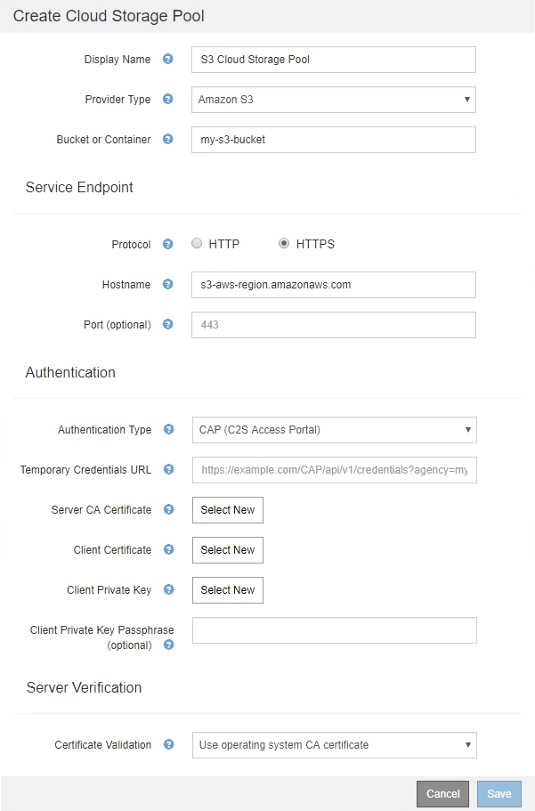
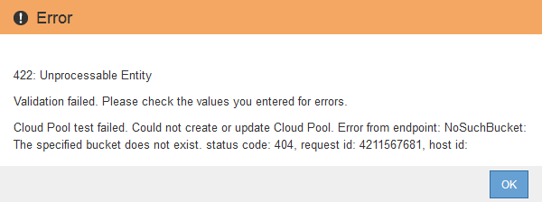

= C2S S3: Specifying authentication details for a Cloud Storage Pool
:icons: font
:imagesdir: ../media/

[.lead]
To use the Commercial Cloud Services (C2S) S3 service as a Cloud Storage Pool, you must configure C2S Access Portal (CAP) as the authentication type, so that StorageGRID can request temporary credentials to access the S3 bucket in your C2S account.

.What you'll need

* You must have entered the basic information for an Amazon S3 Cloud Storage Pool, including the service endpoint.
* You must know the complete URL that StorageGRID will use to obtain temporary credentials from the CAP server, including all the required and optional API parameters assigned to your C2S account.
* You must have a server CA certificate issued by an appropriate Government Certificate Authority (CA). StorageGRID uses this certificate to verify the identity of the CAP server. The server CA certificate must use PEM encoding.
* You must have a client certificate issued by an appropriate Government Certificate Authority (CA). StorageGRID uses this certificate to identity itself to the CAP server. The client certificate must use PEM encoding and must have been granted access to your C2S account.
* You must have a PEM-encoded private key for the client certificate.
* If the private key for the client certificate is encrypted, you must have the passphrase for decrypting it.

.Steps
. In the *Authentication* section, select *CAP (C2S Access Portal)* from the *Authentication Type* drop-down.
+
The CAP C2S authentication fields appear.
+

. Provide the following information:
 .. For *Temporary Credentials URL*, enter the complete URL that StorageGRID will use to obtain temporary credentials from the CAP server, including all the required and optional API parameters assigned to your C2S account.
 .. For *Server CA Certificate*, click *Select New*, and upload the PEM-encoded CA certificate that StorageGRID will use to verify the CAP server.
 .. For *Client Certificate*, click *Select New*, and upload the PEM-encoded certificate that StorageGRID will use to identify itself to the CAP server.
 .. For *Client Private Key*, click *Select New*, and upload the PEM-encoded private key for the client certificate.
+
If the private key is encrypted, the traditional format must be used. (PKCS #8 encrypted format is not supported.)

 .. If the client private key is encrypted, enter the passphrase for decrypting the client private key. Otherwise, leave the *Client Private Key Passphrase* field blank.
. In the Server Verification section, provide the following information:
 .. For *Certificate Validation*, select *Use custom CA certificate*.
 .. Click *Select New*, and upload the PEM-encoded CA certificate.
. Click *Save*.

When you save a Cloud Storage Pool, StorageGRID does the following:

 ** Validates that the bucket and the service endpoint exist and that they can be reached using the credentials that you specified.
 ** Writes a marker file to the bucket to identify the bucket as a Cloud Storage Pool. Never remove this file, which is named `x-ntap-sgws-cloud-pool-uuid`.

If Cloud Storage Pool validation fails, you receive an error message that explains why validation failed. For example, an error might be reported if there is a certificate error or if the bucket you specified does not already exist.

See the instructions for troubleshooting Cloud Storage Pools, resolve the issue, and then try saving the Cloud Storage Pool again.

.Related information

xref:troubleshooting-cloud-storage-pools.adoc[Troubleshooting Cloud Storage Pools]
