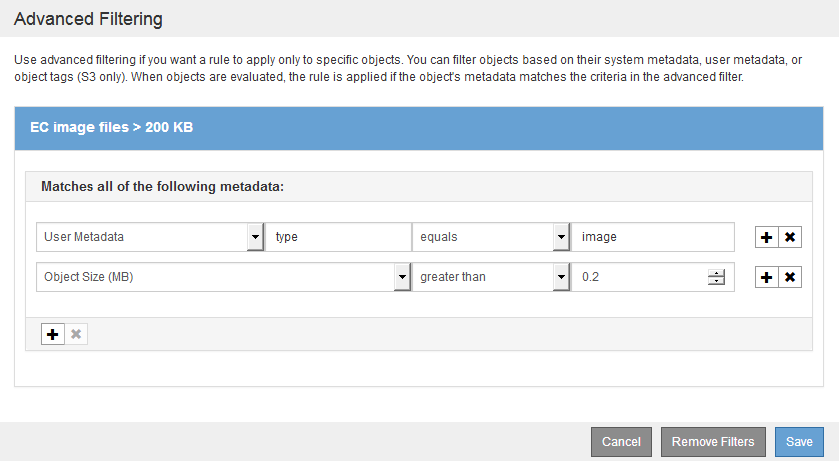
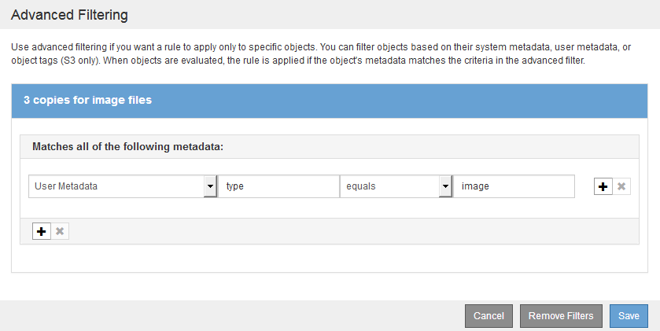
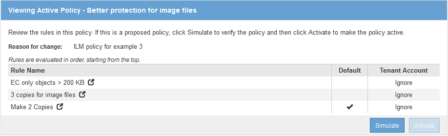

= Example 3: ILM rules and policy for better protection for image files
:icons: font
:imagesdir: ../media/

[.lead]
You can use the following example rules and policy to ensure that images larger than 200 KB are erasure coded and that three copies are made of smaller images.

CAUTION:

The following ILM rules and policy are only examples. There are many ways to configure ILM rules. Before activating a new policy, simulate the proposed policy to confirm it will work as intended to protect content from loss.

== ILM rule 1 for example 3: Use EC for image files larger than 200 KB

[.lead]
This example ILM rule uses advanced filtering to erasure code all image files larger than 200 KB.

|===
| Rule definition| Example value
a|
Rule Name
a|
EC image files > 200 KB
a|
Reference Time
a|
Ingest Time
a|
Advanced Filtering for User Metadata
a|
User Metadata type equals image files
a|
Advanced Filtering for Object Size
a|
Object Size (MB) greater than 0.2
a|
Content Placement
a|
Create a 2+1 erasure-coded copy using three sites
|===

Because this rule is configured as the first rule in the policy, the erasure-coding placement instruction only applies to images that are larger than 200 KB.

image::../media/policy_2_rule_1_ec_objects_placements.png[ILM rule 1 for example 3: Use EC for image files larger than 200 KB]

== ILM rule 2 for example 3: Replicate 3 copies for all remaining image files

[.lead]
This example ILM rule uses advanced filtering to specify that image files be replicated.

|===
| Rule definition| Example value
a|
Rule Name
a|
3 copies for image files
a|
Reference Time
a|
Ingest Time
a|
Advanced Filtering for User Metadata
a|
User Metadata type equals image files
a|
Content Placement
a|
Create 3 replicated copies in all Storage Nodes
|===

Because the first rule in the policy has already matched image files larger than 200 KB, these placement instructions only apply to image files 200 KB or smaller.

== ILM policy for example 3: Better protection for image files

[.lead]
In this example, the ILM policy uses three ILM rules to create a policy that erasure codes image files larger than 200 KB (0.2 MB), creates replicated copies for image files 200 KB or smaller, and makes two replicated copies for any non-image files.

This example ILM policy includes rules that perform the following:

* Erasure code all image files larger than 200 KB.
* Create three copies of any remaining image files (that is, images that are 200 KB or smaller).
* Apply the default rule to any remaining objects (that is, all non-image files).

