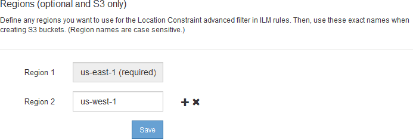

= Configure regions (optional and S3 only)
:icons: font
:imagesdir: ../media/

[.lead]
ILM rules can filter objects based on the regions where S3 buckets are created, allowing you to store objects from different regions in different storage locations. If you want to use an S3 bucket region as a filter in a rule, you must first create the regions that can be used by the buckets in your system.

.What you'll need
* You are signed in to the Grid Manager using a xref:../admin/web-browser-requirements.adoc[supported web browser].
* You have specific access permissions.

.About this task

When creating an S3 bucket, you can specify that the bucket be created in a specific region. Specifying a region allows the bucket to be geographically close to its users, which can help optimize latency, minimize costs, and address regulatory requirements.

When you create an ILM rule, you might want to use the region associated with an S3 bucket as an advanced filter. For example, you can design a rule that applies only to objects in S3 buckets created in the us-west-2 region. You can then specify that copies of those objects be placed on Storage Nodes at a data center site within that region to optimize latency.

When configuring regions, follow these guidelines:

* By default, all buckets are considered to belong to the us-east-1 region.
* You must create the regions using the Grid Manager before you can specify a non-default region when creating buckets using the Tenant Manager or Tenant Management API or with the LocationConstraint request element for S3 PUT Bucket API requests. An error occurs if a PUT Bucket request uses a region that has not been defined in StorageGRID.
* You must use the exact region name when you create the S3 bucket. Region names are case sensitive and must contain at least 2 and no more than 32 characters. Valid characters are numbers, letters, and hyphens.
+
NOTE: EU is not considered to be an alias for eu-west-1. If you want to use the EU or eu-west-1 region, you must use the exact name.

* You cannot delete or modify a region if it is currently used within the active ILM policy or the proposed ILM policy.
* If the region used as the advanced filter in an ILM rule is invalid, it is still possible to add that rule to the proposed policy. However, an error occurs if you attempt to save or activate the proposed policy. (An invalid region can result if you use a region as an advanced filter in an ILM rule but you later delete that region, or if you use the Grid Management API to create a rule and specify a region that you have not defined.)
* If you delete a region after using it to create an S3 bucket, you will need to re-add the region if you ever want to use the Location Constraint advanced filter to find objects in that bucket.

.Steps

. Select *ILM* > *Regions*.
+
The Regions page appears, with the currently defined regions listed. *Region 1* shows the default region, `us-east-1`, which cannot be modified or removed.
+

. To add a region:
 .. Select the insert icon image:../media/icon_plus_sign_black_on_white.gif[insert icon] to the right of the last entry.
 .. Enter the name of a region that you want to use when creating S3 buckets.
+
You must use this exact region name as the LocationConstraint request element when you create the corresponding S3 bucket.
. To remove an unused region, select the delete icon image:../media/icon_nms_delete_new.gif[delete icon].
+
An error message appears if you attempt to remove a region that is currently used in the active policy or the proposed policy.
+
image::../media/ilm_regions_error_message.gif[Message if region can't be deleted]

. When you are done making changes, select *Save*.
+
You can now select these regions from the *Location Constraint* list on the Advanced Filtering page of the Create ILM rule wizard. See 
xref:using-advanced-filters-in-ilm-rules.adoc[Use advanced filters in ILM rules].
