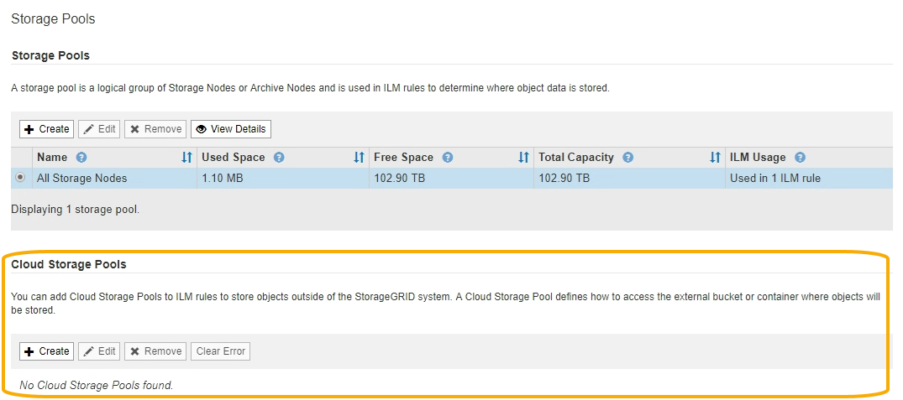
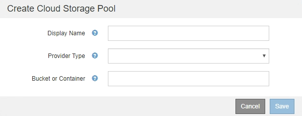

= Create a Cloud Storage Pool
:icons: font
:imagesdir: ../media/

[.lead]
When you create a Cloud Storage Pool, you specify the name and location of the external bucket or container that StorageGRID will use to store objects, the cloud provider type (Amazon S3 or Azure Blob Storage), and the information StorageGRID needs to access the external bucket or container.

.What you'll need
* You are signed in to the Grid Manager using a xref:../admin/web-browser-requirements.adoc[supported web browser].
* You have specific access permissions.
* You have reviewed the guidelines for configuring Cloud Storage Pools.
* The external bucket or container referenced by the Cloud Storage Pool already exists.
* You have all of the authentication information needed to access the bucket or container.

.About this task
A Cloud Storage Pool specifies a single external S3 bucket or Azure Blob storage container. StorageGRID validates the Cloud Storage Pool as soon as you save it, so you must ensure that the bucket or container specified in the Cloud Storage Pool exists and is reachable.

.Steps
. Select *ILM* > *Storage pools*.
+
The Storage Pools page appears. This page includes two sections: Storage Pools and Cloud Storage Pools.
+

. In the Cloud Storage Pools section of the page, select *Create*.
+
The Create Cloud Storage Pool dialog box appears.
+

. Enter the following information:
+
[cols="1a,2a" options="header"]
|===
| Field| Description
a|
Display Name
a|
A name that briefly describes the Cloud Storage Pool and its purpose. Use a name that will be easy to identify when you configure ILM rules.
a|
Provider Type
a|
Which cloud provider you will use for this Cloud Storage Pool:

 ** *Amazon S3*: Select this option for an S3, C2S S3, or Google Cloud Platform (GCP) endpoint. 
 ** *Azure Blob Storage*

*Note:* When you select a Provider Type, the Service Endpoint, Authentication and Server Verification sections appear at the bottom on the page.

a|
Bucket or Container
a|
The name of the external S3 bucket or Azure container that was created for the Cloud Storage Pool. The name you specify here must exactly match the bucket or container's name or Cloud Storage Pool creation will fail. You cannot change this value after the Cloud Storage Pool is saved.
|===

. Complete the Service Endpoint, Authentication and Server Verification sections of the page, based on the selected provider type.

* xref:s3-authentication-details-for-cloud-storage-pool.adoc[S3: Specify authentication details for a Cloud Storage Pool]
* xref:c2s-s3-authentication-details-for-cloud-storage-pool.adoc[C2S S3: Specify authentication details for a Cloud Storage Pool]
* xref:azure-authentication-details-for-cloud-storage-pool.adoc[Azure: Specify authentication details for a Cloud Storage Pool]
