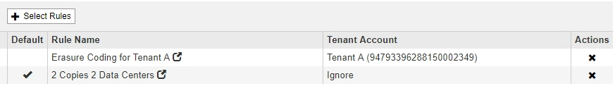

= Create a default ILM rule
:icons: font
:imagesdir: ../media/

[.lead]
Before creating an ILM policy, you must create a default rule to place any objects not matched by another rule in the policy. The default rule cannot use any filters. It must apply to all tenants, all buckets, and all object versions.

.What you'll need
* You are signed in to the Grid Manager using a xref:../admin/web-browser-requirements.adoc[supported web browser].
* You have specific access permissions.

.About this task
The default rule is the last rule to be evaluated in an ILM policy, so it cannot use any filters or the Noncurrent reference time. The placement instructions for the default rule are applied to any objects that are not matched by another rule in the policy.

In this example policy, the first rule applies only to objects belonging to Tenant A. The default rule, which is last, applies to objects belonging to all other tenant accounts.

When you create the default rule, keep these requirements in mind:

* The default rule is automatically placed as the last rule in the policy.
* The default rule cannot use any basic or advanced filters.
* The default rule must apply to all object versions, so it cannot use the Noncurrent Time reference time.
* The default rule should create replicated copies.
+
IMPORTANT: Do not use a rule that creates erasure-coded copies as the default rule for a policy. Erasure-coding rules should use an advanced filter to prevent smaller objects from being erasure coded.

* In general, the default rule should retain objects forever.
* If you are using (or you plan to enable) the global S3 Object Lock setting, the default rule for the active or proposed policy must be compliant.

.Steps

. Select *ILM* > *Rules*.
+
The ILM Rules page appears.

. Select *Create*.
+
Step 1 (Define Basics) of the Create ILM Rule wizard appears.

. Enter a unique name for the rule in the *Name* field.
. Optionally, enter a short description for the rule in the *Description* field.
. Leave the *Tenant Accounts* field blank.
+
The default rule must apply to all tenant accounts.

. Leave the *Bucket Name* field blank.
+
The default rule must apply to all S3 buckets and Swift containers.

. Do not select *Advanced filtering*
+
The default rule cannot specify any filters.

. Select *Next*.
+
Step 2 (Define Placements) appears.

. For Reference Time, select any option except *Noncurrent Time*.
+
The default rule must apply all object versions.

. Specify the placement instructions for the default rule.
 * The default rule should retain objects forever. A warning appears when you activate a new policy if the default rule does not retain objects forever. You must confirm this is the behavior you expect.
 * The default rule should create replicated copies.
+
IMPORTANT: Do not use a rule that creates erasure-coded copies as the default rule for a policy. Erasure-coding rules should include the *Object Size (MB) greater than 0.2* advanced filter to prevent smaller objects from being erasure coded.

 * If you are using (or you plan to enable) the global S3 Object Lock setting, the default rule must be compliant:
  ** It must create at least two replicated object copies or one erasure-coded copy.
  ** These copies must exist on Storage Nodes for the entire duration of each line in the placement instructions.
  ** Object copies cannot be saved in a Cloud Storage Pool.
  ** Object copies cannot be saved on Archive Nodes.
  ** At least one line of the placement instructions must start at day 0, using Ingest Time as the reference time.
  ** At least one line of the placement instructions must be "`forever.`"
. Select *Refresh* to update the Retention Diagram and to confirm your placement instructions.
. Select *Next*.
+
Step 3 (Define Ingest Behavior) appears.

. Select the data protection option to use when objects are ingested, and select *Save*.
