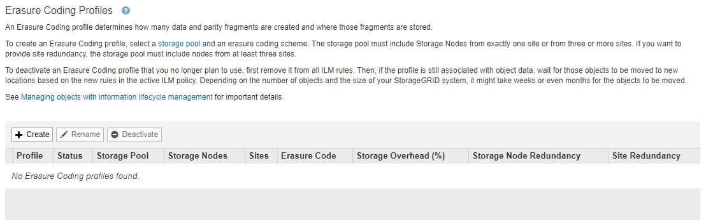
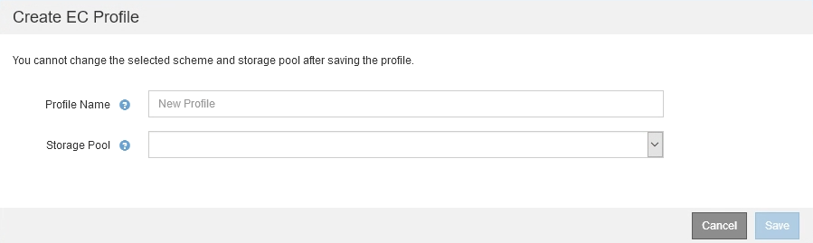
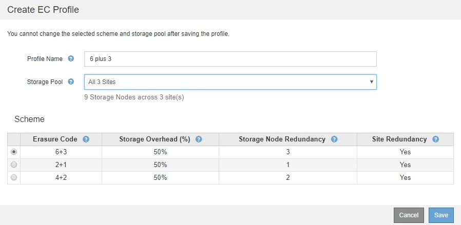
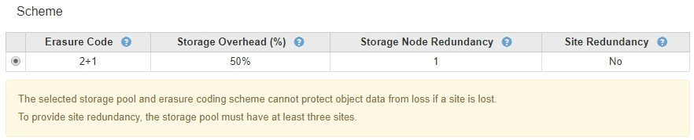
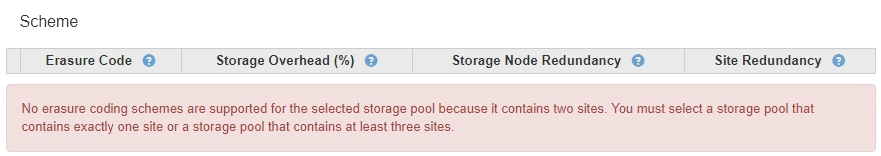
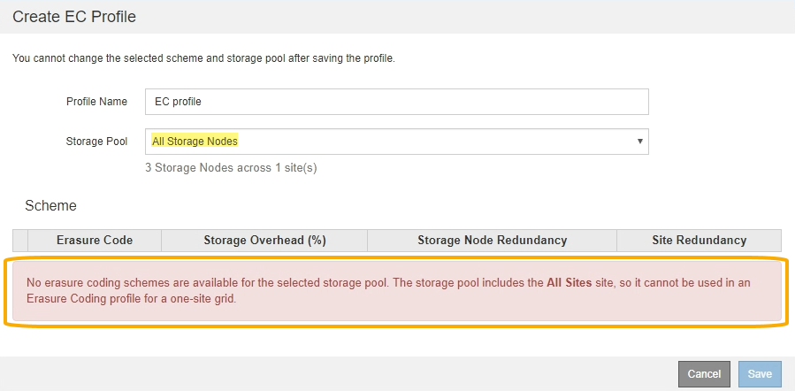
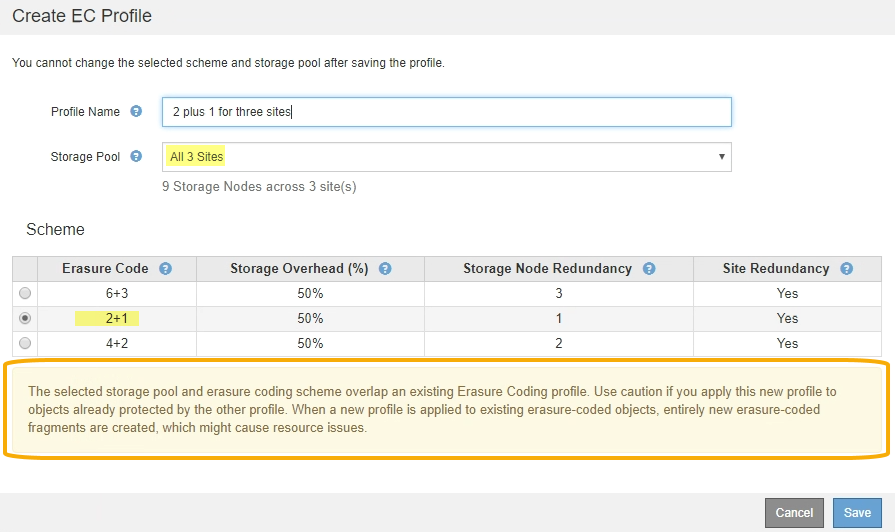

= Create an Erasure Coding profile
:icons: font
:imagesdir: ../media/

[.lead]
To create an Erasure Coding profile, you associate a storage pool containing Storage Nodes with an erasure-coding scheme. This association determines the number of data and parity fragments created and where the system distributes these fragments.

.What you'll need

* You are signed in to the Grid Manager using a xref:../admin/web-browser-requirements.adoc[supported web browser].
* You have specific access permissions.
* You have created a storage pool that includes exactly one site or a storage pool that includes three or more sites. No erasure-coding schemes are available for a storage pool that has only two sites.

.About this task
The storage pools used in Erasure Coding profiles must include exactly one site or three or more sites. If you want to provide site redundancy, the storage pool must have at least three sites.

NOTE: You must select a storage pool that contains Storage Nodes. You cannot use Archive Nodes for erasure-coded data.

.Steps

. Select *ILM* > *Erasure coding*.
+
The Erasure Coding Profiles page appears.
+

. Select *Create*.
+
The Create EC Profile dialog box appears.
+

. Enter a unique name for the Erasure Coding profile.
+
Erasure Coding profile names must be unique. A validation error occurs if you use the name of an existing profile, even if that profile has been deactivated.
+
NOTE: The Erasure Coding profile name is appended to the storage pool name in the placement instruction for an ILM rule.
+
image::../media/storage_pool_and_erasure_coding_profile.png[Storage pool and EC profile name]

. Select the storage pool you created for this Erasure Coding profile.
+
NOTE: If your grid currently includes only one site, you are prevented from using the default storage pool, All Storage Nodes, or any storage pool that includes the default site, All Sites. This behavior prevents the Erasure Coding profile from becoming invalid if a second site is added.
+
NOTE: If a storage pool includes exactly two sites, you cannot use that storage pool for erasure coding. No erasure-coding schemes are available for a storage pool that has two sites.
+
When you select a storage pool, the list of available erasure-coding schemes is shown, based on the number of Storage Nodes and sites in the pool.
+

+
The following information is listed for each available erasure-coding scheme:

 ** *Erasure Code*: The name of the erasure-coding scheme in the following format: data fragments + parity fragments.
 ** *Storage Overhead (%)*: The additional storage required for parity fragments relative to the object's data size. Storage Overhead = Total number of parity fragments / Total number of data fragments.
 ** *Storage Node Redundancy*: The number of Storage Nodes that can be lost while still maintaining the ability to retrieve object data.
 ** *Site Redundancy*: Whether the selected erasure code allows the object data to be retrieved if a site is lost.
+
To support site redundancy, the selected storage pool must include multiple sites, each with enough Storage Nodes to allow any site to be lost. For example, to support site redundancy using a 6+3 erasure-coding scheme, the selected storage pool must include at least three sites with at least three Storage Nodes at each site.

+
Messages are displayed in these cases:

 ** The storage pool you selected does not provide site redundancy. The following message is expected when the selected storage pool includes only one site. You can use this Erasure Coding profile in ILM rules to protect against node failures.
+

 ** The storage pool you selected does not satisfy the requirements for any erasure-coding scheme. For example, the following message is expected when the selected storage pool includes exactly two sites. If you want to use erasure coding to protect object data, you must select a storage pool with exactly one site or a storage pool with three or more sites.
+

 ** Your grid includes only one site and you selected the default storage pool, All Storage Nodes, or any storage pool that includes the default site, All Sites.
+

 ** The erasure-coding scheme and storage pool you selected overlap with another Erasure Coding profile.
+

+
In this example, a warning message appears because another Erasure Coding profile is using the 2+1 scheme and the storage pool for the other profile also uses one of the sites in the All 3 Sites storage pool.
+
While you are not prevented from creating this new profile, you must be very careful when you start using it in the ILM policy. If this new profile is applied to existing erasure-coded objects already protected by the other profile, StorageGRID will create an entirely new set of object fragments. It will not reuse the existing 2+1 fragments. Resource issues might occur when you migrate from one Erasure Coding profile to the other, even though the erasure-coding schemes are the same.

. If more than one erasure-coding scheme is listed, select the one you want to use.
+
When deciding which erasure-coding scheme to use, you should balance fault tolerance (achieved by having more parity segments) against the network traffic requirements for repairs (more fragments equals more network traffic). For example, when deciding between a 4+2 scheme and 6+3 scheme, select the 6+3 scheme if additional parity and fault tolerance are required. Select the 4+2 scheme if network resources are constrained to reduce network usage during node repairs.

. Select *Save*.
