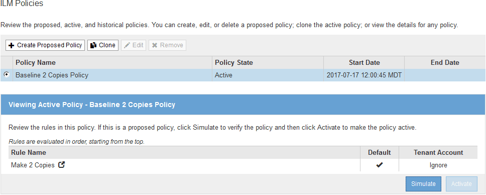
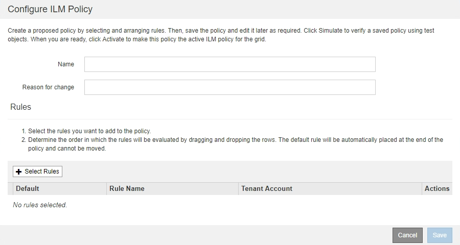
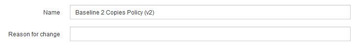
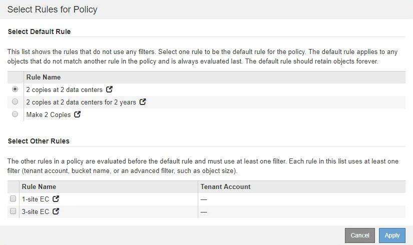
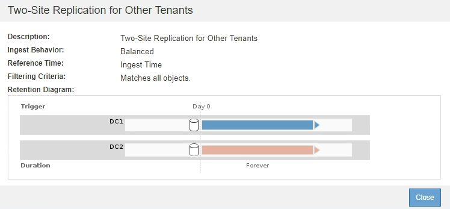
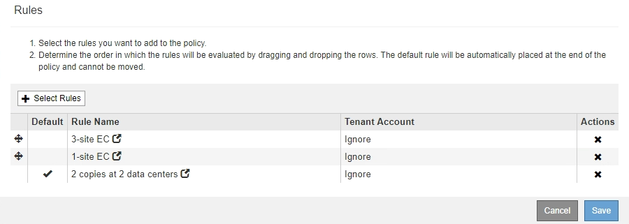
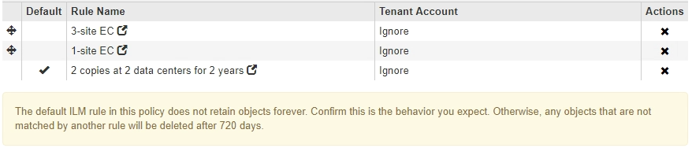
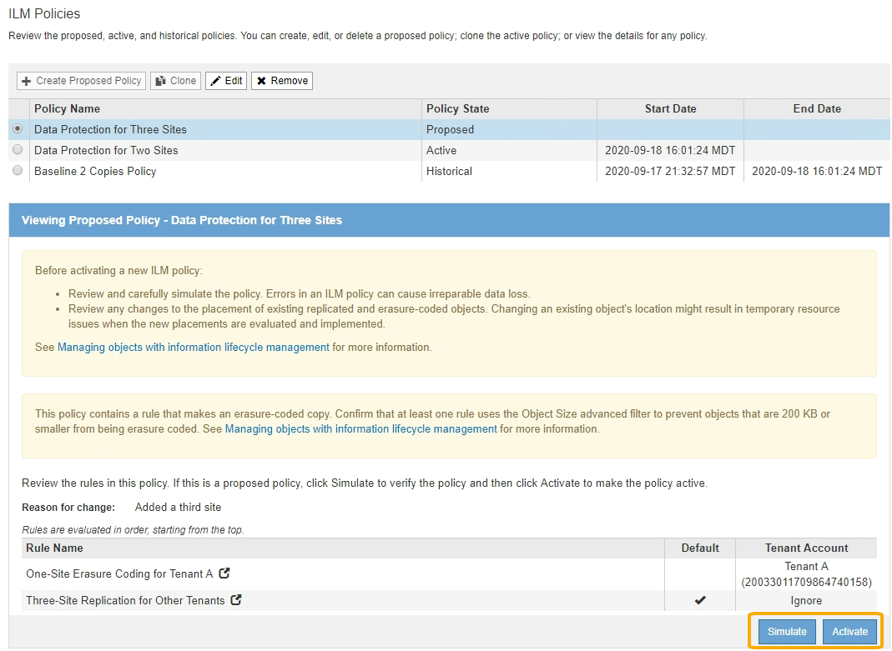

= Create a proposed ILM policy
:icons: font
:imagesdir: ../media/

[.lead]
You can create a proposed ILM policy from scratch, or you can clone the current active policy if you want to start with the same set of rules.

NOTE: If the global S3 Object Lock setting has been enabled, use this procedure instead: xref:creating-ilm-policy-after-s3-object-lock-is-enabled.adoc[Create an ILM policy after S3 Object Lock is enabled].

.What you'll need

* You are signed in to the Grid Manager using a xref:../admin/web-browser-requirements.adoc[supported web browser].
* You have specific access permissions.
* You have created the ILM rules you want to add to the proposed policy. As required, you can save a proposed policy, create additional rules, and then edit the proposed policy to add the new rules.
* You have xref:creating-default-ilm-rule.adoc[created a default ILM rule] for the policy that does not contain any filters.

* Optionally, you have watched the video: https://netapp.hosted.panopto.com/Panopto/Pages/Viewer.aspx?id=c929e94e-353a-4375-b112-acc5013c81c7[Video: StorageGRID ILM Policies^]
+
image::../media/video-screenshot-ilm-policies.png[link="https://netapp.hosted.panopto.com/Panopto/Pages/Viewer.aspx?id=c929e94e-353a-4375-b112-acc5013c81c7" alt="Video: StorageGRID ILM Policies", window=_blank]

.About this task

Typical reasons for creating a proposed ILM policy include:

* You added a new site and need to use new ILM rules to place objects at that site.
* You are decommissioning a site and you need to remove all rules that refer to the site.
* You added a new tenant that has special data protection requirements.
* You started to use a Cloud Storage Pool.

IMPORTANT: Use the system's built-in policy, Baseline 2 Copies Policy, in test systems only. The Make 2 Copies rule in this policy uses the All Storage Nodes storage pool, which contains all sites. If your StorageGRID system has more than one site, two copies of an object might be placed on the same site.

.Steps
. Select *ILM* > *Policies*.
+
The ILM Policies page appears. From this page, you can review the list of proposed, active, and historical policies; create, edit, or remove a proposed policy; clone the active policy; or view the details for any policy.
+

. Determine how you want to create the proposed ILM policy.
+
[cols="1a,2a" options="header"]
|===
| Option| Steps
a|
Create a new proposed policy that has no rules already selected
a|

 .. If a proposed ILM policy currently exists, select that policy, and select *Remove*.
+
You cannot create a new proposed policy if a proposed policy already exists.

 .. Select *Create Proposed Policy*.

a|
Create a proposed policy based on the active policy
a|

 .. If a proposed ILM policy currently exists, select that policy, and select *Remove*.
+
You cannot clone the active policy if a proposed policy already exists.

 .. Select the active policy from the table.
 .. Select *Clone*.

a|
Edit the existing proposed policy
a|

 .. Select the proposed policy from the table.
 .. Select *Edit*.

+
|===
The Configure ILM Policy dialog box appears.
+
If you are creating a new proposed policy, all fields are blank and no rules are selected.
+

+
If you are cloning the active policy, the *Name* field shows the name of the active policy, appended by a version number ("`v2`" in the example). The rules used in the active policy are selected and shown in their current order.
+

. Enter a unique name for the proposed policy in the *Name* field.
+
You must enter at least 1 and no more than 64 characters. If you are cloning the active policy, you can use the current name with the appended version number or you can enter a new name.

. Enter the reason you are creating a new proposed policy in the *Reason for change* field.
+
You must enter at least 1 and no more than 128 characters.

. To add rules to the policy, select *Select Rules*.
+
The Select Rules for Policy dialog box appears, with all defined rules listed. If you are cloning a policy:

 * The rules used by the policy you are cloning are selected.
 * If the policy you are cloning used any rules with no filters that were not the default rule, you are prompted to remove all but one of those rules.
 * If the default rule used a filter or the Noncurrent reference time, you are prompted to select a new default rule.
 * If the default rule was not the last rule, a button allows you to move the rule to the end of the new policy.
+

. Select a rule name or the more details icon  to view the settings for that rule.
+
This example shows the details of an ILM rule that makes two replicated copies at two sites.
+

. In the *Select Default Rule* section, select one default rule for the proposed policy.
+
The default rule applies to any objects that do not match another rule in the policy. The default rule cannot use any filters and is always evaluated last.
+
NOTE: If no rule is listed in the Select Default Rule section, you must exit the ILM policy page and xref:creating-default-ilm-rule.adoc[create a default ILM rule].
+
IMPORTANT: Do not use the Make 2 Copies stock rule as the default rule for a policy. The Make 2 Copies rule uses a single storage pool, All Storage Nodes, which contains all sites. If your StorageGRID system has more than one site, two copies of an object might be placed on the same site.

. In the *Select Other Rules* section, select any other rules you want to include in the policy.
+
The other rules are evaluated before the default rule and must use at least one filter (tenant account, bucket name, advanced filter, or the Noncurrent reference time).

. When you are done selecting rules, select *Apply*.
+
The rules you selected are listed. The default rule is at the end, with the other rules above it.
+

+
[NOTE]
====
A warning appears if the default rule does not retain objects forever. When you activate this policy, you must confirm that you want StorageGRID to delete objects when the placement instructions for the default rule elapse (unless a bucket lifecycle keeps the objects for longer).

====

. Drag and drop the rows for the non-default rules to determine the order in which these rules will be evaluated.
+
You cannot move the default rule.
+
IMPORTANT: You must confirm that the ILM rules are in the correct order. When the policy is activated, new and existing objects are evaluated by the rules in the order listed, starting at the top.

. As required, select the delete icon image:../media/icon_nms_delete_new.gif[delete icon] to delete any rules that you do not want in the policy, or select *Select Rules* to add more rules.
. When you are done, select *Save*.
+
The ILM Policies page is updated:

 ** The policy you saved is shown as Proposed. Proposed policies do not have start and end dates.
 ** The *Simulate* and *Activate* buttons are enabled.
+

. Go to xref:simulating-ilm-policy.adoc[Simulate an ILM policy].

.Related information

* xref:what-ilm-policy-is.adoc[What an ILM policy is]

* xref:managing-objects-with-s3-object-lock.adoc[Manage objects with S3 Object Lock]
