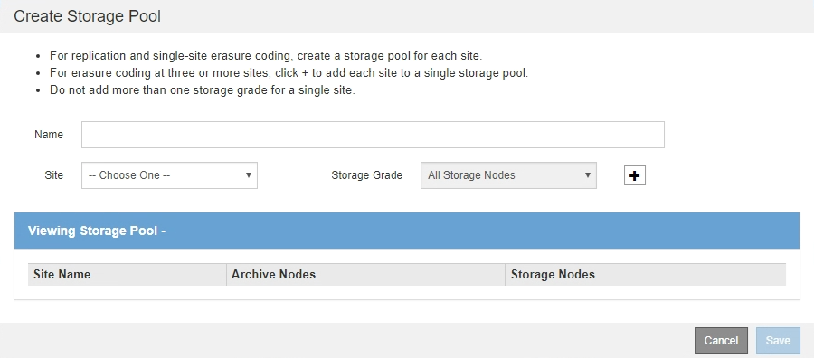

= Create a storage pool
:icons: font
:imagesdir: ../media/

[.lead]
You create storage pools to determine where the StorageGRID system stores object data and the type of storage used. Each storage pool includes one or more sites and one or more storage grades.

.What you'll need

* You are signed in to the Grid Manager using a xref:../admin/web-browser-requirements.adoc[supported web browser].
* You have specific access permissions.
* You have reviewed the guidelines for creating storage pools.

.About this task

Storage pools determine where object data is stored. The number of storage pools you need depends on the number of sites in your grid and on the types of copies you want: replicated or erasure-coded.

* For replication and single-site erasure coding, create a storage pool for each site. For example, if you want to store replicated object copies at three sites, create three storage pools.
* For erasure coding at three or more sites, create one storage pool that includes an entry for each site. For example, if you want to erasure code objects across three sites, create one storage pool. Select the plus icon image:../media/icon_plus_sign_black_on_white.gif[insert icon] to add an entry for each site.
+
IMPORTANT: Do not include the default All Sites site in a storage pool that will be used in an Erasure Coding profile. Instead, add a separate entry to the storage pool for each site that will store erasure coded data. See <<entries,this step>> for an example.

* If you have more than one storage grade, do not create a storage pool that includes different storage grades at a single site. See the xref:guidelines-for-creating-storage-pools.adoc[Guidelines for creating storage pools].

.Steps

. Select *ILM* > *Storage pools*.
+
The Storage Pools page appears and lists all defined storage pools.
+
image::../media/storage_pools_page.png[Storage Pools Page]
+
The list includes the system-default storage pool, All Storage Nodes, which uses the system-default site, All Sites, and the default storage grade, All Storage Nodes.
+
IMPORTANT: Because the All Storage Nodes storage pool is automatically updated whenever you add new data center sites, using this storage pool in ILM rules is not recommended.

. To create a new storage pool, select *Create*.
+
The Create Storage Pool dialog box appears.
+

. Enter a unique name for the storage pool.
+
Use a name that will be easy to identify when you configure Erasure Coding profiles and ILM rules.

. From the *Site* drop-down list, select a site for this storage pool.
+
When you select a site, the number of Storage Nodes and Archive Nodes in the table are automatically updated.
+
In general, do not use the default All Sites site in any storage pool. ILM rules that use an All Sites storage pool place objects at any available site, giving you less control of object placement. Also, an All Sites storage pool uses the Storage Nodes at a new site immediately, which might not be the behavior you expect. 

. From the *Storage Grade* drop-down list, select the type of storage that will be used if an ILM rule uses this storage pool.
+
The default All Storage Nodes storage grade includes all Storage Nodes at the selected site. The default Archive Nodes storage grade includes all Archive Nodes at the selected site. If you created additional storage grades for the Storage Nodes in your grid, they are listed in the drop-down.

. [[entries]]If you want to use the storage pool in a multi-site Erasure Coding profile, select image:../media/icon_plus_sign_black_on_white.gif[insert icon] to add an entry for each site to the storage pool.
+
image::../media/storage_pools_all_3_sites_for_ec.png[Storage Pools All 3 Sites for EC]
+
[NOTE]
====
You are prevented from creating duplicate entries or from creating a storage pool that includes both the *Archive Nodes* storage grade and any storage grade that contains Storage Nodes.

You are warned if you add more than one entry for a site but with different storage grades.
====
+
To remove an entry, select image:../media/icon_nms_delete_new.gif[delete icon].

. When you are satisfied with your selections, select *Save*.
+
The new storage pool is added to the list.
