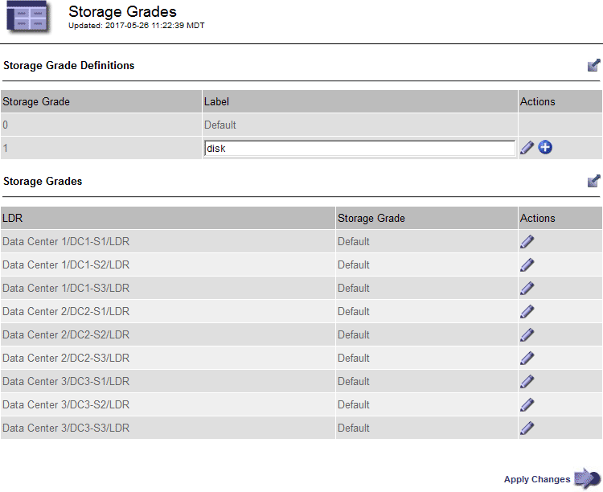
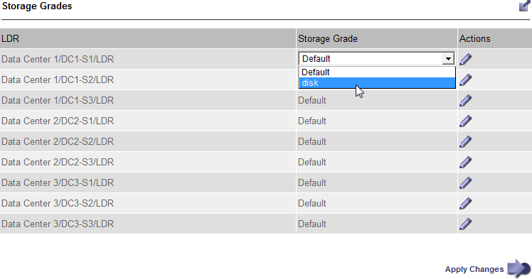

= Creating and assigning storage grades
:icons: font
:imagesdir: ../media/

[.lead]
Storage grades identify the type of storage used by a Storage Node. You can create storage grades if you want ILM rules to place certain objects on certain Storage Nodes, instead of on all nodes at the site. For example, you might want certain objects to be stored on your fastest Storage Nodes, such as StorageGRID all-flash storage appliances.

.What you'll need
* You must be signed in to the Grid Manager using a supported browser.
* You must have specific access permissions.

.About this task
If you use more than one type of storage, you can optionally create a storage grade to identify each type. Creating storage grades allows you to select a specific type of Storage Node when configuring storage pools.

If storage grade is not a concern (for example, all Storage Nodes are identical), you can skip this procedure and use the All Storage Nodes default storage grade when configuring storage pools.

When you add a new Storage Node in an expansion, that node is added to the All Storage Nodes default storage grade. As a result:

* If an ILM rule uses a storage pool with the All Storage Nodes grade, the new node can be used immediately after the expansion completes.
* If an ILM rule uses a storage pool with a custom storage grade, the new node will not be used until you manually assign the custom storage grade to the node, as described below.

NOTE: When creating storage grades, do not create more storage grades than necessary. For example, do not create one storage grade for each Storage Node. Instead, assign each storage grade to two or more nodes. Storage grades assigned to only one node can cause ILM backlogs if that node becomes unavailable.

.Steps
. Select *ILM* > *Storage Grades*.
. Create a storage grade:
 .. For each storage grade you need to define, click *Insert* image:../media/icon_nms_insert.gif[insert icon] to add a row and enter a label for the storage grade.
+
The Default storage grade cannot be modified. It is reserved for new Storage Nodes added during a StorageGRID system expansion.
+

 .. To edit an existing storage grade, click *Edit* image:../media/icon_nms_edit.gif[edit icon] and modify the label as required.
+
NOTE: You cannot delete storage grades.

 .. Click *Apply Changes*.
+
These storage grades are now available for assignment to Storage Nodes.
. Assign a storage grade to a Storage Node:
 .. For each Storage Node's LDR service, click *Edit* image:../media/icon_nms_edit.gif[edit icon] and select a storage grade from the list.
+

+
IMPORTANT: Assign a storage grade to a given Storage Node only once. A Storage Node recovered from failure maintains the previously assigned storage grade. Do not change this assignment after the ILM policy is activated. If the assignment is changed, data is stored based on the new storage grade.

 .. Click *Apply Changes*.
