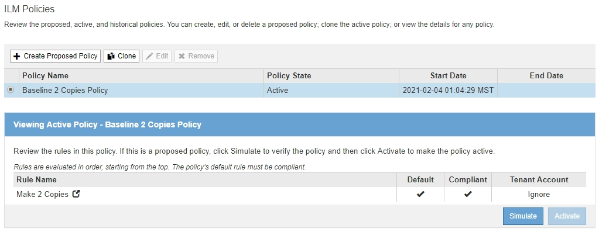
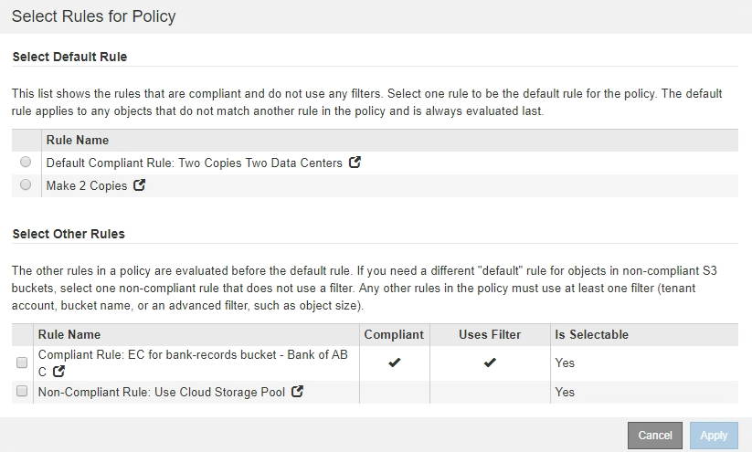
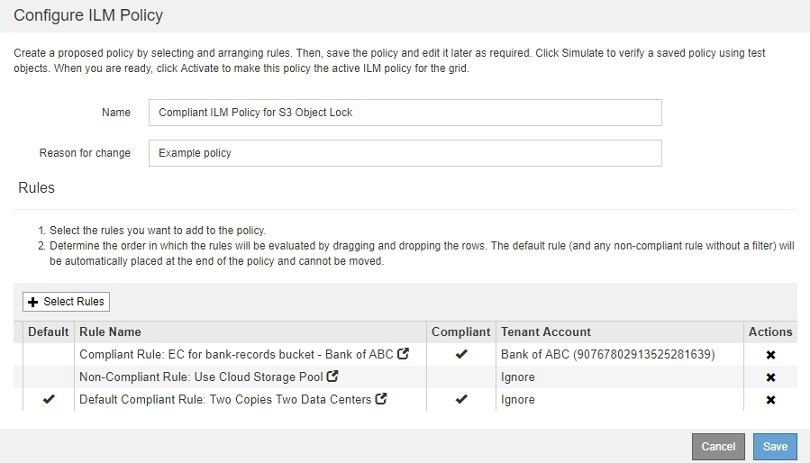
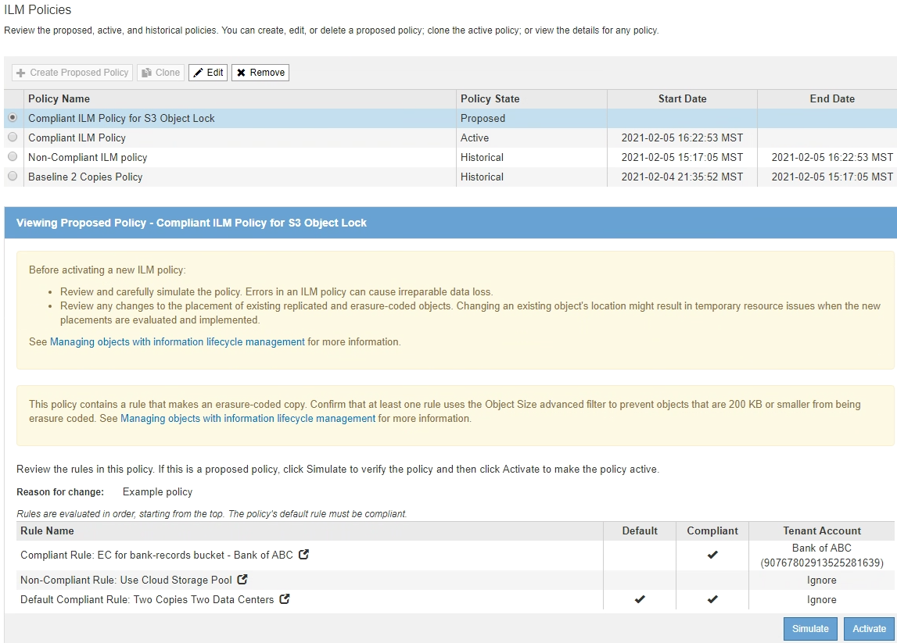

= Creating an ILM policy after S3 Object Lock is enabled
:icons: font
:imagesdir: ../media/

[.lead]
If the global S3 Object Lock setting is enabled, the steps for creating a policy are slightly different. You must ensure that the ILM policy is compliant with the requirements of buckets that have S3 Object Lock enabled.

* You must be signed in to the Grid Manager using a supported browser.
* You must have specific access permissions.
* The global S3 Object Lock setting must already be enabled for the StorageGRID system.
+
NOTE: If the global S3 Object Lock setting has not been enabled, use the general instructions for creating a proposed policy instead.
+
xref:creating_proposed_ilm_policy.adoc[Creating a proposed ILM policy]

* You must have created the compliant and non-compliant ILM rules you want to add to the proposed policy. As required, you can save a proposed policy, create additional rules, and then edit the proposed policy to add the new rules.
+
link:example_7_compliant_ilm_policy_for_s3_object_lock.md#[Example 7: Compliant ILM policy for S3 Object Lock]

* You must have created a compliant default ILM rule for the policy.
+
xref:creating_default_ilm_rule.adoc[Creating a default ILM rule]

. Select *ILM* > *Policies*.
+
The ILM Policies page appears. If the global S3 Object Lock setting is enabled, the ILM Policies page indicates which ILM rules are compliant.
+

. Enter a unique name for the proposed policy in the *Name* field.
+
You must enter at least 1 and no more than 64 characters.

. Enter the reason you are creating a new proposed policy in the *Reason for change* field.
+
You must enter at least 1 and no more than 128 characters.

. To add rules to the policy, select *Select Rules*.
+
The Select Rules for Policy dialog box appears, with all defined rules listed.

 ** The Select Default Rule section lists the rules that can be the default for a compliant policy. It includes compliant rules that do not use filters.
 ** The Select Other Rules section lists the other compliant and non-compliant rules that can be selected for this policy.

. Select a rule name or the more details icon image:../media/icon_nms_more_details.gif[more details icon] to view the settings for that rule.
. In the Select Default Rule section, select one default rule for the proposed policy.
+
The table in this section only lists the rules that are compliant and do not use any filters.
+
NOTE: If no rule is listed in the Select Default Rule section, you must exit the ILM policy page and create a default rule that is compliant.
+
xref:creating_default_ilm_rule.adoc[Creating a default ILM rule]
+
IMPORTANT: Do not use the Make 2 Copies stock rule as the default rule for a policy. The Make 2 Copies rule uses a single storage pool, All Storage Nodes, which contains all sites. If you use this rule, multiple copies of an object might be placed on the same site.

. In the Select Other Rules section, select any other rules you want to include in the policy.
 .. If you need a different "`default`" rule for objects in non-compliant S3 buckets, optionally select one non-compliant rule that does not use a filter.
+
For example, you might want to use a Cloud Storage Pool or an Archive Node to store objects in buckets that do not have S3 Object Lock enabled.
+
NOTE: You can only select one non-compliant rule that does not use a filter. As soon as you select one rule, the *Is Selectable* column shows *No* for any other non-compliant rules without filters.

 .. Select any other compliant or non-compliant rules you want to use in the policy.
+
The other rules must use at least one filter (tenant account, bucket name, or an advanced filter, such as object size).
. When you are done selecting the rules, select *Apply*.
+
The rules you selected are listed. The default rule is at the end, with the other rules above it. If you also selected a non-compliant "`default`" rule, that rule is added as the second-to-last rule in the policy.
+
In this example, the last rule, 2 Copies 2 Data Centers, is the default rule: it is compliant and has no filters. The second-to-last rule, Cloud Storage Pool, also has no filters but it is not compliant.
+

+
.

. Drag and drop the rows for the non-default rules to determine the order in which these rules will be evaluated.
+
You cannot move the default rule or the non-compliant "`default`" rule.
+
IMPORTANT: You must confirm that the ILM rules are in the correct order. When the policy is activated, new and existing objects are evaluated by the rules in the order listed, starting at the top.

. As required, click the delete icon image:../media/icon_nms_delete_new.gif[delete icon] to delete any rules that you do not want in the policy, or select *Select Rules* to add more rules.
. When you are done, select *Save*.
+
The ILM Policies page is updated:

 ** The policy you saved is shown as Proposed. Proposed policies do not have start and end dates.
 ** The *Simulate* and *Activate* buttons are enabled.

. Go to xref:simulating_ilm_policy.adoc[Simulating an ILM policy].
