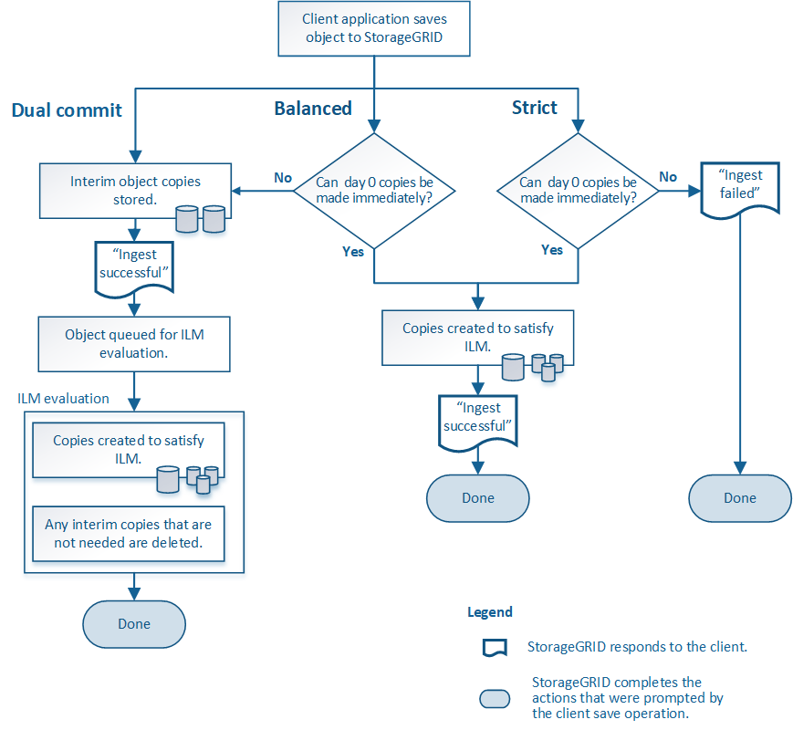

= Data-protection options for ingest
:icons: font
:imagesdir: ../media/

[.lead]
When you create an ILM rule, you specify one of three options for protecting objects at ingest: Dual commit, Balanced, or Strict. Depending on your choice, StorageGRID makes interim copies and queues the objects for ILM evaluation later, or it uses synchronous placement and immediately makes copies to meet ILM requirements.

== Dual commit

When you select the Dual commit option, StorageGRID immediately makes interim object copies on two different Storage Nodes and returns an "`ingest successful`" message to the client. The object is queued for ILM evaluation, and copies that meet the rule's placement instructions are made later.

== When to use the Dual commit option

Use the Dual commit option in either of these cases:

* You are using multi-site ILM rules and client ingest latency is your primary consideration. When using Dual commit, you must ensure your grid can perform the additional work of creating and removing the dual-commit copies if they do not satisfy ILM. Specifically:
 ** The load on the grid must be low enough to prevent an ILM backlog.
 ** The grid must have excess hardware resources (IOPS, CPU, memory, network bandwidth, and so on).
* You are using multi-site ILM rules and the WAN connection between the sites usually has high latency or limited bandwidth. In this scenario, using the Dual commit option can help prevent client timeouts. Before choosing the Dual commit option, you should test the client application with realistic workloads.

== Strict

When you select the Strict option, StorageGRID uses synchronous placement on ingest and immediately makes all object copies specified in the rule's placement instructions. Ingest fails if StorageGRID cannot create all copies, for example, because a required storage location is temporarily unavailable. The client must retry the operation.

== When to use the Strict option

Use the Strict option if you have an operational or regulatory requirement to immediately store objects only in the locations outlined in the ILM rule. For example, to satisfy a regulatory requirement, you might need to use the Strict option and a Location Constraint advanced filter to guarantee that objects are never stored at certain data center.

xref:example-5-ilm-rules-and-policy-for-strict-ingest-behavior.adoc[Example 5: ILM rules and policy for Strict ingest behavior]

== Balanced

When you select the Balanced option, StorageGRID also uses synchronous placement on ingest and immediately makes all copies specified in the rule's placement instructions. In contrast with the Strict option, if StorageGRID cannot immediately make all copies, it uses Dual commit instead.

== When to use the Balanced option

Use the Balanced option to achieve the best combination of data protection, grid performance, and ingest success. Balanced is the default option in the ILM rule wizard.

== Flowchart of three ingest options

The flowchart shows what happens when objects are matched by an ILM rule that uses one of these ingest options.

.Related information

xref:how-objects-are-ingested.adoc[How objects are ingested]
