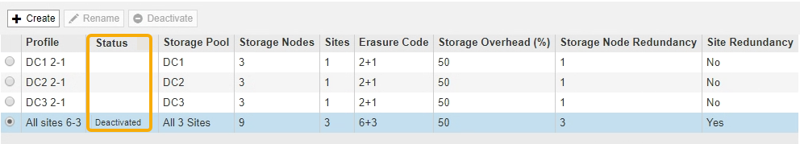
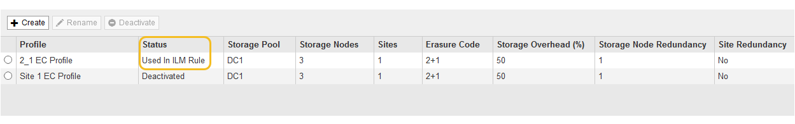
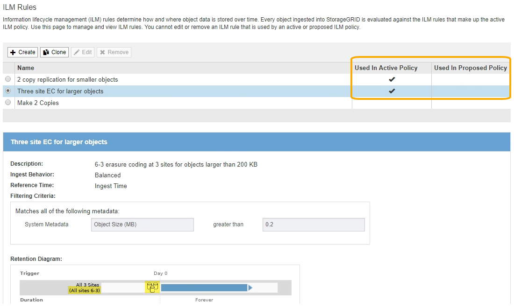
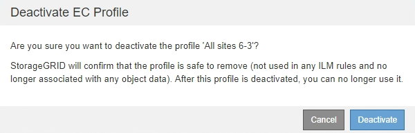

= Deactivate an Erasure Coding profile
:icons: font
:imagesdir: ../media/

[.lead]
You can deactivate an Erasure Coding profile if you no longer plan to use it and if the profile is not currently used in any ILM rules.

.What you'll need

* You are signed in to the Grid Manager using a xref:../admin/web-browser-requirements.adoc[supported web browser].
* You have specific access permissions.
* You have confirmed that no erasure coded data repair operations or decommission procedures are in process. An error message is returned if you attempt to deactivate an Erasure Coding profile while either of these operations are in progress.

.About this task
When you deactivate an Erasure Coding profile, the profile still appears on the Erasure Coding Profiles page, but its status is *Deactivated*.

You can no longer use an Erasure Coding profile that has been deactivated. A deactivated profile is not shown when you create the placement instructions for an ILM rule. You cannot reactivate a deactivated profile.

StorageGRID prevents you from deactivating an Erasure Coding profile if either of the following is true:

* The Erasure Coding profile is currently used in an ILM rule.
* The Erasure Coding profile is no longer used in any ILM rules, but object data and parity fragments for the profile still exist.

.Steps

. Select *ILM* > *Erasure Coding*.
+
The Erasure Coding Profiles page appears. The *Rename* and *Deactivate* buttons are both disabled.

. Review the *Status* column to confirm that the Erasure Coding profile you want to deactivate is not used in any ILM rules.
+
You cannot deactivate an Erasure Coding profile if it is used in any ILM rule. In the example, the *2_1 EC Profile* is used in at least one ILM rule.
+

. If the profile is used in an ILM rule, follow these steps:
 .. Select *ILM* > *Rules*.
 .. For each rule listed, select the radio button and review the retention diagram to determine if the rule uses the Erasure Coding profile you want to deactivate.
+
In the example, the *Three site EC for larger objects* rule uses a storage pool called *All 3 Sites* and the *All sites 6-3* Erasure Coding profile. Erasure Coding profiles are represented by this icon: image:../media/icon_nms_erasure_coded.gif[EC profiles icon]
+

 .. If the ILM rule uses the Erasure Coding profile you want to deactivate, determine if the rule is used in either the active ILM policy or a proposed policy.
+
In the example, the *Three site EC for larger objects* rule is used in the active ILM policy.

 .. Complete the additional steps in the table, based on where the Erasure Coding profile is used.
+
[cols="2a,3a,1a" options="header"]
|===
| Where has the profile been used?| Additional steps to perform before deactivating the profile| Refer to these additional instructions
a|
Never used in any ILM rule
a|
No additional steps required. Continue with this procedure.
a|
_None_
a|
In an ILM rule that has never been used in any ILM policy
a|

  . Edit or delete all affected ILM rules. If you edit the rule, remove all placements that use the Erasure Coding profile.
  . Continue with this procedure.

a|
xref:working-with-ilm-rules-and-ilm-policies.adoc[Work with ILM rules and ILM policies]
a|
In an ILM rule that is currently in the active ILM policy
a|

  . Clone the active policy.
  . Remove the ILM rule that uses the Erasure Coding profile.
  . Add one or more new ILM rules to ensure objects are protected.
  . Save, simulate, and activate the new policy.
  . Wait for the new policy to be applied and for existing objects to be moved to new locations based on the new rules you added.
+
*Note:* Depending on the number of objects and the size of your StorageGRID system, it might take weeks or even months for ILM operations to move the objects to new locations, based on the new ILM rules.
+
While you can safely attempt to deactivate an Erasure Coding profile while it is still associated with data, the deactivation operation will fail. An error message will inform you if the profile is not yet ready to be deactivated.

  . Edit or delete the rule you removed from the policy. If you edit the rule, remove all placements that use the Erasure Coding profile.
  . Continue with this procedure.

a|

  * xref:creating-ilm-policy.adoc[Create an ILM policy]
  * xref:working-with-ilm-rules-and-ilm-policies.adoc[Work with ILM rules and ILM policies]

a|
In an ILM rule that is currently in a proposed ILM policy
a|

  . Edit the proposed policy.
  . Remove the ILM rule that uses the Erasure Coding profile.
  . Add one or more new ILM rules to ensure all objects are protected.
  . Save the proposed policy.
  . Edit or delete the rule you removed from the policy. If you edit the rule, remove all placements that use the Erasure Coding profile.
  . Continue with this procedure.

a|

  * xref:creating-ilm-policy.adoc[Create an ILM policy]
  * xref:working-with-ilm-rules-and-ilm-policies.adoc[Work with ILM rules and ILM policies]

a|
In an ILM rule that is in a historical ILM policy
a|

  . Edit or delete the rule. If you edit the rule, remove all placements that use the Erasure Coding profile. (The rule will now appear as a historical rule in the historical policy.)
  . Continue with this procedure.

a|
xref:working-with-ilm-rules-and-ilm-policies.adoc[Work with ILM rules and ILM policies]

|===

 .. Refresh the Erasure Coding Profiles page to ensure that the profile is not used in an ILM rule.
. If the profile is not used in an ILM rule, select the radio button and select *Deactivate*.
+
The Deactivate EC Profile dialog box appears.
+

. If you are sure you want to deactivate the profile, select *Deactivate*.
 ** If StorageGRID is able to deactivate the Erasure Coding profile, its status is *Deactivated*. You can no longer select this profile for any ILM rule.
 ** If StorageGRID is not able to deactivate the profile, an error message appears. For example, an error message appears if object data is still associated with this profile. You might need to wait several weeks before trying the deactivation process again.
