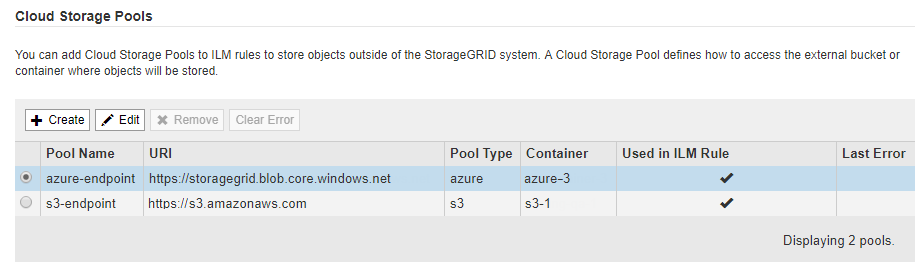

= Edit a Cloud Storage Pool
:icons: font
:imagesdir: ../media/

[.lead]
You can edit a Cloud Storage Pool to change its name, service endpoint, or other details; however, you cannot change the S3 bucket or Azure container for a Cloud Storage Pool.

.What you'll need
* You are signed in to the Grid Manager using a xref:../admin/web-browser-requirements.adoc[supported web browser].
* You have specific access permissions.
* You have reviewed the xref:considerations-for-cloud-storage-pools.adoc[considerations for Cloud Storage Pools].

.Steps
. Select *ILM* > *Storage pools*.
+
The Storage Pools page appears. The Cloud Storage Pools table lists the existing Cloud Storage Pools.
+

. Select the radio button for the Cloud Storage Pool you want to edit.
. Select *Edit*.
. As required, change the display name, service endpoint, authentication credentials, or certificate validation method.
+
IMPORTANT: You cannot change the provider type or the S3 bucket or Azure container for a Cloud Storage Pool.
+
If you previously uploaded a server or client certificate, you can select *View Current* to review the certificate that is currently in use.

. Select *Save*.
+
When you save a Cloud Storage Pool, StorageGRID validates that the bucket or container and the service endpoint exist, and that they can be reached using the credentials that you specified.
+
If Cloud Storage Pool validation fails, an error message is displayed. For example, an error might be reported if there is a certificate error.
+
See the instructions for xref:troubleshooting-cloud-storage-pools.adoc[troubleshooting Cloud Storage Pools], resolve the issue, and then try saving the Cloud Storage Pool again.

