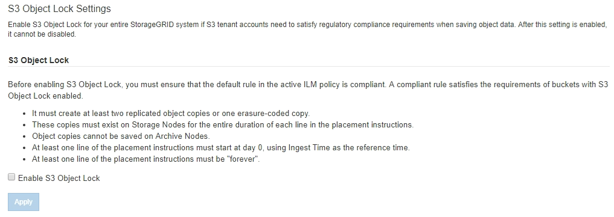
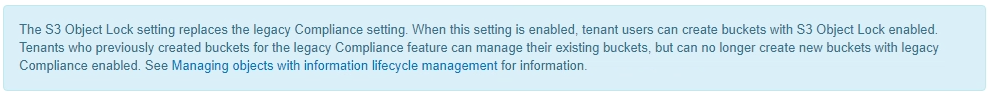
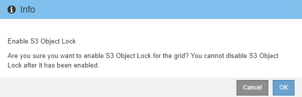
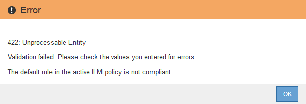

= Enable S3 Object Lock globally
:icons: font
:imagesdir: ../media/

[.lead]
If an S3 tenant account needs to comply with regulatory requirements when saving object data, you must enable S3 Object Lock for your entire StorageGRID system. Enabling the global S3 Object Lock setting allows any S3 tenant user to create and manage buckets and objects with S3 Object Lock.

.What you'll need
* You have the Root access permission.
* You are signed in to the Grid Manager using a xref:../admin/web-browser-requirements.adoc[supported web browser].
* You have reviewed the S3 Object Lock workflow, and you must understand the considerations.
* The default rule in the active ILM policy is compliant.

** xref:creating-default-ilm-rule.adoc[Create a default ILM rule]

** xref:creating-ilm-policy.adoc[Create an ILM policy]

.About this task

A grid administrator must enable the global S3 Object Lock setting to allow tenant users to create new buckets that have S3 Object Lock enabled. After this setting is enabled, it cannot be disabled.

NOTE: If you enabled the global Compliance setting using a previous version of StorageGRID, the S3 Object Lock setting is enabled in StorageGRID 11.6. You can continue to use StorageGRID to manage the settings of existing compliant buckets; however, you cannot create new compliant buckets. See https://kb.netapp.com/Advice_and_Troubleshooting/Hybrid_Cloud_Infrastructure/StorageGRID/How_to_manage_legacy_Compliant_buckets_in_StorageGRID_11.5[NetApp Knowledge Base: How to manage legacy Compliant buckets in StorageGRID 11.5^].

.Steps

. Select *CONFIGURATION* > *System* > *S3 Object Lock*.
+
The S3 Object Lock Settings page appears.
+

+
If you had enabled the global Compliance setting using a previous version of StorageGRID, the page includes the following note:
+

. Select *Enable S3 Object Lock*.
. Select *Apply*.
+
A confirmation dialog box appears and reminds you that you cannot disable S3 Object Lock after it is enabled.
+

. If you are sure you want to permanently enable S3 Object Lock for your entire system, select *OK*.
+
When you select *OK*:

 ** If the default rule in the active ILM policy is compliant, S3 Object Lock is now enabled for the entire grid and cannot be disabled.
 ** If the default rule is not compliant, an error appears, indicating that you must create and activate a new ILM policy that includes a compliant rule as its default rule. Select *OK*, and create a new proposed policy, simulate it, and activate it.
+

.After you finish

After you enable the global S3 Object Lock setting, you might need to xref:../ilm/creating-default-ilm-rule.adoc[create a default rule] that is compliant and  xref:creating-ilm-policy-after-s3-object-lock-is-enabled.adoc[create an ILM policy] that is compliant. After the setting is enabled, the ILM policy can optionally include both a compliant default rule and a non-compliant default rule. For example, you might want to use a non-compliant rule that does not have filters for objects in buckets that do not have S3 Object Lock enabled.

.Related information

* xref:managing-objects-with-s3-object-lock.adoc#comparing-s3-object-lock-to-legacy-compliance[Compare S3 Object Lock to legacy Compliance]
