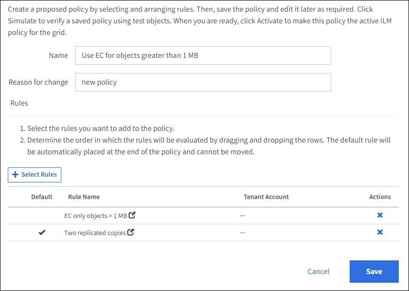

= Example 2: ILM rules and policy for EC object size filtering
:icons: font
:imagesdir: ../media/

[.lead]
You can use the following example rules and policy as starting points to define an ILM policy that filters by object size to meet recommended EC requirements.

CAUTION: The following ILM rules and policy are only examples. There are many ways to configure ILM rules. Before activating a new policy, simulate the proposed policy to confirm it will work as intended to protect content from loss.

== ILM rule 1 for example 2: Use EC for all objects larger than 200 KB

This example ILM rule erasure codes all objects larger than 200 KB (0.20 MB).

[cols="1a,2a" options="header"]
|===
| Rule definition| Example value
a|
Rule Name
a|
EC only objects > 200 KB
a|
Reference Time
a|
Ingest Time
a|
Advanced Filtering for Object Size
a|
Object Size (MB) greater than 0.20
a|
Content Placement
a|
Create a 2+1 erasure-coded copy using three sites
|===
image:../media/policy_2_rule_1_ec_objects_adv_filtering.gif[ILM rule 1 for example 2: Use EC for all objects larger than 200 KB]

The placement instructions specify that a 2+1 erasure-coded copy be created using all three sites.

image::../media/policy_2_rule_1_ec_objects_placements.png[ILM rule 1 for example 2: Use EC for all objects larger than 200 KB]

== ILM rule 2 for example 2: Two replicated copies

This example ILM rule creates two replicated copies and does not filter by object size. This rule is the second rule in the policy. Because ILM rule 1 for example 2 filters out all objects larger than 200 KB, ILM rule 2 for example 2 only applies to objects that are 200 KB or smaller.

[cols="1a,2a" options="header"]
|===
| Rule definition| Example value
a|
Rule Name
a|
Two Replicated Copies
a|
Reference Time
a|
Ingest Time
a|
Advanced Filtering for Object Size
a|
None
a|
Content Placement
a|
Create two replicated copies and save them at two data centers, DC1 and DC2
|===
image:../media/ilm_rule_2_example_2_two_replicated_copies.png[Example ILM Rule 2 for Example 2 - Two Replicated Copies]

== ILM policy for example 2: Use EC for objects larger than 200 KB

In this example policy, objects larger than 200 KB are erasure coded. Two replicated copies are made of all other objects.

This example ILM policy includes the following ILM rules:

* Erasure code all objects larger than 200 KB.
* If an object does not match the first ILM rule, use the default ILM rule to create two replicated copies of that object. Because objects larger than 200 KB have been filtered out by rule 1, rule 2 only applies to objects that are 200 KB or smaller.
+

