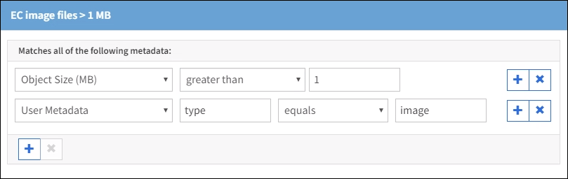

= Example 3: ILM rules and policy for better protection for image files
:icons: font
:imagesdir: ../media/

[.lead]
You can use the following example rules and policy to ensure that images greater than 1 MB are erasure coded and that two copies are made of smaller images.

CAUTION: The following ILM rules and policy are only examples. There are many ways to configure ILM rules. Before activating a new policy, simulate the proposed policy to confirm it will work as intended to protect content from loss.

== ILM rule 1 for example 3: Use EC for image files greater than 1 MB

This example ILM rule uses advanced filtering to erasure code all image files greater than 1 MB.

IMPORTANT: Erasure coding is best suited for objects greater than 1 MB. Do not use erasure coding for objects smaller than 200 KB to avoid the overhead of managing very small erasure-coded fragments.

[cols="1a,2a" options="header"]
|===
| Rule definition| Example value

|Rule Name
|EC image files > 1 MB

|Reference Time
|Ingest Time

|Advanced Filtering for Object Size
|Object Size (MB) greater than 1.0

|Advanced Filtering for User Metadata
|User Metadata type equals image

|Content Placement
|Create a 2+1 erasure-coded copy using three sites
|===

Because this rule is configured as the first rule in the policy, the erasure-coding placement instruction only applies to images that are greater than 1 MB.

== ILM rule 2 for example 3: Create 2 replicated copies for all remaining image files

This example ILM rule uses advanced filtering to specify that smaller image files be replicated. Because the first rule in the policy has already matched image files greater than 1 MB, this rule applies to image files that are 1 MB or smaller.

[cols="1a,2a" options="header"]
|===
| Rule definition| Example value
a|
Rule Name
a|
2 copies for image files
a|
Reference Time
a|
Ingest Time
a|
Advanced Filtering for User Metadata
a|
User Metadata type equals image files
a|
Content Placement
a|
Create 2 replicated copies in two Storage Pools
|===

== ILM policy for example 3: Better protection for image files

This example ILM policy includes three rules:

* The first rule erasure codes all image files greater than 1 MB.
* The second rule creates two copies of any remaining image files (that is, images that are 1 MB or smaller).
* The default rule applies to all remaining objects (that is, any non-image files).

