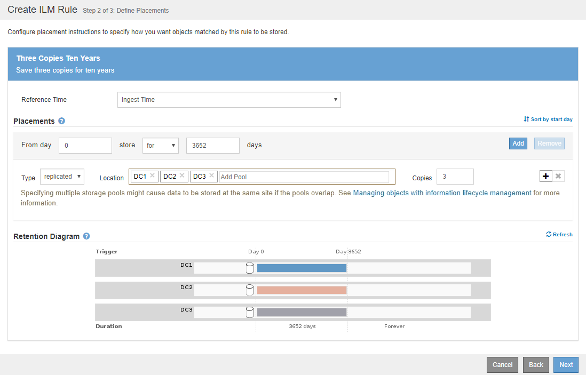
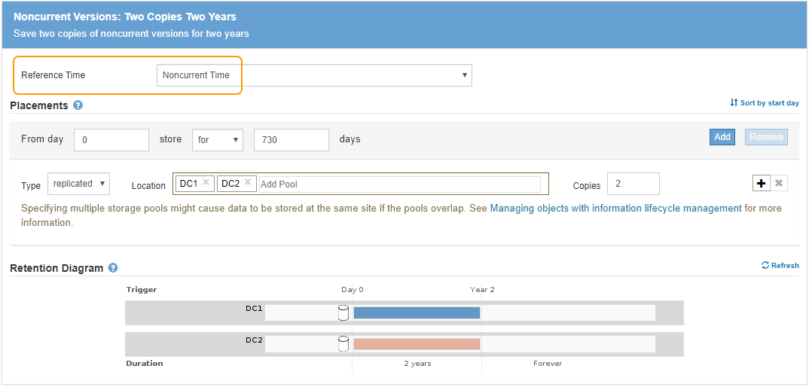
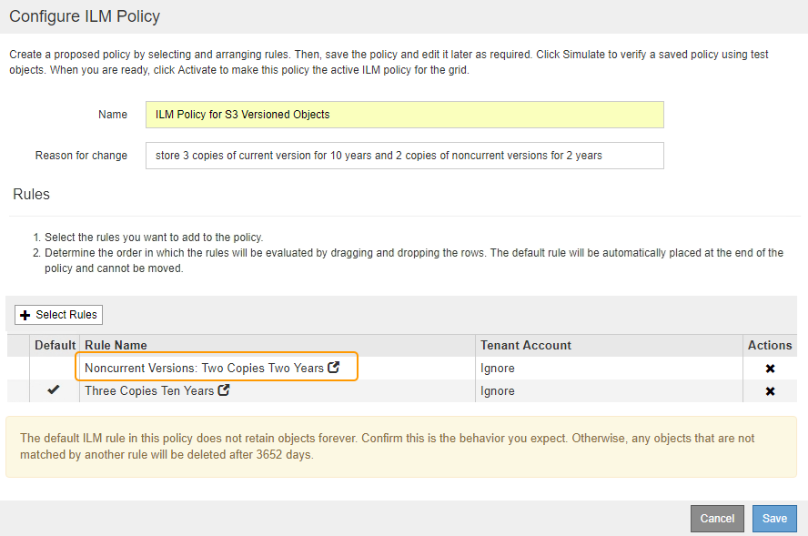

= Example 4: ILM rules and policy for S3 versioned objects
:icons: font
:imagesdir: ../media/

[.lead]
If you have an S3 bucket with versioning enabled, you can manage the noncurrent object versions by including rules in your ILM policy that use *Noncurrent time* as the Reference Time.

As this example shows, you can control the amount of storage used by versioned objects by using different placement instructions for noncurrent object versions.

CAUTION: The following ILM rules and policy are only examples. There are many ways to configure ILM rules. Before activating a new policy, simulate the proposed policy to confirm it will work as intended to protect content from loss.

NOTE: If you create ILM policies to manage noncurrent object versions, be aware that you must know the object version's UUID or CBID to simulate the policy. To find an object's UUID and CBID, use Object Metadata Lookup while the object is still current. See xref:verifying-ilm-policy-with-object-metadata-lookup.adoc[Verify an ILM policy with object metadata lookup].

.Related information

* xref:how-objects-are-deleted.adoc[How objects are deleted]

== ILM rule 1 for example 4: Save three copies for 10 years

This example ILM rule stores a copy of each object at three data centers for 10 years.

This rule applies to all objects, whether or not they are versioned.

[cols="1a,2a" options="header"]
|===
| Rule definition| Example value
a|
Storage Pools
a|
Three storage pools, each at different data centers, named DC1, DC2, and DC3.
a|
Rule Name
a|
Three Copies Ten Years
a|
Reference Time
a|
Ingest Time
a|
Content Placement
a|
On Day 0, keep three replicated copies for 10 years (3,652 days), one in DC1, one in DC2, and one in DC3. At the end of 10 years, delete all copies of the object.
|===

== ILM rule 2 for example 4: Save two copies of noncurrent versions for 2 years

This example ILM rule stores two copies of the noncurrent versions of an S3 versioned object for 2 years.

Because ILM rule 1 applies to all versions of the object, you must create another rule to filter out any noncurrent versions. This rule uses the *Noncurrent Time* option for Reference Time.

In this example, only two copies of the noncurrent versions are stored, and those copies will be stored for two years.

[cols="1a,2a" options="header"]
|===
| Rule definition| Example value
a|
Storage Pools
a|
Two storage pools, each at different data centers, named DC1 and DC2.
a|
Rule Name
a|
Noncurrent Versions: Two Copies Two Years
a|
Reference Time
a|
Noncurrent Time
a|
Content Placement
a|
On Day 0 relative to Noncurrent Time (that is, starting from the day the object version becomes the noncurrent version), keep two replicated copies of the noncurrent object versions for 2 years (730 days), one in DC1 and one in DC2. At the end of 2 years, delete the noncurrent versions.
|===

== ILM policy for example 4: S3 versioned objects

If you want to manage older versions of an object differently than the current version, rules that use *Noncurrent Time* as the Reference Time must appear in the ILM policy before rules that apply to the current object version.

An ILM policy for S3 versioned objects might include ILM rules such as the following:

* Keep any older (noncurrent) versions of each object for 2 years, starting from the day the version became noncurrent.
+
NOTE: The Noncurrent Time rules must appear in the policy before the rules that apply to the current object version. Otherwise, the noncurrent object versions will never be matched by the Noncurrent Time rule.

* At ingest, create three replicated copies and store one copy at each of three data centers. Keep copies of the current object version for 10 years.

When you simulate the example policy, you would expect test objects to be evaluated as follows:

* Any noncurrent object versions would be matched by the first rule. If a noncurrent object version is older than 2 years, it is permanently deleted by ILM (all copies of the noncurrent version removed from the grid).
+
NOTE: To simulate noncurrent object versions, you must use that version's UUID or CBID. While the object is still current, you can use Object Metadata Lookup to find its UUID and CBID.

* The current object version would be matched by the second rule. When the current object version has been stored for 10 years, the ILM process adds a delete marker as the current version of the object, and it makes the previous object version "`noncurrent.`" The next time ILM evaluation occurs, this noncurrent version is matched by the first rule. As a result, the copy at DC3 is purged and the two copies at DC1 and DC2 are stored for 2 more years.
