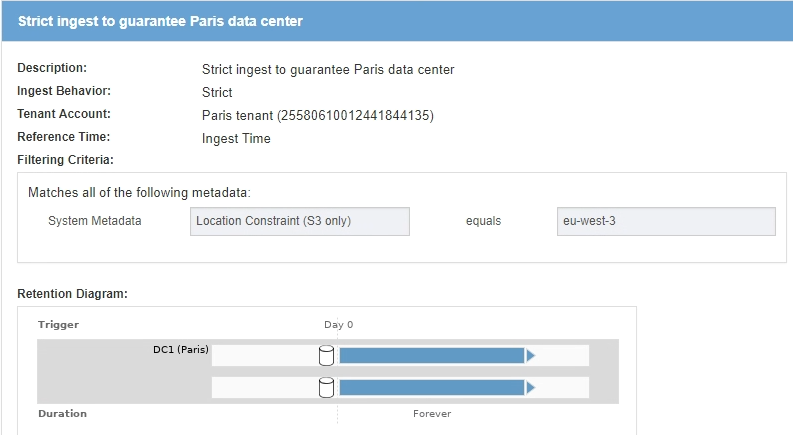
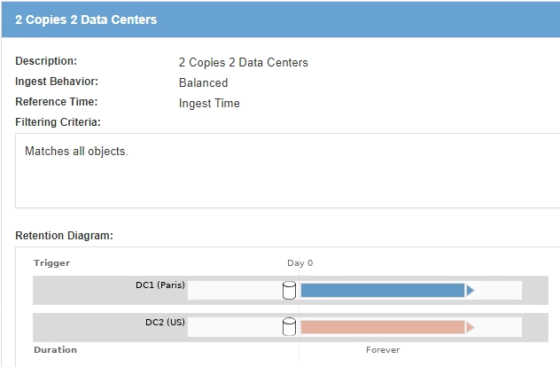
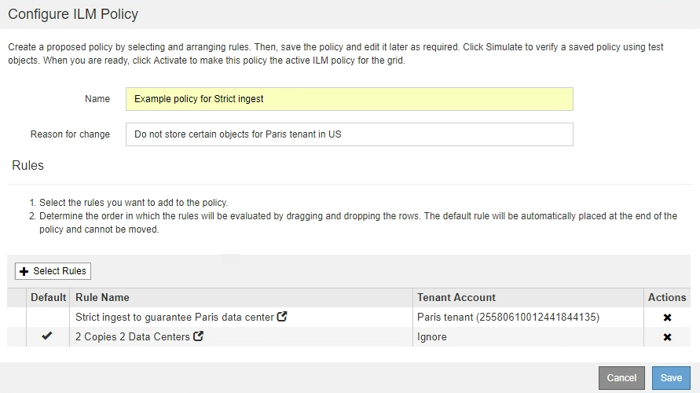

= Example 5: ILM rules and policy for Strict ingest behavior
:icons: font
:imagesdir: ../media/

[.lead]
You can use a location filter and the Strict ingest behavior in a rule to prevent objects from being saved at a particular data center location.

In this example, a Paris-based tenant does not want to store some objects outside of the EU because of regulatory concerns. Other objects, including all objects from other tenant accounts, can be stored at either the Paris data center or the US data center.

CAUTION: The following ILM rules and policy are only examples. There are many ways to configure ILM rules. Before activating a new policy, simulate the proposed policy to confirm it will work as intended to protect content from loss.

.Related information

* xref:data-protection-options-for-ingest.adoc[Data-protection options for ingest]

* xref:step-3-of-3-define-ingest-behavior.adoc[Step 3 of 3: Define ingest behavior]

== ILM rule 1 for example 5: Strict ingest to guarantee Paris data center

This example ILM rule uses the Strict ingest behavior to guarantee that objects saved by a Paris-based tenant to S3 buckets with the region set to eu-west-3 region (Paris) are never stored at the US data center.

This rule applies to objects that belong to the Paris tenant and that have the S3 bucket region set to eu-west-3 (Paris).

[cols="1a,2a" options="header"]
|===
| Rule definition| Example value
a|
Tenant Account
a|
Paris tenant
a|
Advanced Filtering
a|
Location Constraint equals eu-west-3
a|
Storage Pools
a|
DC1 (Paris)
a|
Rule Name
a|
Strict ingest to guarantee Paris data center
a|
Reference Time
a|
Ingest Time
a|
Content Placement
a|
On Day 0, keep two replicated copies forever in DC1 (Paris)
a|
Ingest Behavior
a|
Strict. Always use this rule's placements on ingest. Ingest fails if it is not possible to store two copies of the object at the Paris data center.
|===

== ILM rule 2 for example 5: Balanced ingest for other objects

This example ILM rule uses the Balanced ingest behavior to provide optimum ILM efficiency for any objects not matched by the first rule. Two copies of all objects matched by this rule will be stored--one at the US data center and one at the Paris data center. If the rule cannot be satisfied immediately, interim copies are stored at any available location.

This rule applies to objects that belong to any tenant and any region.

[cols="1a,2a" options="header"]
|===
| Rule definition| Example value
a|
Tenant Account
a|
Ignore
a|
Advanced Filtering
a|
_Not specified_
a|
Storage Pools
a|
DC1 (Paris) and DC2 (US)
a|
Rule Name
a|
2 Copies 2 Data Centers
a|
Reference Time
a|
Ingest Time
a|
Content Placement
a|
On Day 0, keep two replicated copies forever at two data centers
a|
Ingest Behavior
a|
Balanced. Objects that match this rule are placed according to the rule's placement instructions if possible. Otherwise, interim copies are made at any available location.
|===

== ILM policy for example 5: Combining ingest behaviors

The example ILM policy includes two rules that have different ingest behaviors.

An ILM policy that uses two different ingest behaviors might include ILM rules such as the following:

* Store objects that belong to the Paris tenant and that have the S3 bucket region set to eu-west-3 (Paris) only in the Paris data center. Fail ingest if the Paris data center is not available.
* Store all other objects (including those that belong to the Paris tenant but that have a different bucket region) in both the US data center and the Paris data center. Make interim copies in any available location if the placement instruction cannot be satisfied.

When you simulate the example policy, you expect test objects to be evaluated as follows:

* Any objects that belong to the Paris tenant and that have the S3 bucket region set to eu-west-3 are matched by the first rule and are stored at the Paris data center. Because the first rule uses Strict ingest, these objects are never stored at the US data center. If the Storage Nodes at the Paris data center are not available, ingest fails.
* All other objects are matched by the second rule, including objects that belong to the Paris tenant and that do not have the S3 bucket region set to eu-west-3. One copy of each object is saved at each data center. However, because the second rule uses Balanced ingest, if one data center is unavailable, two interim copies are saved at any available location.
