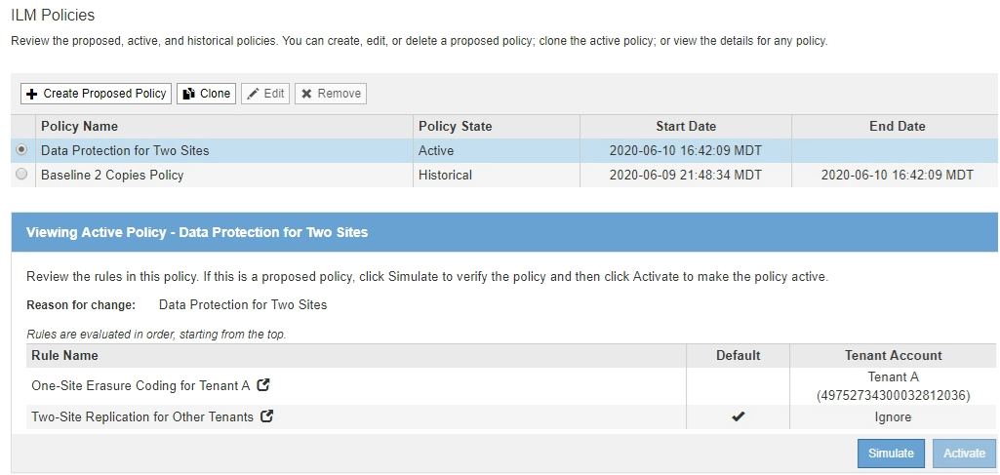
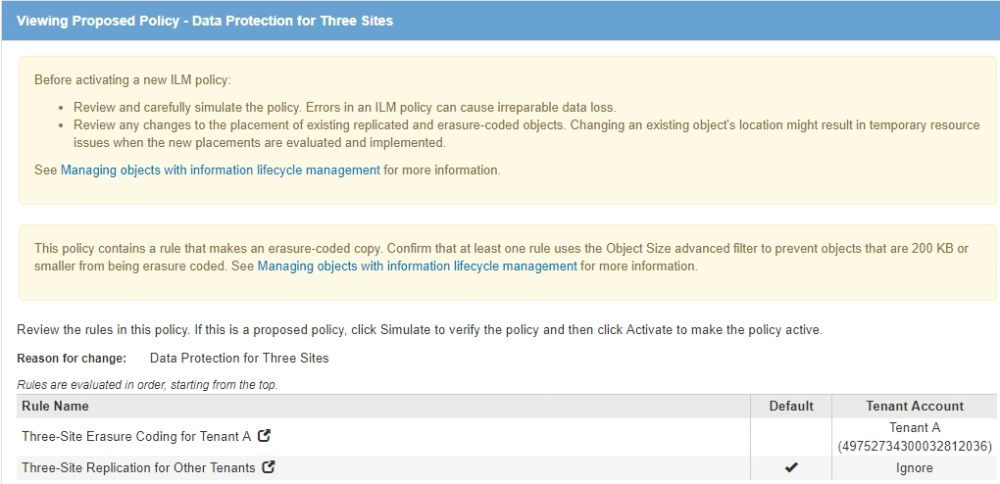

= Example 6: Changing an ILM policy
:icons: font
:imagesdir: ../media/

[.lead]
You might need to create and activate a new ILM policy if your data protection needs change or you add new sites.

Before changing a policy, you must understand how changes in ILM placements can temporarily affect the overall performance of a StorageGRID system.

In this example, a new StorageGRID site has been added in an expansion and the active ILM policy needs to be revised to store data at the new site.

CAUTION: The following ILM rules and policy are only examples. There are many ways to configure ILM rules. Before activating a new policy, simulate the proposed policy to confirm it will work as intended to protect content from loss.

== How does changing an ILM policy affect performance

When you activate a new ILM policy, the performance of your StorageGRID system might be temporarily affected, especially if the placement instructions in the new policy require many existing objects to be moved to new locations.

CAUTION: When you activate a new ILM policy, StorageGRID uses it to manage all objects, including existing objects and newly ingested objects. Before activating a new ILM policy, review any changes to the placement of existing replicated and erasure-coded objects. Changing an existing object's location might result in temporary resource issues when the new placements are evaluated and implemented.

The types of ILM policy changes that can temporarily affect StorageGRID performance include the following:

* Applying a different Erasure Coding profile to existing erasure-coded objects.
+
NOTE: StorageGRID considers each Erasure Coding profile to be unique and does not reuse erasure-coding fragments when a new profile is used.

* Changing the type of copies required for existing objects; for example, converting a large percentage of replicated objects to erasure-coded objects.
* Moving copies of existing objects to a completely different location; for example, moving a large number of objects to or from a Cloud Storage Pool or to or from a remote site.

.Related information

xref:creating-ilm-policy.adoc[Create an ILM policy]

== Active ILM policy for example 6: Data protection at two sites

In this example, the active ILM policy was initially designed for a two-site StorageGRID system and uses two ILM rules.

In this ILM policy, objects belonging to Tenant A are protected by 2+1 erasure coding at a single site, while objects belonging to all other tenants are protected across two sites using 2-copy replication.

NOTE: The first rule in this example uses an advanced filter to ensure that erasure coding is not used for small objects. Any of Tenant A's objects that are smaller than 1 MB will be protected by the second rule, which uses replication.

=== Rule 1: One-site erasure coding for Tenant A

[cols="1a,2a" options="header"]
|===
| Rule definition| Example value
a|
Rule Name
a|
One-Site Erasure Coding for Tenant A
a|
Tenant Account
a|
Tenant A
a|
Storage Pool
a|
Data Center 1
a|
Content Placement
a|
2+1 erasure coding in Data Center 1 from day 0 to forever
|===

=== Rule 2: Two-site replication for other tenants

[cols="1a,2a" options="header"]
|===
| Rule definition| Example value
a|
Rule Name
a|
Two-Site Replication for Other Tenants
a|
Tenant Account
a|
Ignore
a|
Storage Pools
a|
Data Center 1 and Data Center 2
a|
Content Placement
a|
Two replicated copies from day 0 to forever: one copy at Data Center 1 and one copy at Data Center 2.
|===

== Proposed ILM policy for example 6: Data protection at three sites

In this example, the ILM policy is being updated for a three-site StorageGRID system.

After performing an expansion to add the new site, the grid administrator created two new storage pools: a storage pool for Data Center 3 and a storage pool containing all three sites (not the same as the All Storage Nodes default storage pool). Then, the administrator created two new ILM rules and a new proposed ILM policy, which is designed to protect data at all three sites.

When this new ILM policy is activated, objects belonging to Tenant A will be protected by 2+1 erasure coding at three sites, while objects belonging to other tenants (and smaller objects belonging to Tenant A) will be protected across three sites using 3-copy replication.

=== Rule 1: Three-site erasure coding for Tenant A

[cols="1a,2a" options="header"]
|===
| Rule definition| Example value
a|
Rule Name
a|
Three-Site Erasure Coding for Tenant A
a|
Tenant Account
a|
Tenant A
a|
Storage Pool
a|
All 3 Data Centers (includes Data Center 1, Data Center 2, and Data Center 3)
a|
Content Placement
a|
2+1 erasure coding in All 3 Data Centers from day 0 to forever
|===

=== Rule 2: Three-site replication for other tenants

[cols="1a,2a" options="header"]
|===
| Rule definition| Example value
a|
Rule Name
a|
Three-Site Replication for Other Tenants
a|
Tenant Account
a|
Ignore
a|
Storage Pools
a|
Data Center 1, Data Center 2, and Data Center 3
a|
Content Placement
a|
Three replicated copies from day 0 to forever: one copy at Data Center 1, one copy at Data Center 2, and one copy at Data Center 3.
|===

== Activating the proposed ILM policy for example 6

When you activate a new proposed ILM policy, existing objects might be moved to new locations or new object copies might be created for existing objects, based on the placement instructions in any new or updated rules.

CAUTION: Errors in an ILM policy can cause unrecoverable data loss. Carefully review and simulate the policy before activating it to confirm that it will work as intended.

CAUTION: When you activate a new ILM policy, StorageGRID uses it to manage all objects, including existing objects and newly ingested objects. Before activating a new ILM policy, review any changes to the placement of existing replicated and erasure-coded objects. Changing an existing object's location might result in temporary resource issues when the new placements are evaluated and implemented.

=== What happens when erasure-coding instructions change

In the currently active ILM policy for this example, objects belonging to Tenant A are protected using 2+1 erasure coding at Data Center 1. In the new proposed ILM policy, objects belonging to Tenant A will be protected using 2+1 erasure coding at Data Centers 1, 2, and 3.

When the new ILM policy is activated, the following ILM operations occur:

* New objects ingested by Tenant A are split into two data fragments and one parity fragment is added. Then, each of the three fragments is stored at a different data center.
* The existing objects belonging to Tenant A are re-evaluated during the ongoing ILM scanning process. Because the ILM placement instructions use a new Erasure Coding profile, entirely new erasure-coded fragments are created and distributed to the three data centers.
+
NOTE: The existing 2+1 fragments at Data Center 1 are not reused. StorageGRID considers each Erasure Coding profile to be unique and does not reuse erasure-coding fragments when a new profile is used.

=== What happens when replication instructions change

In the currently active ILM policy for this example, objects belonging other tenants are protected using two replicated copies in storage pools at Data Centers 1 and 2. In the new proposed ILM policy, objects belonging to other tenants will be protected using three replicated copies in storage pools at Data Centers 1, 2, and 3.

When the new ILM policy is activated, the following ILM operations occur:

* When any tenant other than Tenant A ingests a new object, StorageGRID creates three copies and saves one copy at each data center.
* Existing objects belonging to these other tenants are re-evaluated during the ongoing ILM scanning process. Because the existing object copies at Data Center 1 and Data Center 2 continue to satisfy the replication requirements of the new ILM rule, StorageGRID only needs to create one new copy of the object for Data Center 3.

=== Performance impact of activating this policy

When the proposed ILM policy in this example is activated, the overall performance of this StorageGRID system will be temporarily affected. Higher than normal levels of grid resources will be required to create new erasure-coded fragments for Tenant A's existing objects and new replicated copies at Data Center 3 for other tenants' existing objects.

As a result of the ILM policy change, client read and write requests might temporarily experience higher than normal latencies. Latencies will return to normal levels after the placement instructions are fully implemented across the grid.

To avoid resource issues when activating an new ILM policy, you can use the Ingest Time advanced filter in any rule that might change the location of large numbers of existing objects. Set Ingest Time to be greater than or equal to the approximate time when the new policy will go into effect to ensure that existing objects are not moved unnecessarily.

NOTE: Contact technical support if you need to slow or increase the rate at which objects are processed after an ILM policy change.
