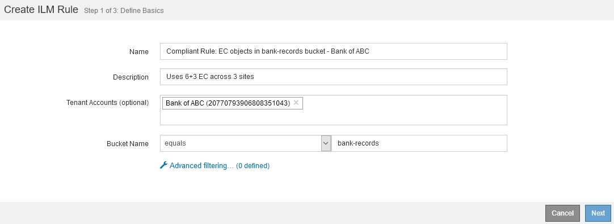
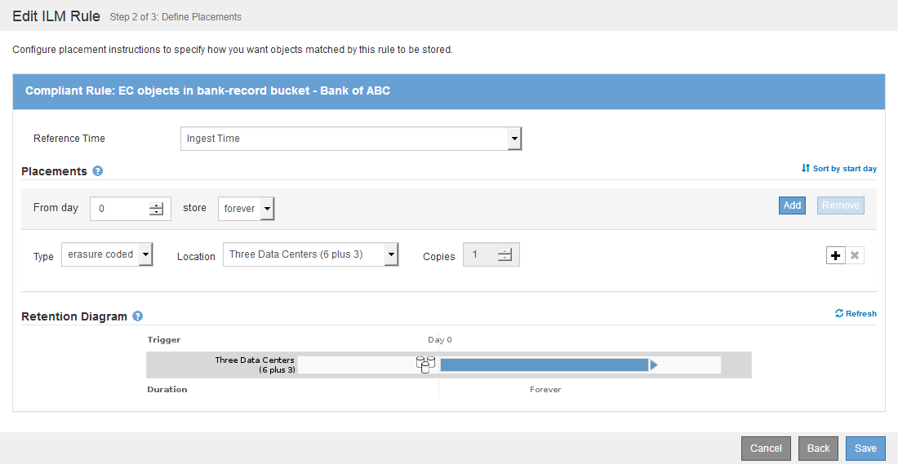
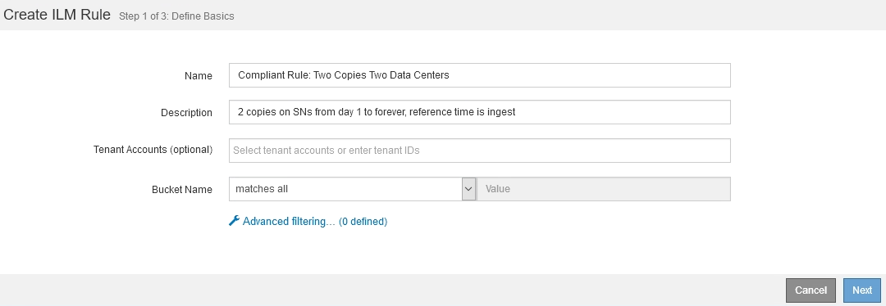
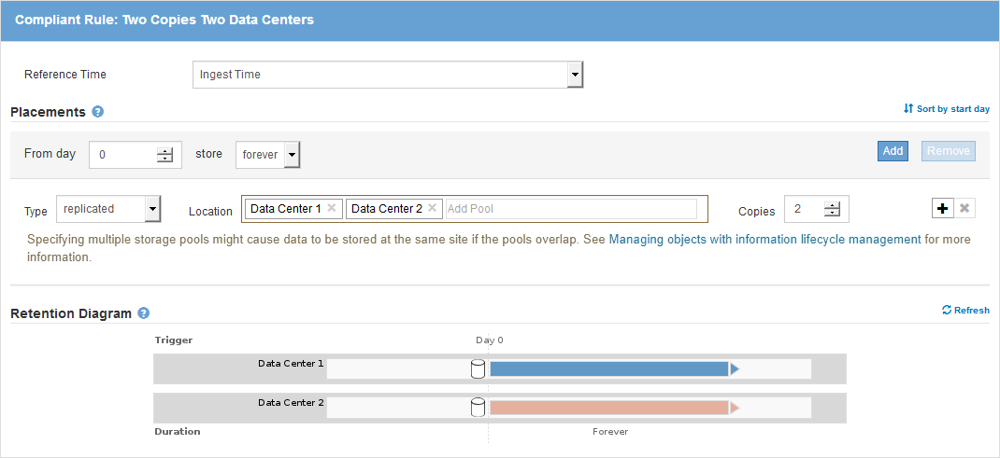
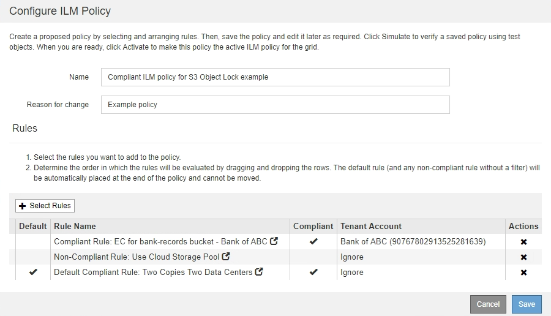

= Example 7: Compliant ILM policy for S3 Object Lock
:icons: font
:imagesdir: ../media/

[.lead]
You can use the S3 bucket, ILM rules, and ILM policy in this example as a starting point when defining an ILM policy to meet the object protection and retention requirements for objects in buckets with S3 Object Lock enabled.

NOTE: If you used the legacy Compliance feature in previous StorageGRID releases, you can also use this example to help manage any existing buckets that have the legacy Compliance feature enabled.

CAUTION: The following ILM rules and policy are only examples. There are many ways to configure ILM rules. Before activating a new policy, simulate the proposed policy to confirm it will work as intended to protect content from loss.

.Related information

* xref:managing-objects-with-s3-object-lock.adoc[Manage objects with S3 Object Lock]

* xref:creating-ilm-policy.adoc[Create an ILM policy]

== Bucket and objects for S3 Object Lock example

In this example, an S3 tenant account named Bank of ABC has used the Tenant Manager to create a bucket with S3 Object Lock enabled to store critical bank records.

[cols="1a,2a" options="header"]
|===
| Bucket definition| Example value
a|
Tenant Account Name
a|
Bank of ABC
a|
Bucket Name
a|
bank-records
a|
Bucket Region
a|
us-east-1 (default)
|===

image::../media/compliant_bucket.png[screen shot of an example compliant bucket]

Each object and object version that is added to the bank-records bucket will use the following values for `retain-until-date` and `legal hold` settings.

[cols="1a,2a" options="header"]
|===
| Setting for each object| Example value
a|
`retain-until-date`
a|
`"2030-12-30T23:59:59Z"` (December 30, 2030)

Each object version has its own `retain-until-date` setting. This setting can be increased, but not decreased.

a|
`legal hold`
a|
`"OFF"` (Not in effect)

A legal hold can be placed or lifted on any object version at any time during the retention period. If an object is under a legal hold, the object cannot be deleted even if the `retain-until-date` has been reached.

|===

== ILM rule 1 for S3 Object Lock example: Erasure Coding profile with bucket matching

This example ILM rule applies only to the S3 tenant account named Bank of ABC. It matches any object in the `bank-records` bucket and then uses erasure coding to store the object on Storage Nodes at three data center sites using a 6+3 Erasure Coding profile. This rule satisfies the requirements of buckets with S3 Object Lock enabled: an erasure-coded copy is kept on Storage Nodes from day 0 to forever, using Ingest Time as the reference time.

[cols="1a,2a" options="header"]
|===
| Rule definition| Example value
a|
Rule Name
a|
Compliant Rule: EC objects in bank-records bucket - Bank of ABC
a|
Tenant Account
a|
Bank of ABC
a|
Bucket Name
a|
`bank-records`
a|
Advanced filtering
a|
Object Size (MB) greater than 1

*Note:* This filter ensures that erasure coding is not used for objects 1 MB or smaller.

|===

[cols="1a,2a" options="header"]
|===
| Rule definition| Example value
a|
Reference Time
a|
Ingest Time
a|
Placements
a|
From day 0 store forever
a|
Erasure Coding Profile
a|

* Create an erasure-coded copy on Storage Nodes at three data center sites
* Uses 6+3 erasure-coding scheme

|===

== ILM rule 2 for S3 Object Lock example: Non-compliant rule

This example ILM rule initially stores two replicated object copies on Storage Nodes. After one year, it stores one copy on a Cloud Storage Pool forever. Because this rule uses a Cloud Storage Pool, it is not compliant and will not apply to the objects in buckets with S3 Object Lock enabled.

[cols="1a,2a" options="header"]
|===
| Rule definition| Example value
a|
Rule Name
a|
Non-Compliant Rule: Use Cloud Storage Pool
a|
Tenant Accounts
a|
Not specified
a|
Bucket Name
a|
Not specified, but will only apply to buckets that do not have S3 Object Lock (or the legacy Compliance feature) enabled.
a|
Advanced filtering
a|
Not specified
|===

image::../media/ilm_example_non_compliant_rule_step_1.png[Example Non-Compliant Rule Step 1]

[cols="1a,2a" options="header"]
|===
| Rule definition| Example value
a|
Reference Time
a|
Ingest Time
a|
Placements
a|

* On Day 0, keep two replicated copies on Storage Nodes in Data Center 1 and Data Center 2 for 365 days
* After 1 year, keep one replicated copy in a Cloud Storage Pool forever

|===

== ILM rule 3 for S3 Object Lock example: Default rule

This example ILM rule copies object data to storage pools in two data centers. This compliant rule is designed to be the default rule in the ILM policy. It does not include any filters, does not use the Noncurrent reference time, and satisfies the requirements of buckets with S3 Object Lock enabled: two object copies are kept on Storage Nodes from day 0 to forever, using Ingest as the reference time.

[cols="1a,2a" options="header"]
|===
| Rule definition| Example value
a|
Rule Name
a|
Default Compliant Rule: Two Copies Two Data Centers
a|
Tenant Account
a|
Not specified
a|
Bucket Name
a|
Not specified
a|
Advanced filtering
a|
Not specified
|===

[cols="1a,2a" options="header"]
|===
| Rule definition| Example value
a|
Reference Time
a|
Ingest Time
a|
Placements
a|
From Day 0 to forever, keep two replicated copies--one on Storage Nodes in Data Center 1 and one on Storage Nodes in Data Center 2.
|===

== Compliant ILM policy for S3 Object Lock example

To create an ILM policy that will effectively protect all objects in your system, including those in buckets with S3 Object Lock enabled, you must select ILM rules that satisfy the storage requirements for all objects. Then, you must simulate and activate the proposed policy.

=== Add rules to the policy

In this example, the ILM policy includes three ILM rules, in the following order:

. A compliant rule that uses erasure coding to protect objects greater than 1 MB in a specific bucket with S3 Object Lock enabled. The objects are stored on Storage Nodes from day 0 to forever.
. A non-compliant rule that creates two replicated object copies on Storage Nodes for a year and then moves one object copy to a Cloud Storage Pool forever. This rule does not apply to buckets with S3 Object Lock enabled because it uses a Cloud Storage Pool.
. The default compliant rule that creates two replicated object copies on Storage Nodes from day 0 to forever.

=== Simulate the proposed policy

After you have added rules in your proposed policy, chosen a default compliant rule, and arranged the other rules, you should simulate the policy by testing objects from the bucket with S3 Object Lock enabled and from other buckets. For example, when you simulate the example policy, you would expect test objects to be evaluated as follows:

* The first rule will only match test objects that are greater than 1 MB in the bucket bank-records for the Bank of ABC tenant.
* The second rule will match all objects in all non-compliant buckets for all other tenant accounts.
* The default rule will match these objects:
 ** Objects 1 MB or smaller in the bucket bank-records for the Bank of ABC tenant.
 ** Objects in any other bucket that has S3 Object Lock enabled for all other tenant accounts.

=== Activate the policy

When you are completely satisfied that the new policy protects object data as expected, you can activate it.
