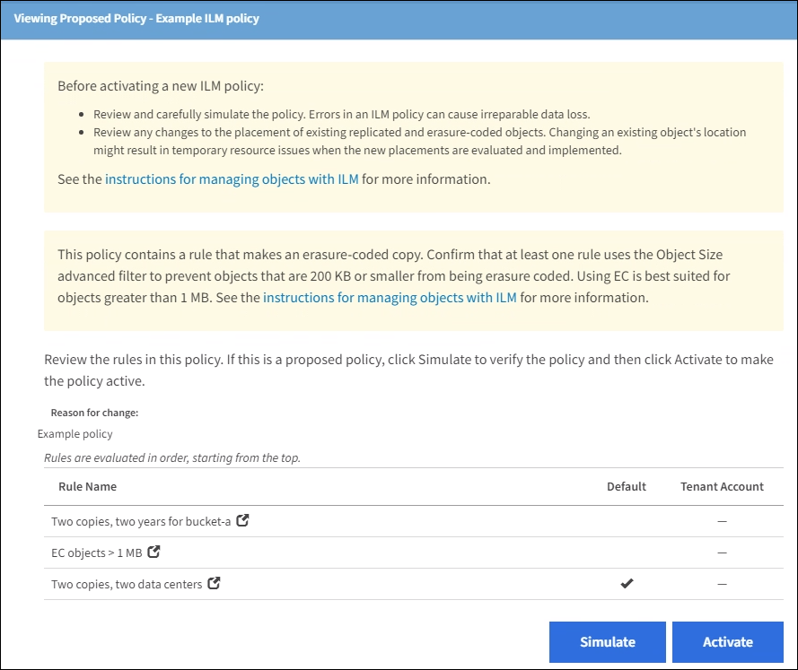

= Examples for simulating ILM policies
:experimental:
:icons: font
:imagesdir: ../media/

[.lead]
These examples show how you can verify ILM rules by simulating the ILM policy before activating it.

== Example 1: Verifying rules when simulating a proposed ILM policy

This example shows how to verify rules when simulating a proposed policy.

In this example, the *Example ILM policy* is being simulated against the ingested objects in two buckets. The policy includes three rules, as follows:

* The first rule, *Two copies, two years for bucket-a*, applies only to objects in bucket-a.
* The second rule, menu:EC objects[1 MB], applies to all buckets but filters on objects greater than 1 MB.
* The third rule is the default rule and does not include any filters.

.Steps
. After adding the rules and saving the policy, click *Simulate*.
+
The Simulate ILM Policy dialog box appears.

. In the *Object* field, enter the S3 bucket/object-key or the Swift container/object-name for a test object, and click *Simulate*.
+
The Simulation Results appear, showing which rule in the policy matched each object you tested.
+
image::../media/simulate_policy_screen.png[Simulate Policy Screen]

. Confirm that each object was matched by the correct rule.
+
In this example:

 .. `bucket-a/bucket-a object.pdf` correctly matched the first rule, which filters on objects in `bucket-a`.
 .. `bucket-b/test object greater than 1 MB.pdf` is in `bucket-b`, so it did not match the first rule. Instead, it was correctly matched by the second rule, which filters on objects greater than 1 MB.
 .. `bucket-b/test object less than 1 MB.pdf` did not match the filters in the first two rules, so it will be placed by the default rule, which includes no filters.

== Example 2: Reordering rules when simulating a proposed ILM policy

This example shows how you can reorder rules to change the results when simulating a policy.

In this example, the *Demo* policy is being simulated. This policy, which is intended to find objects that have series=x-men user metadata, includes three rules, as follows:

* The first rule, *PNGs*, filters for key names that end in `.png`.
* The second rule, *X-men*, applies only to objects for Tenant A and filters for `series=x-men` user metadata.
* The last rule, *Two copies two data centers*, is the default rule, which matches any objects that do not match the first two rules.

image::../media/simulate_reorder_rules_pngs_rule.png[Example 2: Reordering rules when simulating a proposed ILM policy]

.Steps
. After adding the rules and saving the policy, click *Simulate*.
. In the *Object* field, enter the S3 bucket/object-key or the Swift container/object-name for a test object, and click *Simulate*.
+
The Simulation Results appear, showing that the `Havok.png` object was matched by the *PNGs* rule.
+
image::../media/simulate_reorder_rules_pngs_result.gif[Example 2: Reordering rules when simulating a proposed ILM policy]
+
However, the rule that the `Havok.png` object was meant to test was the *X-men* rule.

. To resolve the issue, reorder the rules.
 .. Click *Finish* to close the Simulate ILM Policy page.
 .. Click *Edit* to edit the policy.
 .. Drag the *X-men* rule to the top of the list.
+
image::../media/simulate_reorder_rules_correct_rule.png[Simulate - Reorder Rules - Correct Rule]

 .. Click *Save*.
. Click *Simulate*.
+
The objects you previously tested are re-evaluated against the updated policy, and the new simulation results are shown. In the example, the Rule Matched column shows that the `Havok.png` object now matches the X-men metadata rule, as expected. The Previous Match column shows that the PNGs rule matched the object in the previous simulation.
+
image::../media/simulate_reorder_rules_correct_result.gif[Example 2: Reordering rules when simulating a proposed ILM policy]
+
NOTE: If you stay on the Configure Policies page, you can re-simulate a policy after making changes without needing to re-enter the names of the test objects.

== Example 3: Correcting a rule when simulating a proposed ILM policy

This example shows how to simulate a policy, correct a rule in the policy, and continue the simulation.

In this example, the *Demo* policy is being simulated. This policy is intended to find objects that have `series=x-men` user metadata. However, unexpected results occurred when simulating this policy against the `Beast.jpg` object. Instead of matching the X-men metadata rule, the object matched the default rule, Two copies two data centers.

image::../media/simulate_results_for_object_wrong_metadata.png[Example 3: Correcting a rule when simulating a proposed ILM policy]

When a test object is not matched by the expected rule in the policy, you must examine each rule in the policy and correct any errors.

.Steps

. For each rule in the policy, view the rule settings by clicking the rule name or the more details icon image:../media/icon_nms_more_details.gif[more details icon] on any dialog box where the rule is displayed.
. Review the rule's tenant account, reference time, and filtering criteria.
+
In this example, the metadata for the X-men rule includes an error. The metadata value was entered as "`x-men1`" instead of "`x-men.`"
+
image::../media/simulate_rules_select_rule_popup_with_wrong_metadata.png[Example 3: Correcting a rule when simulating a proposed ILM policy]

. To resolve the error, correct the rule, as follows:
 ** If the rule is part of the proposed policy, you can either clone the rule or remove the rule from the policy and then edit it.
 ** If the rule is part of the active policy, you must clone the rule. You cannot edit or remove a rule from the active policy.
+
[cols="1a,3a" options="header"]
|===
| Option| Description
a|
Cloning the rule
a|

 .. Select *ILM* > *Rules*.
 .. Select the incorrect rule, and click *Clone*.
 .. Change the incorrect information, and click *Save*.
 .. Select *ILM* > *Policies*.
 .. Select the proposed policy, and click *Edit*.
 .. Click *Select Rules*.
 .. Select the check box for the new rule, uncheck the check box for the original rule, and click *Apply*.
 .. Click *Save*.

a|
Editing the rule
a|
 .. Select the proposed policy, and click *Edit*.
 .. Click the delete icon image:../media/icon_nms_delete_new.gif[delete icon] to remove the incorrect rule, and click *Save*.
 .. Select *ILM* > *Rules*.
 .. Select the incorrect rule, and click *Edit*.
 .. Change the incorrect information, and click *Save*.
 .. Select *ILM* > *Policies*.
 .. Select the proposed policy, and click *Edit*.
 .. Select the corrected rule, click *Apply*, and click *Save*.

+
|===
. Perform the simulation again.
+
NOTE: Because you navigated away from the ILM Policies page to edit the rule, the objects you previously entered for simulation are no longer displayed. You must re-enter the names of the objects.
+
In this example, the corrected X-men rule now matches the `Beast.jpg` object based on the `series=x-men` user metadata, as expected.
+
image::../media/simulate_results_for_object_corrected_metadata.gif[Example 3: Correcting a rule when simulating a proposed ILM policy]
