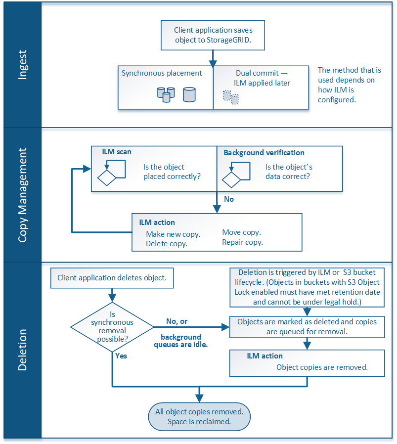

= How ILM operates throughout an object's life
:icons: font
:imagesdir: ../media/

[.lead]
Understanding how StorageGRID uses ILM to manage objects during every stage of their life can help you design a more effective policy.

* *Ingest*: Ingest begins when an S3 or Swift client application establishes a connection to save an object to the StorageGRID system, and is complete when StorageGRID returns an "`ingest successful`" message to the client. Object data is protected during ingest either by applying ILM instructions immediately (synchronous placement) or by creating interim copies and applying ILM later (dual commit), depending on how the ILM requirements were specified.
* *Copy management*: After creating the number and type of object copies that are specified in the ILM's placement instructions, StorageGRID manages object locations and protects objects against loss.
 ** ILM scanning and evaluation: StorageGRID continuously scans the list of objects stored in the grid and checks if the current copies meet ILM requirements. When different types, numbers, or locations of object copies are required, StorageGRID creates, deletes, or moves copies as needed.
 ** Background verification: StorageGRID continuously performs background verification to check the integrity of object data. If a problem is found, StorageGRID automatically creates a new object copy or a replacement erasure-coded object fragment in a location that meets current ILM requirements. See the instructions for monitoring and troubleshooting StorageGRID.
* *Object deletion*: Management of an object ends when all copies are removed from the StorageGRID system. Objects can be removed as a result of a delete request by a client, or as a result of deletion by ILM or deletion caused by the expiration of an S3 bucket lifecycle.
+
NOTE: Objects in a bucket that has S3 Object Lock enabled cannot be deleted if they are under a legal hold or if a retain-until-date has been specified but not yet met.

The diagram summarizes how ILM operates throughout an object's lifecycle.

.Related information

xref:../monitor/index.adoc[Monitor & troubleshoot]
