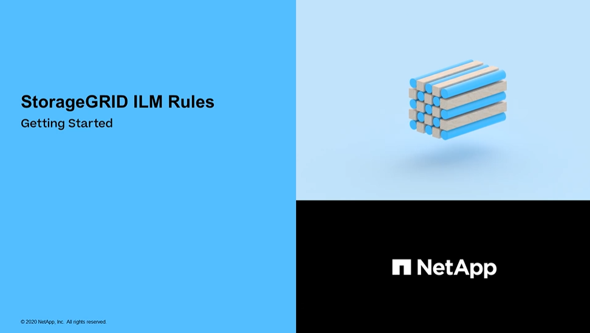
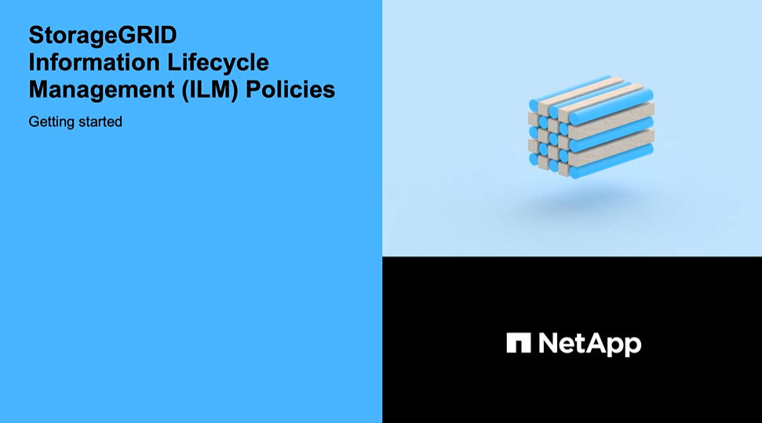

= Manage objects with ILM: Overview
:icons: font
:imagesdir: ../media/

[.lead]

You manage the objects in a StorageGRID system by configuring information lifecycle management (ILM) rules and policies. The ILM rules and policies instruct StorageGRID how to create and distribute copies of object data and how to manage those copies over time.

== About these instructions

Designing and implementing ILM rules and the ILM policy requires careful planning. You must understand your operational requirements, the topology of your StorageGRID system, your object protection needs, and the available storage types. Then, you must determine how you want different types of objects to be copied, distributed, and stored.

Use these instructions to:

* Learn about StorageGRID ILM, including how ILM operates throughout an object's life and what ILM policies and rules are.
* Learn how to configure storage pools, Erasure Coding profiles, and ILM rules.
* Learn how to create and activate an ILM policy that will protect object data across one or more sites.
* Learn how to manage objects with S3 Object Lock, which helps to ensure that objects in specific S3 buckets are not deleted or overwritten for a specified amount of time.

== Learn more

To learn more, review these videos:

* https://netapp.hosted.panopto.com/Panopto/Pages/Viewer.aspx?id=beffbe9b-e95e-4a90-9560-acc5013c93d8[Video: StorageGRID ILM Rules: Getting Started^]
+

* https://netapp.hosted.panopto.com/Panopto/Pages/Viewer.aspx?id=c929e94e-353a-4375-b112-acc5013c81c7[Video: StorageGRID ILM Policies^]
+

