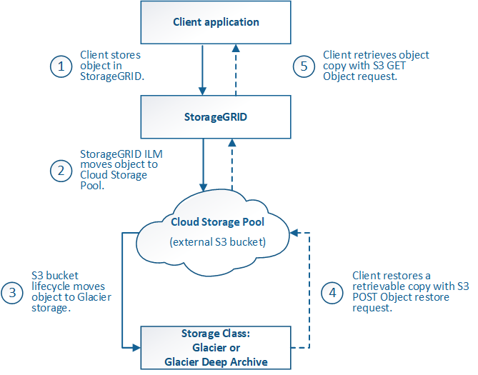
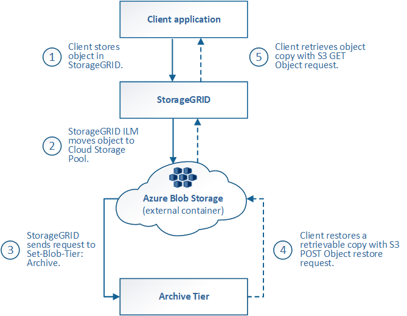

= Lifecycle of a Cloud Storage Pool object
:icons: font
:imagesdir: ../media/

[.lead]
Before implementing Cloud Storage Pools, review the lifecycle of objects that are stored in each type of Cloud Storage Pool.

* <<S3: Lifecycle of a Cloud Storage Pool object>>

* <<Azure: Lifecycle of a Cloud Storage Pool object>>

== S3: Lifecycle of a Cloud Storage Pool object

The figure shows the lifecycle stages of an object that is stored in an S3 Cloud Storage Pool.

NOTE: In the figure and explanations, "`Glacier`" refers to both the Glacier storage class and the Glacier Deep Archive storage class, with one exception: the Glacier Deep Archive storage class does not support the Expedited restore tier. Only Bulk or Standard retrieval is supported.

NOTE: The Google Cloud Platform (GCP) supports object retrieval from long-term storage without requiring a POST Restore operation.

. *Object stored in StorageGRID*
+
To start the lifecycle, a client application stores an object in StorageGRID.

. *Object moved to S3 Cloud Storage Pool*
 ** When the object is matched by an ILM rule that uses an S3 Cloud Storage Pool as its placement location, StorageGRID moves the object to the external S3 bucket specified by the Cloud Storage Pool.
 ** When the object has been moved to the S3 Cloud Storage Pool, the client application can retrieve it using an S3 GET Object request from StorageGRID, unless the object has been transitioned to Glacier storage.
. *Object transitioned to Glacier (non-retrievable state)*
 ** Optionally, the object can be transitioned to Glacier storage. For example, the external S3 bucket might use lifecycle configuration to transition an object to Glacier storage immediately or after some number of days.
+
NOTE: If you want to transition objects, you must create a lifecycle configuration for the external S3 bucket, and you must use a storage solution that implements the Glacier storage class and supports the S3 POST Object restore API.
+
NOTE: Do not use Cloud Storage Pools for objects that have been ingested by Swift clients. Swift does not support POST Object restore requests, so StorageGRID will not be able to retrieve any Swift objects that have been transitioned to S3 Glacier storage. Issuing a Swift GET object request to retrieve these objects will fail (403 Forbidden).

 ** During the transition, the client application can use an S3 HEAD Object request to monitor the object's status.
. *Object restored from Glacier storage*
+
If an object has been transitioned to Glacier storage, the client application can issue an S3 POST Object restore request to restore a retrievable copy to the S3 Cloud Storage Pool. The request specifies how many days the copy should be available in the Cloud Storage Pool and the data-access tier to use for the restore operation (Expedited, Standard, or Bulk). When the expiration date of the retrievable copy is reached, the copy is automatically returned to a non-retrievable state.
+
NOTE: If one or more copies of the object also exist on Storage Nodes within StorageGRID, there is no need to restore the object from Glacier by issuing a POST Object restore request. Instead, the local copy can be retrieved directly, using a GET Object request.

. *Object retrieved*
+
Once an object has been restored, the client application can issue a GET Object request to retrieve the restored object.

== Azure: Lifecycle of a Cloud Storage Pool object

The figure shows the lifecycle stages of an object that is stored in an Azure Cloud Storage Pool.

. *Object stored in StorageGRID*
+
To start the lifecycle, a client application stores an object in StorageGRID.

. *Object moved to Azure Cloud Storage Pool*
+
When the object is matched by an ILM rule that uses an Azure Cloud Storage Pool as its placement location, StorageGRID moves the object to the external Azure Blob storage container specified by the Cloud Storage Pool
+
NOTE: Do not use Cloud Storage Pools for objects that have been ingested by Swift clients. Swift does not support POST Object restore requests, so StorageGRID will not be able to retrieve any Swift objects that have been transitioned to the Azure Blob storage Archive tier. Issuing a Swift GET object request to retrieve these objects will fail (403 Forbidden).

. *Object transitioned to Archive tier (non-retrievable state)*
+
Immediately after moving the object to the Azure Cloud Storage Pool, StorageGRID automatically transitions the object to the Azure Blob storage Archive tier.

. *Object restored from Archive tier*
+
If an object has been transitioned to the Archive tier, the client application can issue an S3 POST Object restore request to restore a retrievable copy to the Azure Cloud Storage Pool.
+
When StorageGRID receives the POST Object Restore, it temporarily transitions the object to the Azure Blob storage Cool tier. As soon as the expiration date in the POST Object restore request is reached, StorageGRID transitions the object back to the Archive tier.
+
NOTE: If one or more copies of the object also exist on Storage Nodes within StorageGRID, there is no need to restore the object from the Archive access tier by issuing a POST Object restore request. Instead, the local copy can be retrieved directly, using a GET Object request.

. *Object retrieved*
+
Once an object has been restored to the Azure Cloud Storage Pool, the client application can issue a GET Object request to retrieve the restored object.

.Related information

xref:../s3/index.adoc[Use S3]
