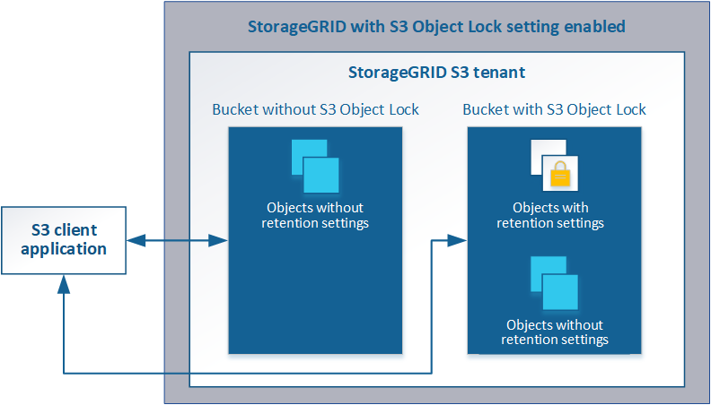

= Managing objects with S3 Object Lock
:icons: font
:imagesdir: ../media/

[.lead]
As a grid administrator, you can enable S3 Object Lock for your StorageGRID system and implement a compliant ILM policy to help ensure that objects in specific S3 buckets are not deleted or overwritten for a specified amount of time.

== What is S3 Object Lock?

The StorageGRID S3 Object Lock feature is an object-protection solution that is equivalent to S3 Object Lock in Amazon Simple Storage Service (Amazon S3).

As shown in the figure, when the global S3 Object Lock setting is enabled for a StorageGRID system, an S3 tenant account can create buckets with or without S3 Object Lock enabled. If a bucket has S3 Object Lock enabled, S3 client applications can optionally specify retention settings for any object version in that bucket. An object version must have retention settings specified to be protected by S3 Object Lock.

The StorageGRID S3 Object Lock feature provides a single retention mode that is equivalent to the Amazon S3 compliance mode. By default, a protected object version cannot be overwritten or deleted by any user. The StorageGRID S3 Object Lock feature does not support a governance mode, and it does not allow users with special permissions to bypass retention settings or to delete protected objects.

If a bucket has S3 Object Lock enabled, the S3 client application can optionally specify either or both of the following object-level retention settings when creating or updating an object:

* *Retain-until-date*: If an object version's retain-until-date is in the future, the object can be retrieved, but it cannot be modified or deleted. As required, an object's retain-until-date can be increased, but this date cannot be decreased.
* *Legal hold*: Applying a legal hold to an object version immediately locks that object. For example, you might need to put a legal hold on an object that is related to an investigation or legal dispute. A legal hold has no expiration date, but remains in place until it is explicitly removed. Legal holds are independent of the retain-until-date.

For details on these settings, go to "`using S3 object lock`" in xref:../s3/s3-rest-api-supported-operations-and-limitations.adoc[S3 REST API supported operations and limitations].
