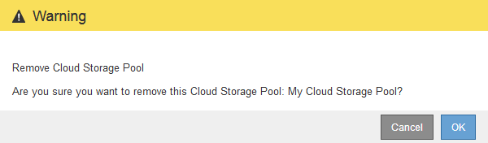

= Remove a Cloud Storage Pool
:icons: font
:imagesdir: ../media/

[.lead]
You can remove a Cloud Storage Pool that is not used in an ILM rule and that does not contain object data.

.What you'll need
* You are signed in to the Grid Manager using a xref:../admin/web-browser-requirements.adoc[supported web browser].
* You have specific access permissions.
* You have confirmed that the S3 bucket or Azure container does not contain any objects. An error occurs if you attempt to remove a Cloud Storage Pool if it contains objects. See xref:troubleshooting-cloud-storage-pools.adoc[Troubleshoot Cloud Storage Pools].
+
NOTE: When you create a Cloud Storage Pool, StorageGRID writes a marker file to the bucket or container to identify it as a Cloud Storage Pool. Do not remove this file, which is named `x-ntap-sgws-cloud-pool-uuid`.

* You have already removed any ILM rules that might have used the pool.

.Steps
. Select *ILM* > *Storage pools*.
+
The Storage Pools page appears.

. Select the radio button for a Cloud Storage Pool that is not currently used in an ILM rule.
+
You cannot remove a Cloud Storage Pool if it is used in an ILM rule. The *Remove* button is disabled.
+
image::../media/cloud_storage_pool_used_in_ilm_rule.png[Cloud Storage Pool Used In ILM Rule]

. Select *Remove*.
+
A confirmation warning is displayed.
+

. Select *OK*.
+
The Cloud Storage Pool is removed.

