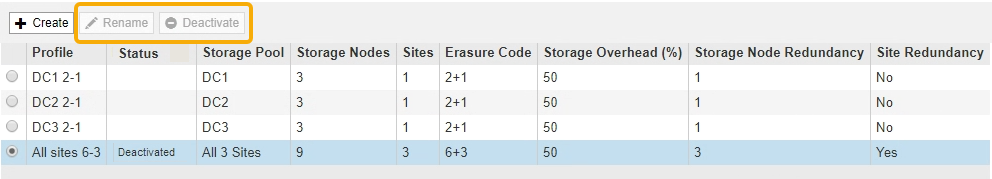
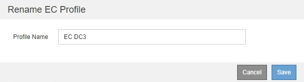

= Rename an Erasure Coding profile
:icons: font
:imagesdir: ../media/

[.lead]
You might want to rename an Erasure Coding profile to make it more obvious what the profile does.

.What you'll need

* You are signed in to the Grid Manager using a xref:../admin/web-browser-requirements.adoc[supported web browser].
* You have specific access permissions.

.Steps

. Select *ILM* > *Erasure coding*.
+
The Erasure Coding Profiles page appears. The *Rename* and *Deactivate* buttons are both disabled.
+

. Select the profile you want to rename.
+
The *Rename* and *Deactivate* buttons become enabled.

. Select *Rename*.
+
The Rename EC Profile dialog box appears.
+

. Enter a unique name for the Erasure Coding profile.
+
The Erasure Coding profile name is appended to the storage pool name in the placement instruction for an ILM rule.
+
image::../media/storage_pool_and_erasure_coding_profile.png[Storage pool and EC profile name]
+
NOTE: Erasure Coding profile names must be unique. A validation error occurs if you use the name of an existing profile, even if that profile has been deactivated.

. Select *Save*.
