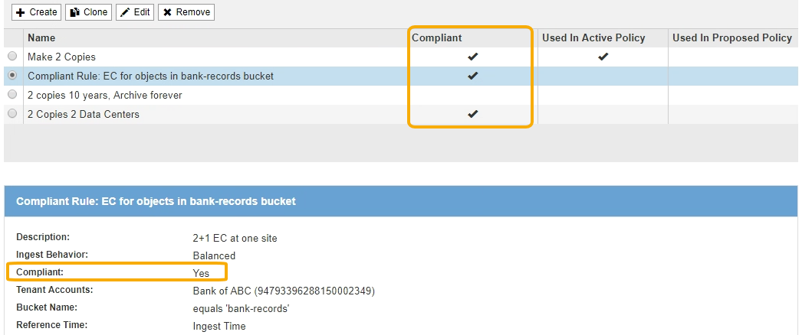
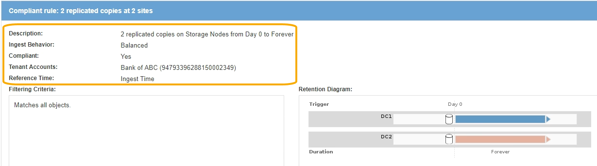

= Requirements for S3 Object Lock
:icons: font
:imagesdir: ../media/

[.lead]
You must review the requirements for enabling the global S3 Object Lock setting, the requirements for creating compliant ILM rules and ILM policies, and the restrictions StorageGRID places on buckets and objects that use S3 Object Lock.

== Requirements for using the global S3 Object Lock setting

* You must enable the global S3 Object Lock setting using the Grid Manager or the Grid Management API before any S3 tenant can create a bucket with S3 Object Lock enabled.
* Enabling the global S3 Object Lock setting allows all S3 tenant accounts to create buckets with S3 Object Lock enabled.
* After you enable the global S3 Object Lock setting, you cannot disable the setting.
* You cannot enable the global S3 Object Lock unless the default rule in the active ILM policy is__compliant__ (that is, the default rule must comply with the requirements of buckets with S3 Object Lock enabled).
* When the global S3 Object Lock setting is enabled, you cannot create a new proposed ILM policy or activate an existing proposed ILM policy unless the default rule in the policy is compliant. After the global S3 Object Lock setting has been enabled, the ILM Rules and ILM Policies pages indicate which ILM rules are compliant.
+
In the following example, the ILM Rules page lists three rules that are compliant with buckets with S3 Object Lock enabled.
+

== Requirements for compliant ILM rules

If you want to enable the global S3 Object Lock setting, you must ensure that the default rule in your active ILM policy is compliant. A compliant rule satisfies the requirements of both buckets with S3 Object Lock enabled and any existing buckets that have legacy Compliance enabled:

* It must create at least two replicated object copies or one erasure-coded copy.
* These copies must exist on Storage Nodes for the entire duration of each line in the placement instructions.
* Object copies cannot be saved in a Cloud Storage Pool.
* Object copies cannot be saved on Archive Nodes.
* At least one line of the placement instructions must start at day 0, using *Ingest Time* as the reference time.
* At least one line of the placement instructions must be "`forever.`"

For example, this rule satisfies the requirements of buckets with S3 Object Lock enabled. It stores two replicated object copies from Ingest Time (day 0) to "`forever.`" The objects will be stored on Storage Nodes at two data centers.

== Requirements for active and proposed ILM policies

When the global S3 Object Lock setting is enabled, active and proposed ILM policies can include both compliant and non-compliant rules.

* The default rule in the active or any proposed ILM policy must be compliant.
* Non-compliant rules only apply to objects in buckets that do not have S3 Object Lock enabled or that do not have the legacy Compliance feature enabled.
* Compliant rules can apply to objects in any bucket; S3 Object Lock or legacy Compliance does not need to be enabled for the bucket.

A compliant ILM policy might include these three rules:

. A compliant rule that creates erasure-coded copies of the objects in a specific bucket with S3 Object Lock enabled. The EC copies are stored on Storage Nodes from day 0 to forever.
. A non-compliant rule that creates two replicated object copies on Storage Nodes for a year and then moves one object copy to Archive Nodes and stores that copy forever. This rule only applies to buckets that do not have S3 Object Lock or legacy Compliance enabled because it stores only one object copy forever and it uses Archive Nodes.
. A default, compliant rule that creates two replicated object copies on Storage Nodes from day 0 to forever. This rule applies to any object in any bucket that was not filtered out by the first two rules.

== Requirements for buckets with S3 Object Lock enabled

* If the global S3 Object Lock setting is enabled for the StorageGRID system, you can use the Tenant Manager, the Tenant Management API, or the S3 REST API to create buckets with S3 Object Lock enabled.
+
This example from the Tenant Manager shows a bucket with S3 Object Lock enabled.
+
image::../media/compliant_bucket.png[Example Compliant Bucket]

* If you plan to use S3 Object Lock, you must enable S3 Object Lock when you create the bucket. You cannot enable S3 Object Lock for an existing bucket.
* Bucket versioning is required with S3 Object Lock. When S3 Object Lock is enabled for a bucket, StorageGRID automatically enables versioning for that bucket.
* After you create a bucket with S3 Object Lock enabled, you cannot disable S3 Object Lock or suspend versioning for that bucket.
* An StorageGRID bucket that has S3 Object Lock enabled does not have a default retention period. Instead, the S3 client application can optionally specify a retention date and legal hold setting for each object version that is added to that bucket.
* Bucket lifecycle configuration is supported for S3 Object Lifecycle buckets.
* CloudMirror replication is not supported for buckets with S3 Object Lock enabled.

== Requirements for objects in buckets with S3 Object Lock enabled

* The S3 client application must specify retention settings for each object that needs to be protected by S3 Object Lock.
* You can increase the retain-until-date for an object version, but you can never decrease this value.
* If you are notified of a pending legal action or regulatory investigation, you can preserve relevant information by placing a legal hold on an object version. When an object version is under a legal hold, that object cannot be deleted from StorageGRID, even if it has reached its retain-until-date. As soon as the legal hold is lifted,the object version can be deleted if the retain-until-date has been reached.
* S3 Object Lock requires the use of versioned buckets. Retention settings apply to individual object versions. An object version can have both a retain-until-date and a legal hold setting, one but not the other, or neither. Specifying a retain-until-date or a legal hold setting for an object protects only the version specified in the request. You can create new versions of the object, while the previous version of the object remains locked.

== Lifecycle of objects in buckets with S3 Object Lock enabled

Each object that is saved in a bucket with S3 Object Lock enabled goes through three stages:

. *Object ingest*
 ** When adding an object version to a bucket with S3 Object Lock enabled, the S3 client application can optionally specify retention settings for the object (retain-until-date, legal hold, or both). StorageGRID then generates metadata for that object, which includes a unique object identifier (UUID) and the ingest date and time.
 ** After an object version with retention settings is ingested, its data and S3 user-defined metadata cannot be modified.
 ** StorageGRID stores the object metadata independently of the object data. It maintains three copies of all object metadata at each site.
. *Object retention*
 ** Multiple copies of the object are stored by StorageGRID. The exact number and type of copies and the storage locations are determined by the compliant rules in the active ILM policy.
. *Object deletion*
 ** An object can be deleted when its retain-until-date is reached.
 ** An object that is under a legal hold cannot be deleted.

.Related information

xref:../tenant/index.adoc[Use a tenant account]

xref:../s3/index.adoc[Use S3]

xref:comparing-s3-object-lock-to-legacy-compliance.adoc[Comparing S3 Object Lock to legacy Compliance]

xref:example-7-compliant-ilm-policy-for-s3-object-lock.adoc[Example 7: Compliant ILM policy for S3 Object Lock]

xref:../audit/index.adoc[Review audit logs]
