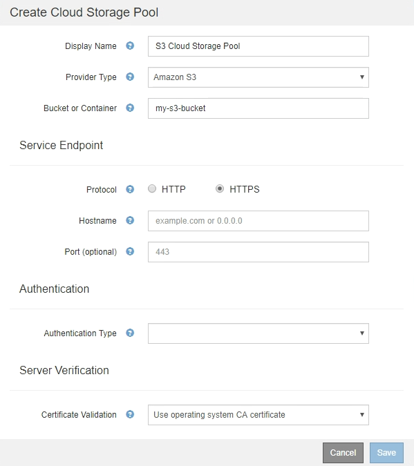

= S3: Specifying authentication details for a Cloud Storage Pool
:icons: font
:imagesdir: ../media/

[.lead]
When you create a Cloud Storage Pool for S3, you must select the type of authentication that is required for the Cloud Storage Pool endpoint. You can specify Anonymous or enter an Access Key ID and Secret Access Key.

.What you'll need
* You have entered the basic information for the Cloud Storage Pool and specified *Amazon S3* as the provider type.
+

* If you are using access key authentication, you know the Access Key ID and Secret Access Key for the external S3 bucket.

.Steps
. In the *Service Endpoint* section, provide the following information:
 .. Select which protocol to use when connecting to the Cloud Storage Pool.
+
The default protocol is HTTPS.

 .. Enter the server hostname or IP address of the Cloud Storage Pool.
+
For example:
+
`s3-_aws-region_.amazonaws.com`
+
NOTE: Do not include the bucket name in this field. You include the bucket name in the *Bucket or Container* field.

 .. Optionally, specify the port that should be used when connecting to the Cloud Storage Pool.
+
Leave this field blank to use the default port: port 443 for HTTPS or port 80 for HTTP.
 .. Select the URL style for the Cloud Storage Pool bucket:
+
[cols="1a,2a" options="header"]
|===
| Option| Description
a|
Virtual Hosted-Style
a|
Use a virtual hosted-style URL to access the bucket. Virtual hosted-style URLs include the bucket name as part of the domain name, for example `+https://bucket-name.s3.company.com/key-name+`.
a|
Path-Style
a|
Use a path-style URL to access the bucket. Path-style URLs include the bucket name at the end, for example `+https://s3.company.com/bucket-name/key-name+`.

*Note:* The path-style URL is being deprecated.
a|
Auto-Detect
a|
Attempt to automatically detect which URL style to use, based on the information provided. For example, if you specify an IP address, StorageGRID will use a path-style URL. Select this option only if you don't know which specific style to use.
|===

. In the *Authentication* section, select the type of authentication that is required for the Cloud Storage Pool endpoint.
+
[cols="1a,2a" options="header"]
|===
| Option| Description
a|
Access Key
a|
An Access Key ID and Secret Access Key are required to access the Cloud Storage Pool bucket.
a|
Anonymous
a|
Everyone has access to the Cloud Storage Pool bucket. An Access Key ID and Secret Access Key are not required.
a|
CAP (C2S Access Portal)
a|
Used for C2S S3 only. Go to xref:c2s-s3-authentication-details-for-cloud-storage-pool.adoc[C2S S3: Specifying authentication details for a Cloud Storage Pool].
|===

. If you selected Access Key, enter the following information:
+
[cols="1a,2a" options="header"]
|===
| Option| Description
a|
Access Key ID
a|
The Access Key ID for the account that owns the external bucket.
a|
Secret Access Key
a|
The associated Secret Access Key.
|===

. In the Server Verification section, select which method should be used to validate the certificate for TLS connections to the Cloud Storage Pool:
+
[cols="1a,2a" options="header"]
|===
| Option| Description
a|
Use operating system CA certificate
a|
Use the default Grid CA certificates installed on the operating system to secure connections.
a|
Use custom CA certificate
a|
Use a custom CA certificate. Select *Select New*, and upload the PEM-encoded CA certificate.
a|
Do not verify certificate
a|
The certificate used for the TLS connection is not verified.
|===

. Select *Save*.

When you save a Cloud Storage Pool, StorageGRID does the following:

 ** Validates that the bucket and the service endpoint exist and that they can be reached using the credentials that you specified.
 ** Writes a marker file to the bucket to identify the bucket as a Cloud Storage Pool. Never remove this file, which is named `x-ntap-sgws-cloud-pool-uuid`.

If Cloud Storage Pool validation fails, you receive an error message that explains why validation failed. For example, an error might be reported if there is a certificate error or if the bucket you specified does not already exist.

image::../media/cloud_storage_pool_create_error.gif[Cloud Storage Pool Create Error]

See the instructions for xref:troubleshooting-cloud-storage-pools.adoc[troubleshooting Cloud Storage Pools], resolve the issue, and then try saving the Cloud Storage Pool again.
