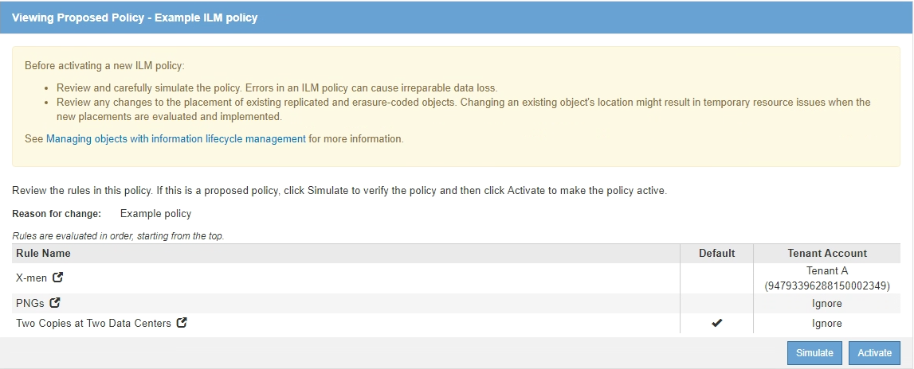
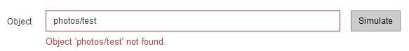
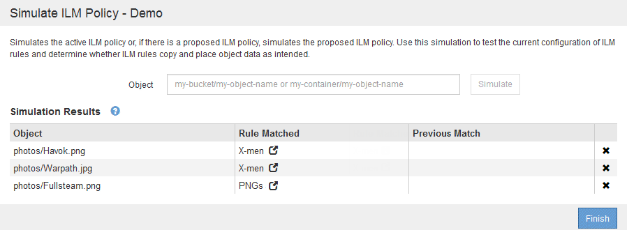
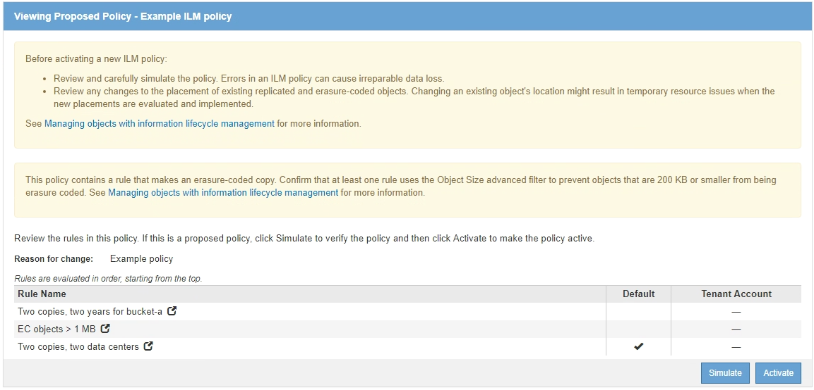
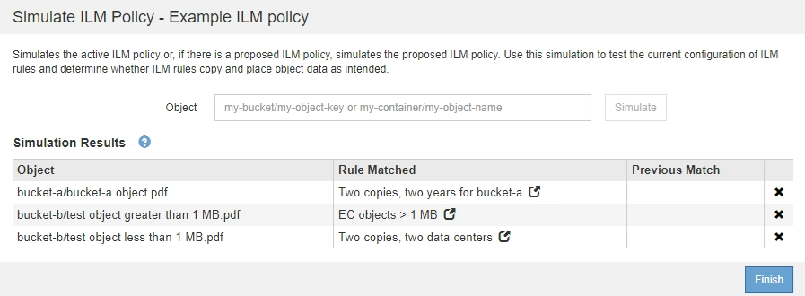
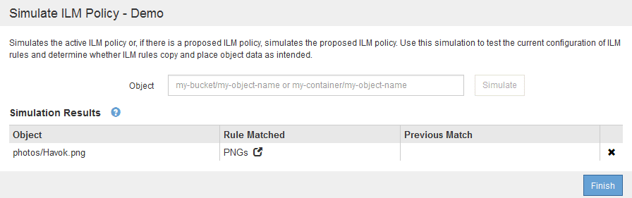
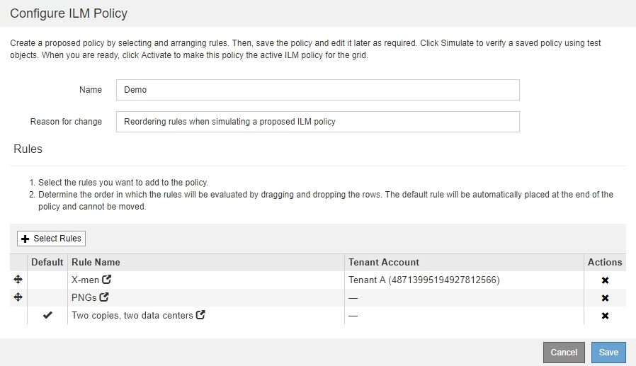
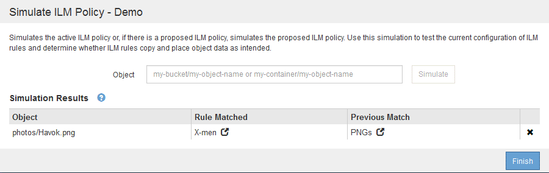
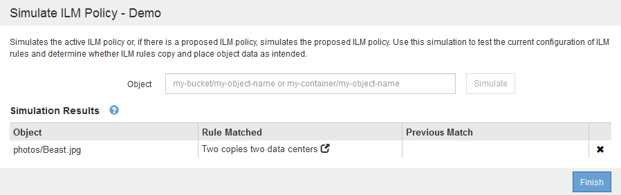
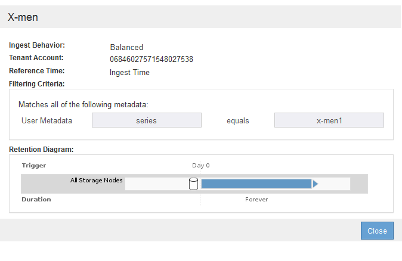

= Simulate an ILM policy
:icons: font
:imagesdir: ../media/

[.lead]
You should simulate a proposed policy on test objects before activating the policy and applying it to your production data. The simulation window provides a standalone environment that is safe for testing policies before they are activated and applied to data in the production environment.

.What you'll need

* You are signed in to the Grid Manager using a xref:../admin/web-browser-requirements.adoc[supported web browser].
* You have specific access permissions.
* You know the S3 bucket/object-key or the Swift container/object-name for each object you want to test, and you have already ingested those objects.

.About this task

You must carefully select the objects you want the proposed policy to test. To simulate a policy thoroughly, you should test at least one object for each filter in each rule.

For example, if a policy includes one rule to match objects in bucket A and another rule to match objects in bucket B, you must select at least one object from bucket A and one object from bucket B to test the policy thoroughly. You must also select at least one object from another bucket to test the default rule.

When simulating a policy, the following considerations apply:

* After you make changes to a policy, save the proposed policy. Then, simulate the behavior of the saved proposed policy.
* When you simulate a policy, the ILM rules in the policy filter the test objects, so you can see which rule was applied to each object. However, no object copies are made and no objects are placed. Running a simulation does not modify your data, rules, or the policy in any way.
* The Simulation page retains the objects you tested until you close, navigate away from, or refresh the ILM Policies page.
* Simulation returns the name of the matched rule. To determine which storage pool or Erasure Coding profile is in effect, you can view the Retention Diagram by selecting the rule name or the more details icon image:../media/icon_nms_more_details.gif[more details icon].
* If S3 Versioning is enabled, the policy is only simulated against the current version of the object.

.Steps

. Select and arrange the rules, and save the proposed policy.
+
The policy in this example has three rules:
+
[cols="1a,1a,1a,1a" options="header"]
|===
| Rule Name| Filter| Type of Copies| Retention

|X-men
|
 ** Tenant A
 ** User metadata (series=x-men)
|2 copies at two data centers
|2 years

|PNGs
|Key ends with .png
|2 copies at two data centers
|5 years

|Two Copies Two Data Centers
|_None_
|2 copies at two data centers
|Forever
|===
+

. Using an S3 or Swift client or the xref:../tenant/use-s3-console.adoc[experimental S3 Console], which is available in Tenant Manager for each tenant, ingest the objects required to test each rule.

. Select *Simulate*.
+
The Simulation ILM Policy dialog box appears.

. In the *Object* field, enter the S3 bucket/object-key or the Swift container/object-name for a test object, and select *Simulate*.
+
[NOTE]
====
A message appears if you specify an object that has not been ingested.

====

. Under *Simulation Results*, confirm that each object was matched by the correct rule.
+
In the example, the `Havok.png` and `Warpath.jpg` objects were correctly matched by the X-men rule. The `Fullsteam.png` object, which does not include `series=x-men` user metadata, was not matched by the X-men rule but was correctly matched by the PNGs rule. The default rule was not used because all three objects were matched by other rules.
+

== Example 1: Verify rules when simulating a proposed ILM policy

This example shows how to verify rules when simulating a proposed policy.

In this example, the *Example ILM policy* is being simulated against the ingested objects in two buckets. The policy includes three rules, as follows:

* The first rule, *Two copies, two years for bucket-a*, applies only to objects in bucket-a.
* The second rule, *EC objects > 1 MB*, applies to all buckets but filters on objects greater than 1 MB.
* The third rule, *Two copies, two data centers*, is the default rule. It does not include any filters and does not use the Noncurrent reference time.

.Steps
. After adding the rules and saving the policy, select *Simulate*.
+
The Simulate ILM Policy dialog box appears.

. In the *Object* field, enter the S3 bucket/object-key or the Swift container/object-name for a test object, and select *Simulate*.
+
The Simulation Results appear, showing which rule in the policy matched each object you tested.
+

. Confirm that each object was matched by the correct rule.
+
In this example:

 .. `bucket-a/bucket-a object.pdf` correctly matched the first rule, which filters on objects in `bucket-a`.
 .. `bucket-b/test object greater than 1 MB.pdf` is in `bucket-b`, so it did not match the first rule. Instead, it was correctly matched by the second rule, which filters on objects greater than 1 MB.
 .. `bucket-b/test object less than 1 MB.pdf` did not match the filters in the first two rules, so it will be placed by the default rule, which includes no filters.

== Example 2: Reorder rules when simulating a proposed ILM policy

This example shows how you can reorder rules to change the results when simulating a policy.

In this example, the *Demo* policy is being simulated. This policy, which is intended to find objects that have series=x-men user metadata, includes three rules, as follows:

* The first rule, *PNGs*, filters for key names that end in `.png`.
* The second rule, *X-men*, applies only to objects for Tenant A and filters for `series=x-men` user metadata.
* The last rule, *Two copies two data centers*, is the default rule, which matches any objects that do not match the first two rules.

image::../media/simulate_reorder_rules_pngs_rule.png[Example 2: Reordering rules when simulating a proposed ILM policy]

.Steps
. After adding the rules and saving the policy, select *Simulate*.
. In the *Object* field, enter the S3 bucket/object-key or the Swift container/object-name for a test object, and select *Simulate*.
+
The Simulation Results appear, showing that the `Havok.png` object was matched by the *PNGs* rule.
+

+
However, the rule that the `Havok.png` object was meant to test was the *X-men* rule.

. To resolve the issue, reorder the rules.
 .. Select *Finish* to close the Simulate ILM Policy page.
 .. Select *Edit* to edit the policy.
 .. Drag the *X-men* rule to the top of the list.
+

 .. Select *Save*.
. Select *Simulate*.
+
The objects you previously tested are re-evaluated against the updated policy, and the new simulation results are shown. In the example, the Rule Matched column shows that the `Havok.png` object now matches the X-men metadata rule, as expected. The Previous Match column shows that the PNGs rule matched the object in the previous simulation.
+

+
NOTE: If you stay on the Configure Policies page, you can re-simulate a policy after making changes without needing to re-enter the names of the test objects.

== Example 3: Correct a rule when simulating a proposed ILM policy

This example shows how to simulate a policy, correct a rule in the policy, and continue the simulation.

In this example, the *Demo* policy is being simulated. This policy is intended to find objects that have `series=x-men` user metadata. However, unexpected results occurred when simulating this policy against the `Beast.jpg` object. Instead of matching the X-men metadata rule, the object matched the default rule, Two copies two data centers.

When a test object is not matched by the expected rule in the policy, you must examine each rule in the policy and correct any errors.

.Steps

. For each rule in the policy, view the rule settings by selecting the rule name or the more details icon image:../media/icon_nms_more_details.gif[more details icon] on any dialog box where the rule is displayed.
. Review the rule's tenant account, reference time, and filtering criteria.
+
In this example, the metadata for the X-men rule includes an error. The metadata value was entered as "`x-men1`" instead of "`x-men.`"
+

. To resolve the error, correct the rule, as follows:
 ** If the rule is part of the proposed policy, you can either clone the rule or remove the rule from the policy and then edit it.
 ** If the rule is part of the active policy, you must clone the rule. You cannot edit or remove a rule from the active policy.
+
[cols="1a,3a" options="header"]
|===
| Option| Description
a|
Clone the rule
a|

 .. Select *ILM* > *Rules*.
 .. Select the incorrect rule, and select *Clone*.
 .. Change the incorrect information, and select *Save*.
 .. Select *ILM* > *Policies*.
 .. Select the proposed policy, and select *Edit*.
 .. Select *Select Rules*.
 .. Select the check box for the new rule, uncheck the check box for the original rule, and select *Apply*.
 .. Select *Save*.

a|
Edit the rule
a|
 .. Select the proposed policy, and select *Edit*.
 .. Select the delete icon image:../media/icon_nms_delete_new.gif[delete icon] to remove the incorrect rule, and select *Save*.
 .. Select *ILM* > *Rules*.
 .. Select the incorrect rule, and select *Edit*.
 .. Change the incorrect information, and select *Save*.
 .. Select *ILM* > *Policies*.
 .. Select the proposed policy, and select *Edit*.
 .. Select the corrected rule, select *Apply*, and select *Save*.

+
|===
. Perform the simulation again.
+
NOTE: Because you navigated away from the ILM Policies page to edit the rule, the objects you previously entered for simulation are no longer displayed. You must re-enter the names of the objects.
+
In this example, the corrected X-men rule now matches the `Beast.jpg` object based on the `series=x-men` user metadata, as expected.
+
image::../media/simulate_results_for_object_corrected_metadata.gif[Example 3: Correcting a rule when simulating a proposed ILM policy]
