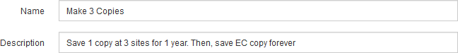

= Step 1 of 3: Define basics
:icons: font
:imagesdir: ../media/

[.lead]
Step 1 (Define Basics) of the Create ILM Rule wizard allows you to define the rule's basic and advanced filters.

.About this task

When evaluating an object against an ILM rule, StorageGRID compares the object metadata to the rule's filters. If the object metadata matches all filters, StorageGRID uses the rule to place the object. You can design a rule to apply to all objects, or you can specify basic filters, such as one or more tenant accounts or bucket names, or advanced filters, such as the object's size or user metadata.

image::../media/ilm_create_ilm_rule_wizard_1.png[Create ILM Rule step 1 of 3]

.Steps

. Enter a unique name for the rule in the *Name* field.
+
You must enter between 1 and 64 characters.

. Optionally, enter a short description for the rule in the *Description* field.
+
You should describe the rule's purpose or function so you can recognize the rule later.
+

. Optionally, select one or more S3 or Swift tenant accounts to which this rule applies. If this rule applies to all tenants, leave this field blank.
+
If you do not have either the Root Access permission or the Tenant Accounts permission, you cannot select tenants from the list. Instead, enter the tenant ID or enter multiple IDs as a comma-delimited string.

. Optionally, specify the S3 buckets or Swift containers to which this rule applies.
+
If *matches all* is selected (default), the rule applies to all S3 buckets or Swift containers.

. Optionally, select *Advanced filtering* to specify additional filters.
+
If you do not configure advanced filtering, the rule applies to all objects that match the basic filters.
+
NOTE: If this rule will create erasure-coded copies, select *Advanced filtering*. Then, add the *Object Size (MB)* advanced filter and set it to *greater than 0.2*. The size filter ensures that objects that are 2 MB or smaller will not be erasure coded.

. Select *Next*.
+
Step 2 (Define Placements) appears.

.Related information

xref:what-ilm-rule-filtering-is.adoc[What ILM rule filtering is]

xref:using-advanced-filters-in-ilm-rules.adoc[Using advanced filters in ILM rules]

xref:step-2-of-3-define-placements.adoc[Step 2 of 3: Define placements]
