= Step 2 of 3: Define placements
:icons: font
:imagesdir: ../media/

[.lead]
Step 2 (Define Placements) of the Create ILM Rule wizard allows you to define the placement instructions that determine how long objects are stored, the type of copies (replicated or erasure coded), the storage location, and the number of copies.

.About this task

An ILM rule can include one or more placement instructions. Each placement instruction applies to a single period of time. When you use more than one instruction, the time periods must be contiguous, and at least one instruction must start on day 0. The instructions can continue either forever, or until you no longer require any object copies.

Each placement instruction can have multiple lines if you want to create different types of copies or use different locations during that time period.

This example ILM rule creates two replicated copies for the first year. Each copy is saved in a storage pool at a different site. After one year, a 2+1 erasure-coded copy is made and saved at only one site.

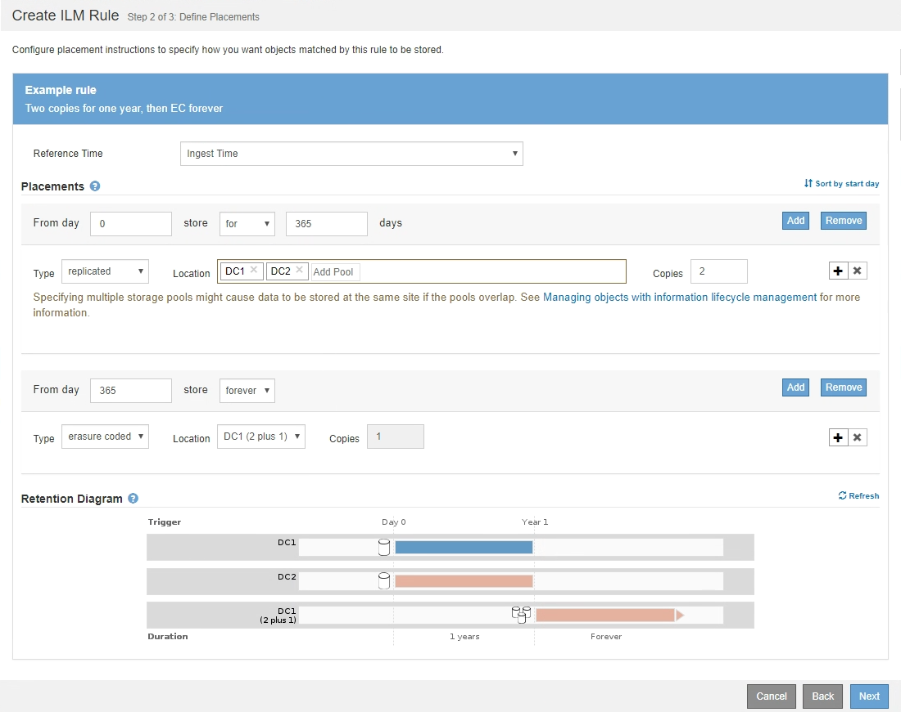

.Steps

. For *Reference Time*, select the type of time to use when calculating the start time for a placement instruction.
+
[cols="1a,2a" options="header"]
|===
| Option| Description
a|
Ingest Time
a|
The time when the object was ingested.
a|
Last Access Time
a|
The time when the object was last retrieved (read or viewed).

*Note:* To use this option, updates to Last Access Time must be enabled for the S3 bucket or Swift container.

xref:using-last-access-time-in-ilm-rules.adoc[Using Last Access Time in ILM rules]
a|
Noncurrent Time
a|
The time an object version became noncurrent because a new version was ingested and replaced it as the current version.

*Note:* Noncurrent Time applies only to S3 objects in versioning-enabled buckets.

You can use this option to reduce the storage impact of versioned objects by filtering for noncurrent object versions. See "`Example 4: ILM rules and policy for S3 versioned objects.`"
a|
User Defined Creation Time
a|
A time specified in user-defined metadata.
|===
NOTE: If you want to create a compliant rule, you must select *Ingest Time*.

. In the *Placements* section, select a starting time and a duration for the first time period.
+
For example, you might want to specify where to store objects for the first year ("`day 0 for 365 days`"). At least one instruction must start at day 0.

. If you want to create replicated copies:
 .. From the *Type* drop-down list, select *replicated*.
 .. In the *Location* field, select *Add Pool* for each storage pool you want to add.
+
*If you specify only one storage pool*, be aware that StorageGRID can store only one replicated copy of an object on any given Storage Node. If your grid includes three Storage Nodes and you select 4 as the number of copies, only three copies will be made--one copy for each Storage Node.
+
NOTE: The *ILM placement unachievable* alert is triggered to indicate that the ILM rule could not be completely applied.
+
*If you specify more than one storage pool*, keep these rules in mind:

  *** The number of copies cannot be greater than the number of storage pools.
  *** If the number of copies equals the number of storage pools, one copy of the object is stored in each storage pool.
  *** If the number of copies is less than the number of storage pools, the system distributes the copies to keep disk usage among the pools balanced, while ensuring that no site gets more than one copy of an object.
  *** If the storage pools overlap (contain the same Storage Nodes), all copies of the object might be saved at only one site. For this reason, do not specify the default All Storage Nodes storage pool and another storage pool.
+
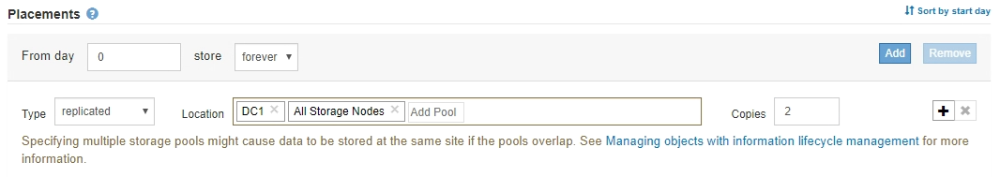

 .. Select the number of copies you want to make.
+
[IMPORTANT]
====
A warning appears if you change the number of copies to 1. An ILM rule that creates only one replicated copy for any time period puts data at risk of permanent loss. If only one replicated copy of an object exists during a time period, that object is lost if a Storage Node fails or has a significant error. You also temporarily lose access to the object during maintenance procedures such as upgrades.

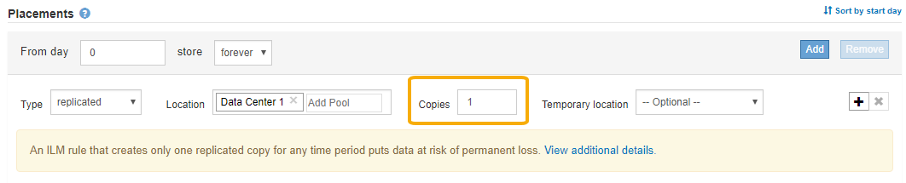

To avoid these risks, do one or more of the following:

  *** Increase the number of copies for the time period.
  *** Click the plus sign icon image:../media/icon_plus_sign_black_on_white.gif[plus sign black on white] to create additional copies during the time period. Then, select a different storage pool or a Cloud Storage Pool.
  *** Select *erasure coded* for Type, instead of *replicated*.
You can safely ignore this warning if this rule already creates multiple copies for all time periods.
====

 .. If you specified only one storage pool, ignore the *Temporary location* field.
+
NOTE: Temporary locations are deprecated and will be removed in a future release.
. If you want to store objects in a Cloud Storage Pool:
 .. From the *Type* drop-down list, select *replicated*.
 .. In the *Location* field, select *Add Pool*. Then, select a Cloud Storage Pool.
+
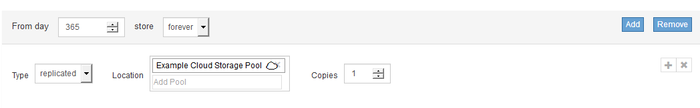
+
When using Cloud Storage Pools, keep these rules in mind:

  *** You cannot select more than one Cloud Storage Pool in a single placement instruction. Similarly, you cannot select a Cloud Storage Pool and a storage pool in the same placement instruction.
+
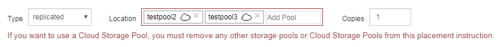

  *** You can store only one copy of an object in any given Cloud Storage Pool. An error message appears if you set *Copies* to 2 or more.
+
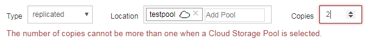

  *** You cannot store more than one object copy in any Cloud Storage Pool at the same time. An error message appears if multiple placements that use a Cloud Storage Pool have overlapping dates or if multiple lines in the same placement use a Cloud Storage Pool.
+
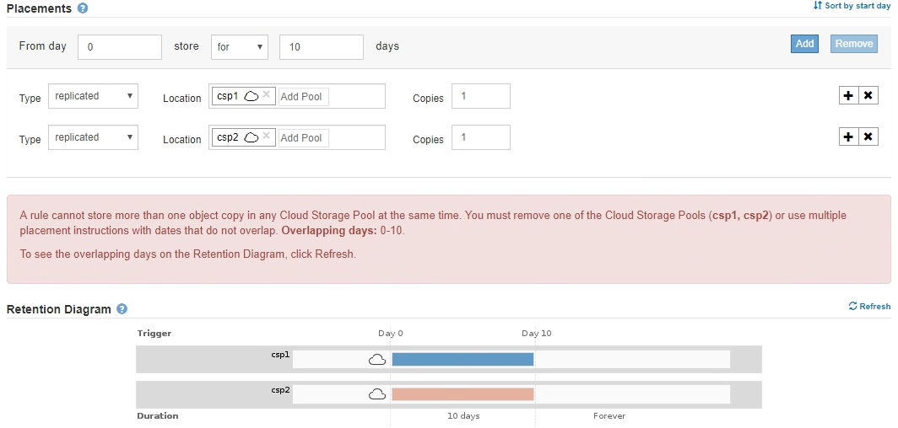

  *** You can store an object in a Cloud Storage Pool at the same time that object is being stored as replicated or erasure coded copies in StorageGRID. However, as this example shows, you must include more than one line in the placement instruction for the time period, so you can specify the number and types of copies for each location.
+
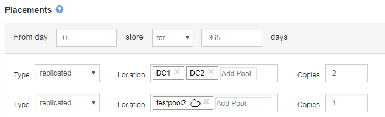
. If you want to create an erasure-coded copy:
 .. From the *Type* drop-down list, select *erasure coded*.
+
The number of copies changes to 1. A warning appears if the rule does not have an advanced filter to ignore objects that are 200 KB or smaller.
+
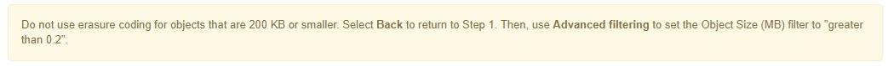
+
IMPORTANT: Do not use erasure coding for objects smaller than 200 KB to avoid the overhead of managing very small erasure-coded fragments.

 .. If the object size warning appeared, follow these steps to clear it:
  ... Select *Back* to return to Step 1.
  ... Select *Advanced filtering*.
  ... Set the Object Size (MB) filter to "`greater than 0.2`".
 .. Select the storage location.
+
The storage location for an erasure-coded copy includes the name of the storage pool, followed by the name of the Erasure Coding profile.
+
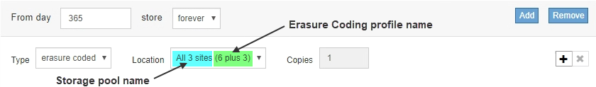
. Optionally, add different time periods or create additional copies at different locations:
 ** Click the plus icon to create additional copies at a different location during the same time period.
 ** Click *Add* to add a different time period to the placement instructions.
+
NOTE: Objects are automatically deleted at the end of the final time period unless the final time period ends with *forever*.
. Click *Refresh* to update the Retention Diagram and to confirm your placement instructions.
+
Each line in the diagram shows where and when object copies will be placed. The type of copy is represented by one of the following icons:
+
[cols="1a,2a"]
|===
    a|

a|
Replicated copy
a|
image:../media/icon_nms_erasure_coded.gif[Icon for erasure coded copy]
a|
Erasure-coded copy
a|

a|
Cloud Storage Pool copy
|===
In this example, two replicated copies will be saved to two storage pools (DC1 and DC2) for one year. Then, an erasure-coded copy will be saved for an additional 10 years, using a 6+3 erasure-coding scheme at three sites. After 11 years, the objects will be deleted from StorageGRID.
+
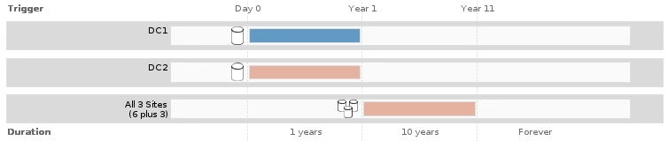

. Click *Next*.
+
Step 3 (Define Ingest Behavior) appears.

.Related information

xref:what-ilm-placement-instructions-are.adoc[What ILM rule placement instructions are]

xref:example-4-ilm-rules-and-policy-for-s3-versioned-objects.adoc[Example 4: ILM rules and policy for S3 versioned objects]

xref:why-you-should-not-use-single-copy-replication.adoc[Why you should not use single-copy replication]

xref:managing-objects-with-s3-object-lock.adoc[Managing objects with S3 Object Lock]

xref:using-storage-pool-as-temporary-location-deprecated.adoc[Using a storage pool as a temporary location (deprecated)]

xref:step-3-of-3-define-ingest-behavior.adoc[Step 3 of 3: Define ingest behavior]
