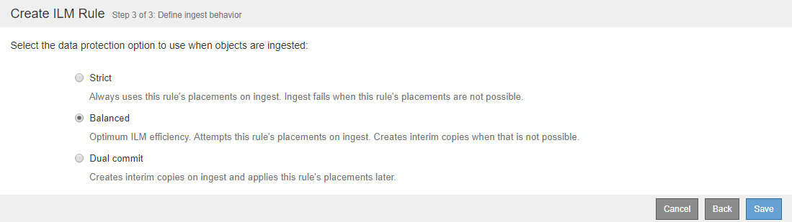

= Step 3 of 3: Define ingest behavior
:icons: font
:imagesdir: ../media/

[.lead]
Step 3 (Define ingest behavior) of the Create ILM Rule wizard allows you to choose how the objects filtered by this rule are protected as they are ingested.

.About this task

StorageGRID can make interim copies and queue the objects for ILM evaluation later, or it can make copies to meet the rule's placement instructions immediately.

.Steps

. Select the data protection option to use when objects are ingested:
+
[cols="1a,2a" options="header"]
|===
| Option| Description
a|
Strict
a|
Always uses this rule's placements on ingest. Ingest fails when this rule's placements are not possible.
a|
Balanced
a|
Optimum ILM efficiency. Attempts this rule's placements on ingest. Creates interim copies when that is not possible.
a|
Dual commit
a|
Creates interim copies on ingest and applies this rule's placements later.
|===
Balanced offers a combination of data security and efficiency that is suitable in most cases. Strict or Dual commit are generally used to meet specific requirements.
+
See "`What the data-protection options for ingest are`" and "`Advantages and disadvantages of each data-protection option`" for more information.
+
[NOTE]
====
An error message appears if you select the Strict or Balanced option and the rule uses one of these placements:

 ** A Cloud Storage Pool at day 0
 ** An Archive Node at day 0
 ** A Cloud Storage Pool or an Archive Node when the rule uses a User Defined Creation Time as a Reference Time
====

. Click *Save*.
+
The ILM rule is saved. The rule does not become active until it is added to an ILM policy and that policy is activated.

.Related information

xref:data-protection-options-for-ingest.adoc[Data-protection options for ingest]

xref:advantages-disadvantages-of-ingest-options.adoc[Advantages, disadvantages, and limitations of the data-protection options]

xref:example-5-ilm-rules-and-policy-for-strict-ingest-behavior.adoc[Example 5: ILM rules and policy for Strict ingest behavior]

xref:creating-ilm-policy.adoc[Creating an ILM policy]
